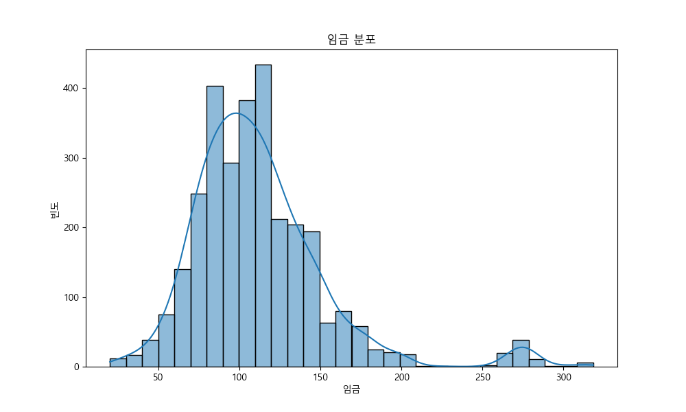
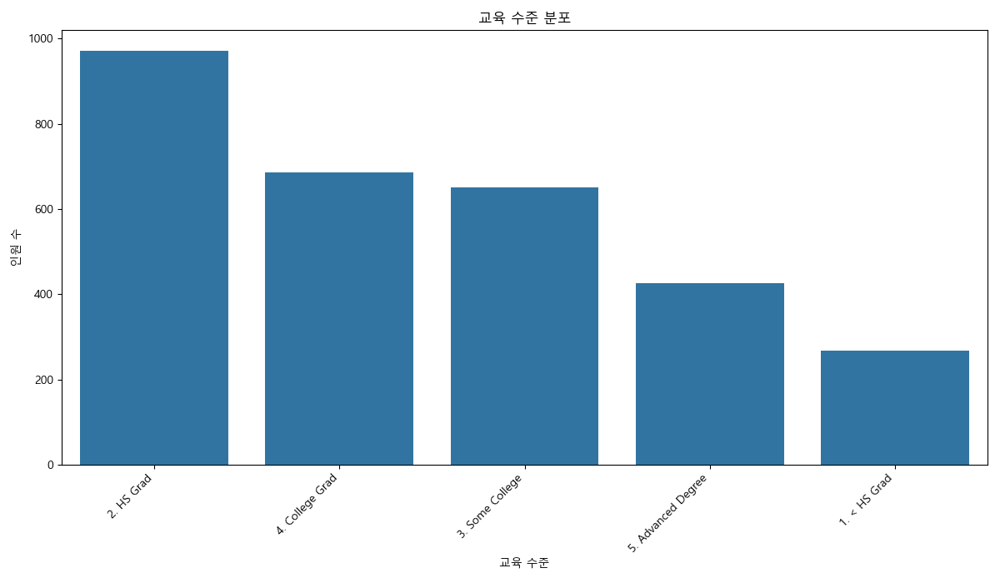
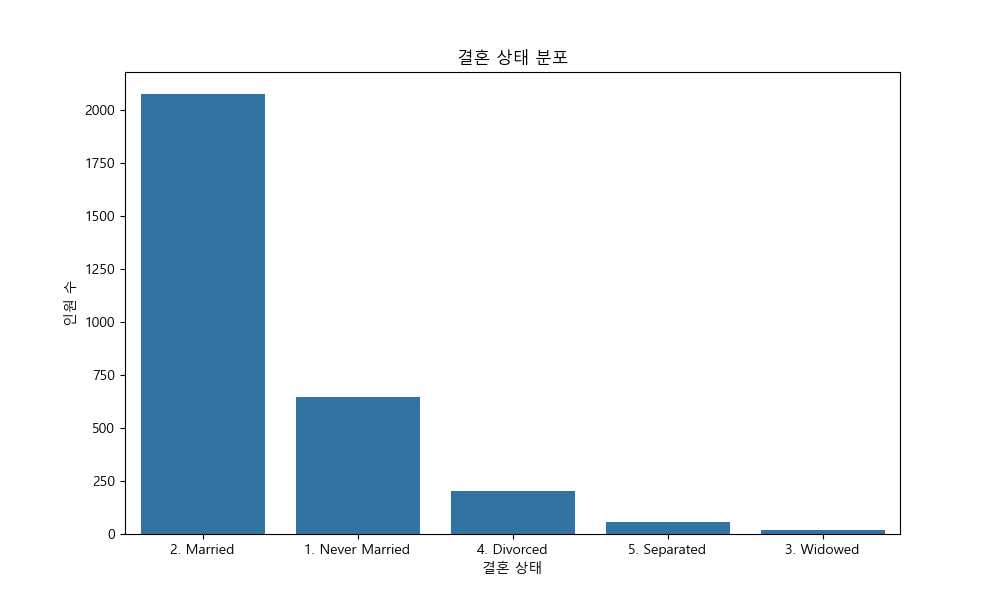
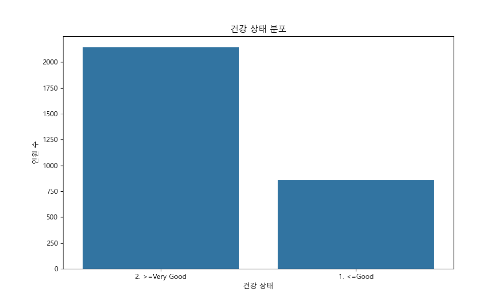
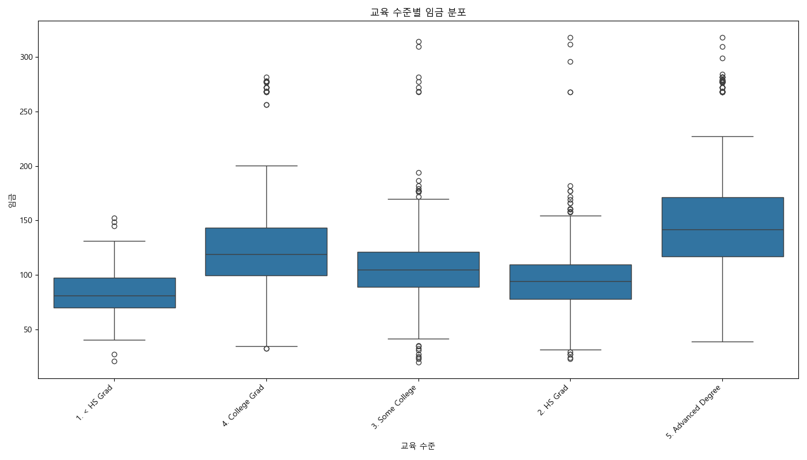
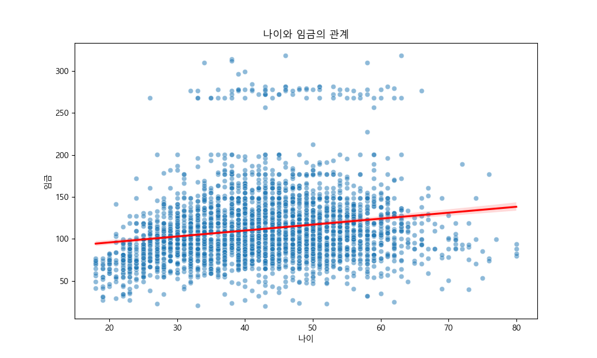
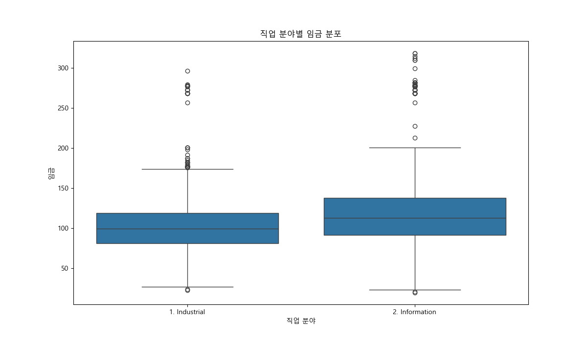
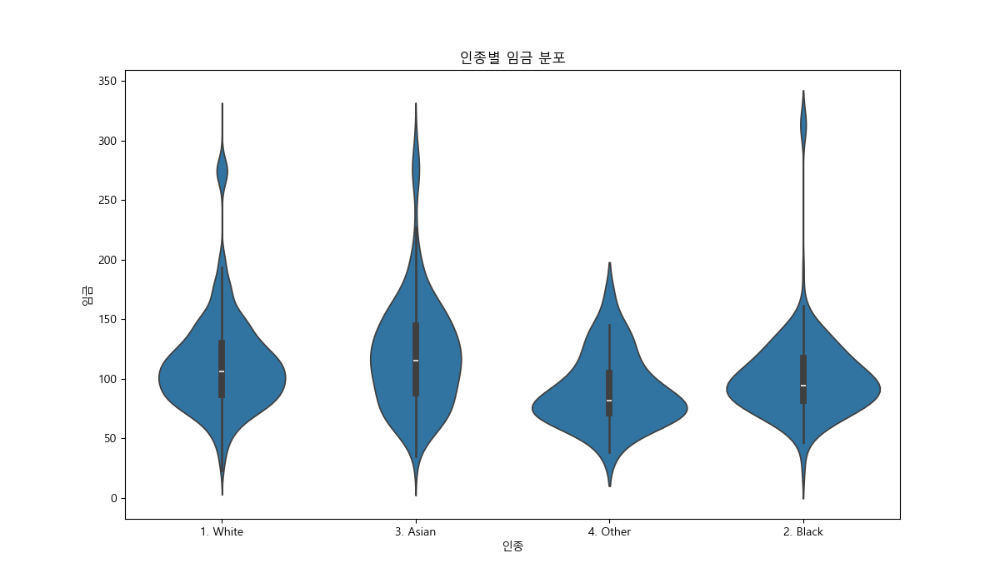
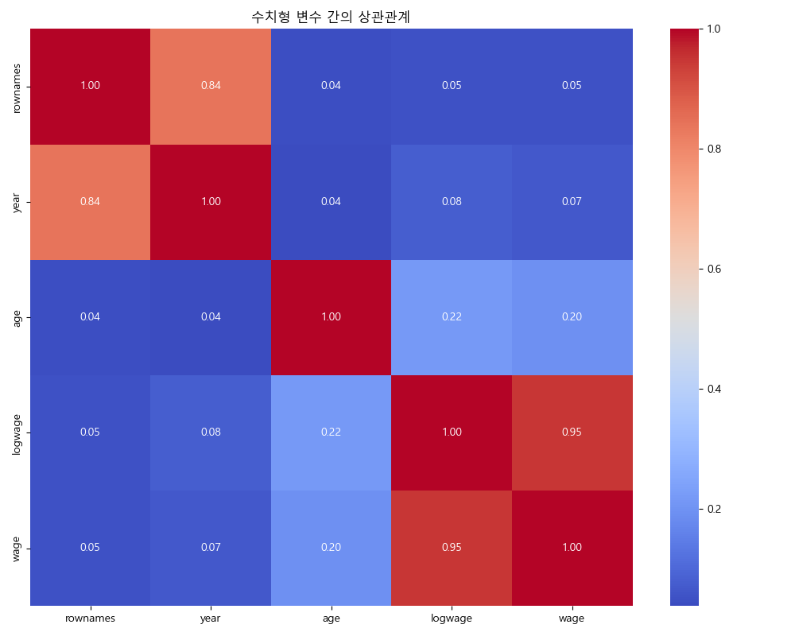
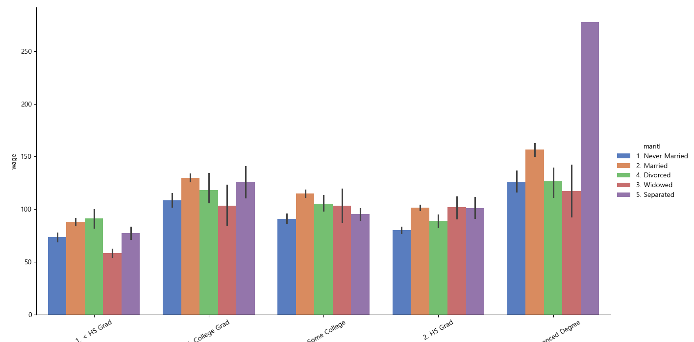

# Wage 데이터셋 EDA 보고서

이 보고서는 Wage 데이터셋에 대한 탐색적 데이터 분석(EDA) 결과를 요약합니다.

## 1. 데이터 기본 정보

### 처음 5개 행:
```
   rownames  year  age            maritl      race        education              region        jobclass          health health_ins   logwage        wage
0    231655  2006   18  1. Never Married  1. White     1. < HS Grad  2. Middle Atlantic   1. Industrial       1. <=Good      2. No  4.318063   75.043154
1     86582  2004   24  1. Never Married  1. White  4. College Grad  2. Middle Atlantic  2. Information  2. >=Very Good      2. No  4.255273   70.476020
2    161300  2003   45        2. Married  1. White  3. Some College  2. Middle Atlantic   1. Industrial       1. <=Good     1. Yes  4.875061  130.982177
3    155159  2003   43        2. Married  3. Asian  4. College Grad  2. Middle Atlantic  2. Information  2. >=Very Good     1. Yes  5.041393  154.685293
4     11443  2005   50       4. Divorced  1. White       2. HS Grad  2. Middle Atlantic  2. Information       1. <=Good     1. Yes  4.318063   75.043154
```

### 데이터 정보:
```
<class 'pandas.core.frame.DataFrame'>
RangeIndex: 3000 entries, 0 to 2999
Data columns (total 12 columns):
 #   Column      Non-Null Count  Dtype  
---  ------      --------------  -----  
 0   rownames    3000 non-null   int64  
 1   year        3000 non-null   int64  
 2   age         3000 non-null   int64  
 3   maritl      3000 non-null   object 
 4   race        3000 non-null   object 
 5   education   3000 non-null   object 
 6   region      3000 non-null   object 
 7   jobclass    3000 non-null   object 
 8   health      3000 non-null   object 
 9   health_ins  3000 non-null   object 
 10  logwage     3000 non-null   float64
 11  wage        3000 non-null   float64
dtypes: float64(2), int64(3), object(7)
memory usage: 281.4+ KB

```

### 기술 통계:
```
            rownames         year          age      logwage         wage
count    3000.000000  3000.000000  3000.000000  3000.000000  3000.000000
mean   218883.373000  2005.791000    42.414667     4.653905   111.703608
std    145654.072587     2.026167    11.542406     0.351753    41.728595
min      7373.000000  2003.000000    18.000000     3.000000    20.085537
25%     85622.250000  2004.000000    33.750000     4.447158    85.383940
50%    228799.500000  2006.000000    42.000000     4.653213   104.921507
75%    374759.500000  2008.000000    51.000000     4.857332   128.680488
max    453870.000000  2009.000000    80.000000     5.763128   318.342430
```

## 2. 데이터 시각화 및 분석

### 2.1. 임금 분포



임금 데이터는 오른쪽으로 꼬리가 긴 분포를 보입니다. 대부분의 사람들은 100-150 사이에 분포하지만, 200 이상의 높은 임금을 받는 소수도 존재합니다. 이는 소득 불평등을 시사할 수 있습니다.

### 2.2. 교육 수준 분포



가장 많은 교육 수준은 '2. High School Grad'이며, '4. College Grad'가 그 뒤를 잇습니다. 교육 수준별로 인원 수에 차이가 있으며, 이는 임금 분석에 중요한 변수가 될 수 있습니다.

#### 교육 수준별 교차표:
```
col_0               count
education                
1. < HS Grad          268
2. HS Grad            971
3. Some College       650
4. College Grad       685
5. Advanced Degree    426
```

### 2.3. 결혼 상태 분포



'2. Married' 상태의 인원이 가장 많습니다. 결혼 여부가 임금에 영향을 미치는지 확인해볼 필요가 있습니다.

#### 결혼 상태별 교차표:
```
col_0             count
maritl                 
1. Never Married    648
2. Married         2074
3. Widowed           19
4. Divorced         204
5. Separated         55
```

### 2.4. 건강 상태 분포



대부분의 사람들이 '1. <=Good' 또는 '2. >=Very Good'의 건강 상태를 가지고 있습니다. 건강 상태가 좋지 않은 사람은 소수입니다.

#### 건강 상태별 교차표:
```
col_0           count
health               
1. <=Good         858
2. >=Very Good   2142
```

### 2.5. 교육 수준별 임금



전반적으로 교육 수준이 높을수록 임금의 중앙값과 분포가 상승하는 경향을 보입니다. 특히 '5. Advanced Degree'는 다른 그룹에 비해 월등히 높은 임금을 받습니다. 이는 교육이 소득에 긍정적인 영향을 미친다는 가설을 뒷받침합니다.

### 2.6. 나이와 임금의 관계



나이가 많아질수록 임금이 대체로 증가하는 양의 상관관계를 보입니다. 하지만 분산도 함께 커지는 경향이 있어, 나이가 들수록 개인 간의 임금 격차가 벌어질 수 있음을 시사합니다.

### 2.7. 직업 분야별 임금



'2. Information' 분야의 임금이 '1. Industrial' 분야보다 전반적으로 높게 나타납니다. 직업 분야가 임금 수준을 결정하는 중요한 요인 중 하나임을 알 수 있습니다.

### 2.8. 인종별 임금



인종별로 임금 분포에 차이가 보입니다. 특히 '3. Asian'과 '1. White' 그룹의 임금 중앙값이 다른 그룹에 비해 높은 경향이 있습니다. 바이올린 플롯은 각 그룹의 데이터 분포 형태를 보여주는데, 모든 인종 그룹에서 고임금 이상치가 존재함을 알 수 있습니다.

### 2.9. 수치형 변수 간의 상관관계



`wage`는 `age`, `year`와 양의 상관관계를, `logwage`와는 매우 강한 양의 상관관계를 가집니다. `age`와 `year`도 약한 양의 상관관계를 보입니다. 이는 시간이 지남에 따라 나이와 임금이 함께 증가하는 경향을 반영합니다.

### 2.10. 결혼 상태 및 교육 수준에 따른 임금



대부분의 교육 수준에서 기혼자('2. Married')의 평균 임금이 미혼자('1. Never Married')보다 높은 경향을 보입니다. 이는 결혼 여부가 임금에 긍정적인 영향을 줄 수 있다는 가능성을 제시합니다. 하지만 이는 다른 요인(예: 나이)에 의한 결과일 수도 있으므로 추가 분석이 필요합니다.

