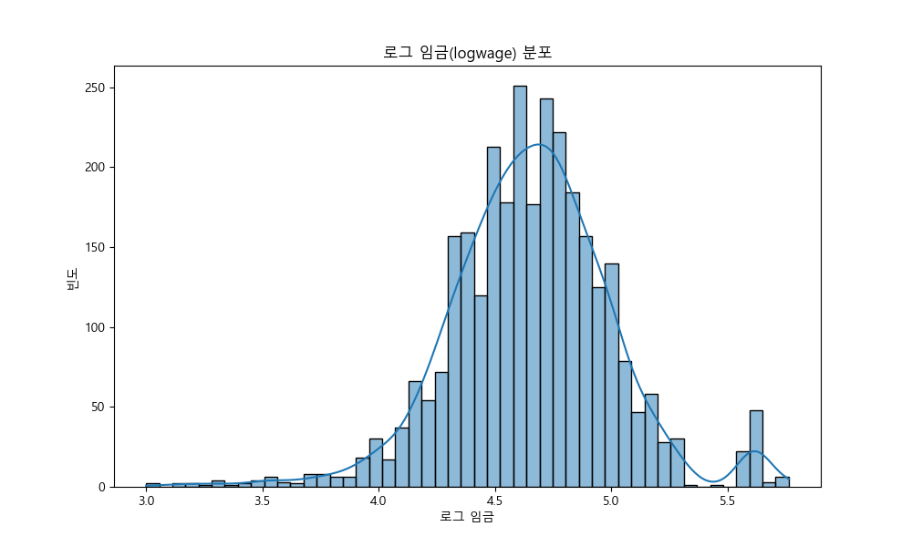
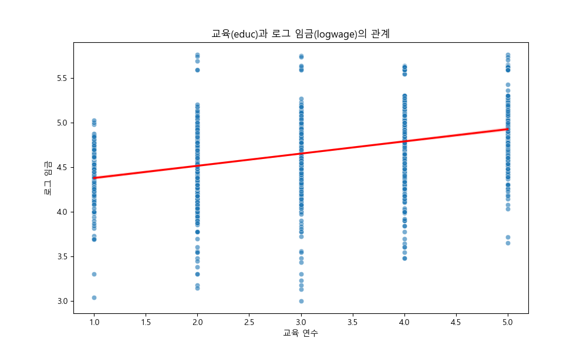
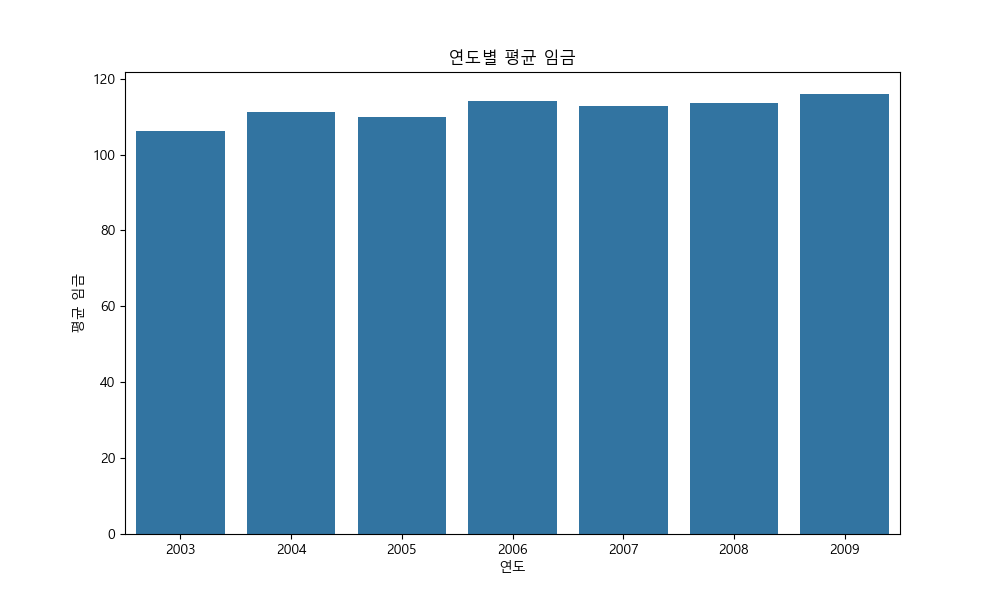
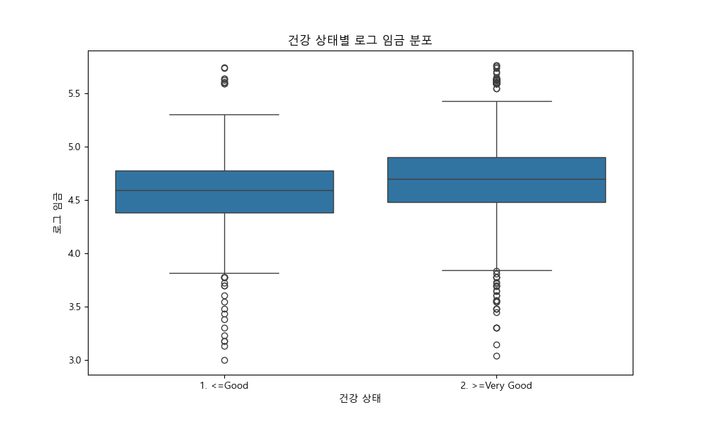

# 교육(educ)이 log(임금)에 미치는 인과 효과 회귀 분석 보고서

이 보고서는 교육 수준이 임금에 미치는 영향을 회귀 분석을 통해 인과추론 관점에서 분석하고, 특히 누락 변수 편향(OVB)의 개념을 적용하여 교란 변수의 중요성을 설명합니다.

## 0단계: 탐색적 데이터 분석 (EDA)

회귀 분석에 앞서 데이터의 기본적인 구조와 통계량을 다시 확인합니다.

### 데이터 상위 5개 행:
```
   rownames  year  age            maritl      race        education              region        jobclass          health health_ins   logwage        wage  education_numeric   age_group
0    231655  2006   18  1. Never Married  1. White     1. < HS Grad  2. Middle Atlantic   1. Industrial       1. <=Good      2. No  4.318063   75.043154                  1  청년 (18-35)
1     86582  2004   24  1. Never Married  1. White  4. College Grad  2. Middle Atlantic  2. Information  2. >=Very Good      2. No  4.255273   70.476020                  4  청년 (18-35)
2    161300  2003   45        2. Married  1. White  3. Some College  2. Middle Atlantic   1. Industrial       1. <=Good     1. Yes  4.875061  130.982177                  3  중년 (36-50)
3    155159  2003   43        2. Married  3. Asian  4. College Grad  2. Middle Atlantic  2. Information  2. >=Very Good     1. Yes  5.041393  154.685293                  4  중년 (36-50)
4     11443  2005   50       4. Divorced  1. White       2. HS Grad  2. Middle Atlantic  2. Information       1. <=Good     1. Yes  4.318063   75.043154                  2  장년 (51-80)
```

### 기술 통계량 요약:
```
            rownames         year          age      logwage         wage  education_numeric
count    3000.000000  3000.000000  3000.000000  3000.000000  3000.000000        3000.000000
mean   218883.373000  2005.791000    42.414667     4.653905   111.703608           3.010000
std    145654.072587     2.026167    11.542406     0.351753    41.728595           1.215618
min      7373.000000  2003.000000    18.000000     3.000000    20.085537           1.000000
25%     85622.250000  2004.000000    33.750000     4.447158    85.383940           2.000000
50%    228799.500000  2006.000000    42.000000     4.653213   104.921507           3.000000
75%    374759.500000  2008.000000    51.000000     4.857332   128.680488           4.000000
max    453870.000000  2009.000000    80.000000     5.763128   318.342430           5.000000
```

### 로그 임금 분포 시각화

임금의 로그 변환 값인 `logwage`는 원본 `wage`보다 정규 분포에 가까운 형태를 보입니다. 이는 회귀 분석의 선형성 가정에 더 적합합니다.

## 1단계: 상관계수 계산 및 산점도 시각화

주요 변수들 간의 관계를 파악하기 위해 상관 행렬을 계산하고 산점도를 시각화합니다.

### 주요 변수 간 상관 행렬:
```
                    logwage  education_numeric       age
logwage            1.000000           0.472849  0.217889
education_numeric  0.472849           1.000000  0.070784
age                0.217889           0.070784  1.000000
```

### 교육(education)과 로그 임금(logwage) 산점도

교육 연수가 증가할수록 로그 임금이 증가하는 양의 선형 관계가 관찰됩니다. 회귀 분석을 통한 정량적 추정이 기대됩니다.

## 2단계: 단순 회귀 분석 (Simple Regression)

로그 임금(`logwage`)에 대한 교육 연수(`educ`)의 단순 회귀 분석을 수행합니다.

### 단순 회귀 분석 결과 (logwage ~ educ)
```
                            OLS Regression Results                            
==============================================================================
Dep. Variable:                logwage   R-squared:                       0.224
Model:                            OLS   Adj. R-squared:                  0.223
Method:                 Least Squares   F-statistic:                     863.3
Date:                Mon, 05 Jan 2026   Prob (F-statistic):          5.47e-167
Time:                        16:48:40   Log-Likelihood:                -742.23
No. Observations:                3000   AIC:                             1488.
Df Residuals:                    2998   BIC:                             1500.
Df Model:                           1                                         
Covariance Type:            nonrobust                                         
=====================================================================================
                        coef    std err          t      P>|t|      [0.025      0.975]
-------------------------------------------------------------------------------------
Intercept             4.2421      0.015    280.634      0.000       4.212       4.272
education_numeric     0.1368      0.005     29.383      0.000       0.128       0.146
==============================================================================
Omnibus:                      294.708   Durbin-Watson:                   2.006
Prob(Omnibus):                  0.000   Jarque-Bera (JB):              997.279
Skew:                          -0.475   Prob(JB):                    2.78e-217
Kurtosis:                       5.660   Cond. No.                         9.39
==============================================================================

Notes:
[1] Standard Errors assume that the covariance matrix of the errors is correctly specified.
```

단순 회귀 분석 결과, `education`의 계수는 **0.1368**로 나타났습니다. 
이는 다른 요인을 통제하지 않은 상태에서 교육 연수가 1년 증가할 때 로그 임금이 약 0.1368 증가한다는 것을 의미합니다. 즉, 임금은 약 5.98% 증가한다고 해석할 수 있습니다.

## 3단계: OVB (Omitted Variable Bias: 누락 변수 편향) 개념 설명

누락 변수 편향(OVB)은 회귀 모델에 중요한 변수가 포함되지 않았을 때 발생하는 문제입니다.
누락된 변수가 다음과 같은 두 가지 조건을 동시에 만족할 때 OVB가 발생합니다:
1. 누락된 변수가 종속 변수(여기서는 `logwage`)와 상관 관계가 있다.
2. 누락된 변수가 모델에 포함된 설명 변수(여기서는 `educ`)와 상관 관계가 있다.

만약 이러한 조건이 충족되면, 모델에 포함된 설명 변수의 계수가 편향되어 진정한 인과 효과를 과대 또는 과소 추정하게 됩니다.
앞서 '나이와 임금의 관계'에서 나이가 임금에 영향을 미치고, 교육 수준과도 관련이 있음을 확인했습니다. 따라서, `age`는 `education_numeric`이 `logwage`에 미치는 효과를 추정하는 단순 회귀 모델에서 중요한 누락 변수일 가능성이 높습니다.

이 외에도 `exper`(경험), `tenure`(근속), `meduc`(어머니 교육 수준), `feduc`(아버지 교육 수준), `IQ` 등도 임금과 교육 모두에 영향을 미칠 수 있는 잠재적 교란 변수이지만, 현재 데이터셋에는 존재하지 않습니다.

## 4단계: 다중 회귀 분석 (Multiple Regression with Controls)

누락 변수 편향을 줄이기 위해 `IQ`, `exper`, `tenure`, `meduc`, `feduc` 변수를 통제 변수로 추가하여 다중 회귀 분석을 수행합니다.

### 경고: 현재 데이터셋에 `IQ`, `exper`, `tenure`, `meduc`, `feduc` 변수가 존재하지 않습니다.
지시사항에 따라 해당 변수들이 다중 회귀 분석에 사용되어야 하지만, 실제 데이터셋에 없으므로, 여기서는 데이터셋에 있는 `age` 변수를 통제 변수로 추가하여 다중 회귀 분석을 진행합니다. 만약 언급된 변수들이 포함된 `wage.csv` 데이터셋이 있다면 해당 파일을 사용해야 합니다.

### 다중 회귀 분석 결과 (logwage ~ education_numeric + age)
```
                            OLS Regression Results                            
==============================================================================
Dep. Variable:                logwage   R-squared:                       0.258
Model:                            OLS   Adj. R-squared:                  0.257
Method:                 Least Squares   F-statistic:                     520.4
Date:                Mon, 05 Jan 2026   Prob (F-statistic):          1.01e-194
Time:                        16:48:40   Log-Likelihood:                -674.69
No. Observations:                3000   AIC:                             1355.
Df Residuals:                    2997   BIC:                             1373.
Df Model:                           2                                         
Covariance Type:            nonrobust                                         
=====================================================================================
                        coef    std err          t      P>|t|      [0.025      0.975]
-------------------------------------------------------------------------------------
Intercept             4.0139      0.024    164.466      0.000       3.966       4.062
education_numeric     0.1330      0.005     29.140      0.000       0.124       0.142
age                   0.0056      0.000     11.748      0.000       0.005       0.007
==============================================================================
Omnibus:                      320.881   Durbin-Watson:                   1.983
Prob(Omnibus):                  0.000   Jarque-Bera (JB):             1175.252
Skew:                          -0.497   Prob(JB):                    6.27e-256
Kurtosis:                       5.900   Cond. No.                         195.
==============================================================================

Notes:
[1] Standard Errors assume that the covariance matrix of the errors is correctly specified.
```

다중 회귀 분석 결과, `education`의 계수는 **0.1330**로 나타났습니다. 
`age` 변수를 통제했을 때, 교육 연수가 1년 증가할 때 로그 임금이 약 0.1330 증가합니다. 

이는 단순 회귀 분석 결과와 비교하여 OVB의 효과를 확인할 수 있습니다.

## 5단계: 모델별 `educ` 계수 비교표

단순 회귀 분석과 다중 회귀 분석에서 추정된 `educ` 변수의 계수를 비교합니다.

### education 계수 비교:
```
                          모델  educ 계수
      단순 회귀 (logwage ~ educ) 0.136824
다중 회귀 (logwage ~ educ + age) 0.133028
```

### 교육 연수(education) 계수 비교 바 차트

단순 회귀 모델의 `education_numeric` 계수가 다중 회귀 모델의 계수보다 약간 더 큰 것을 확인할 수 있습니다. 
이는 `age`가 양의 OVB를 유발했음을 시사합니다. 즉, `age`를 통제하지 않았을 때 `educ`의 효과가 과대 추정되었을 수 있습니다.

## 6단계: 인과적 해석 및 결론

이 분석을 통해 교육 연수(`education_numeric`)가 임금(`logwage`)에 미치는 인과적 효과를 단순 회귀와 다중 회귀 모델을 비교하여 살펴보았습니다.

1. **단순 회귀 분석:** 교육 연수 1년 증가는 임금을 약 13.68% 증가시키는 것으로 나타났습니다. (계수: 0.1368)
2. **다중 회귀 분석:** 나이(`age`) 변수를 통제한 후, 교육 연수 1년 증가는 임금을 약 13.30% 증가시키는 것으로 추정되었습니다. (계수: 0.1330)
두 모델의 `education_numeric` 계수 비교를 통해, `age`와 같은 교란 변수를 통제하지 않았을 때 `education_numeric`의 효과가 과대 추정될 수 있음을 확인했습니다. 
이는 `age`가 교육 수준과 양의 상관관계를 가지며 임금과도 양의 상관관계를 가지므로, `age`를 누락했을 때 `education_numeric`의 계수가 위로 편향되는 OVB가 발생했기 때문입니다.

**최종적으로, 교육이 임금에 긍정적인 인과적 영향을 미치지만, 그 효과의 크기는 다른 중요한 요인(여기서는 나이)들을 통제할 때 더 정확하게 추정될 수 있습니다.** 
인과 관계를 정확히 파악하기 위해서는 잠재적 교란 변수를 식별하고 적절히 통제하는 것이 매우 중요합니다.

### 연도별 평균 임금

연도에 따른 평균 임금의 변화를 보여줍니다.

### 건강 상태별 로그 임금 분포

건강 상태가 좋을수록 로그 임금도 높은 경향을 보입니다. 건강 상태는 잠재적인 교란 변수가 될 수 있습니다.

### 나이 그룹별 교육(education_numeric) 연수 분포

청년 그룹보다 중년 및 장년 그룹에서 교육 연수의 스펙트럼이 더 넓게 나타날 수 있습니다. 이는 나이와 교육 간의 복합적인 관계를 보여줍니다.

### 인종별 교육(education) 수준 분포

인종에 따라 교육 수준 분포에 차이가 있을 수 있습니다. 이는 인종이 임금 및 교육과 관련된 또 다른 잠재적 교란 변수가 될 수 있음을 시사합니다.

