# 브라질 이커머스(Olist) 데이터 분석 보고서

이 보고서는 브라질 이커머스 플랫폼 Olist의 데이터를 사용하여 고객, 주문, 상품, 판매자 등 다양한 관점에서 비즈니스 현황을 분석하고 인사이트를 도출합니다.

## 1. 주문 상태 분포

전체 주문의 상태별 분포를 확인하여 현재 비즈니스의 상태를 파악합니다. 'delivered'가 대부분을 차지하는 것이 이상적입니다.

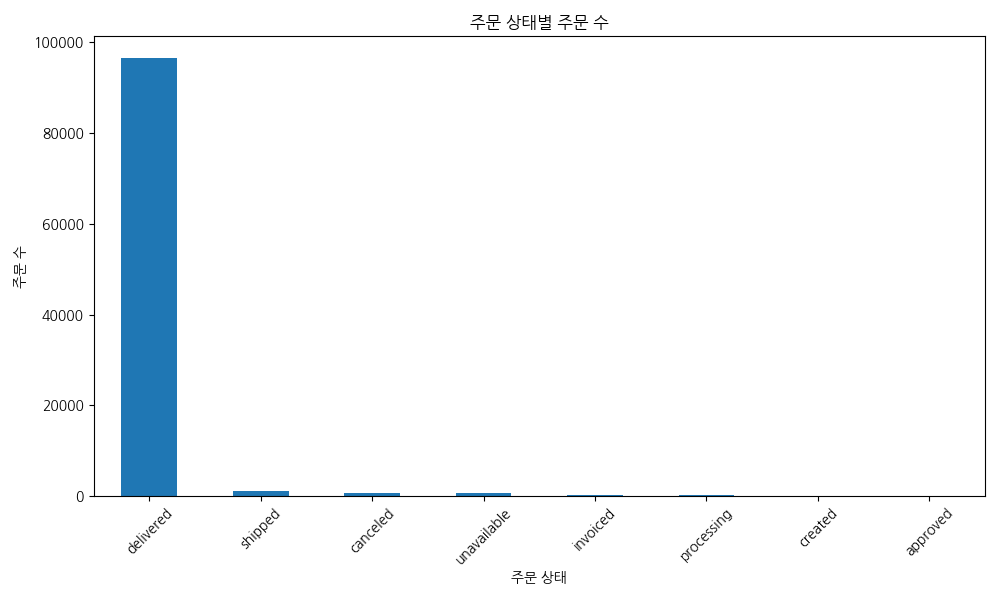

### 주문 상태 교차표

| order_status   |   count |
|:---------------|--------:|
| delivered      |   96478 |
| shipped        |    1107 |
| canceled       |     625 |
| unavailable    |     609 |
| invoiced       |     314 |
| processing     |     301 |
| created        |       5 |
| approved       |       2 |

## 2. 결제 유형 분석

고객들이 선호하는 결제 방식를 파악합니다. 신용카드, 현금(boleto), 바우처 등 다양한 결제 유형의 비중을 확인할 수 있습니다.

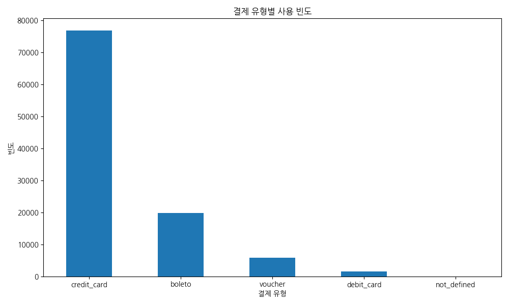

### 결제 유형 교차표

| payment_type   |   count |
|:---------------|--------:|
| credit_card    |   76795 |
| boleto         |   19784 |
| voucher        |    5775 |
| debit_card     |    1529 |
| not_defined    |       3 |

## 3. 리뷰 점수 분포

고객 만족도를 파악하기 위해 리뷰 점수 분포를 확인합니다. 1점에서 5점까지의 점수 분포를 통해 서비스의 전반적인 만족도 수준을 가늠할 수 있습니다.

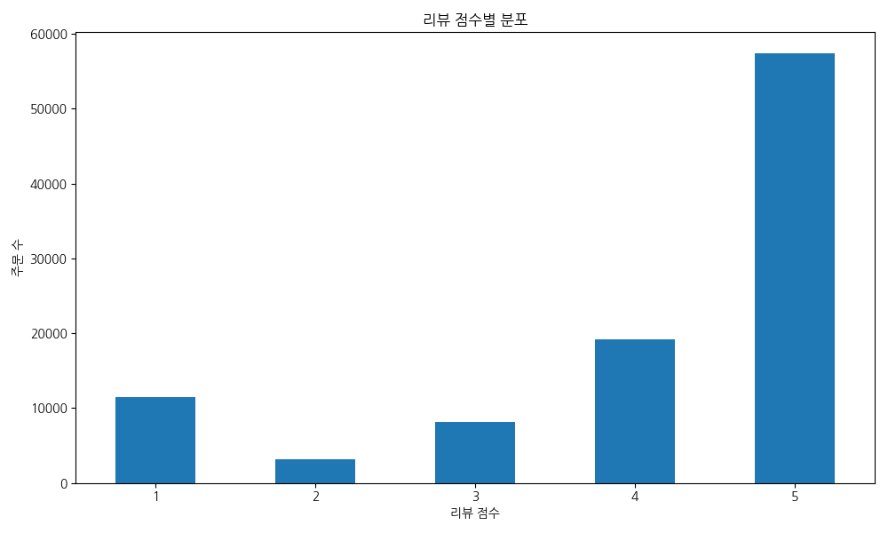

### 리뷰 점수 교차표

|   review_score |   count |
|---------------:|--------:|
|              1 |   11424 |
|              2 |    3151 |
|              3 |    8179 |
|              4 |   19142 |
|              5 |   57328 |

## 4. 월별 매출 추이

시간에 따른 비즈니스 성장을 파악하기 위해 월별 총 매출 추이를 분석합니다. 특정 월에 매출이 급증하거나 급감하는 패턴을 확인할 수 있습니다.

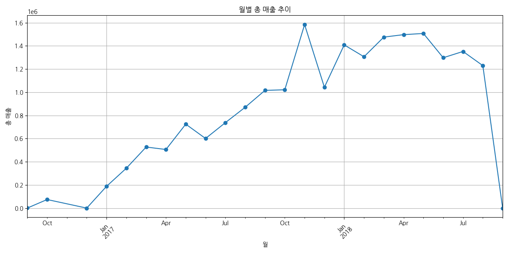

### 월별 매출 피봇 테이블

| purchase_month   |    payment_value |
|:-----------------|-----------------:|
| 2016-09          |    347.52        |
| 2016-10          |  73914.6         |
| 2016-12          |     19.62        |
| 2017-01          | 187779           |
| 2017-02          | 344135           |
| 2017-03          | 526962           |
| 2017-04          | 505666           |
| 2017-05          | 724505           |
| 2017-06          | 600753           |
| 2017-07          | 737293           |
| 2017-08          | 870106           |
| 2017-09          |      1.01585e+06 |
| 2017-10          |      1.02117e+06 |
| 2017-11          |      1.58387e+06 |
| 2017-12          |      1.04286e+06 |
| 2018-01          |      1.40837e+06 |
| 2018-02          |      1.30605e+06 |
| 2018-03          |      1.4756e+06  |
| 2018-04          |      1.49681e+06 |
| 2018-05          |      1.50697e+06 |
| 2018-06          |      1.29759e+06 |
| 2018-07          |      1.35171e+06 |
| 2018-08          |      1.22964e+06 |
| 2018-09          |    166.46        |

## 5. 주요 고객 분포 (주별 매출)

매출이 가장 많이 발생하는 지역을 파악하기 위해 상위 10개 주의 총 매출을 분석합니다. 이를 통해 지역별 마케팅 전략을 수립할 수 있습니다.

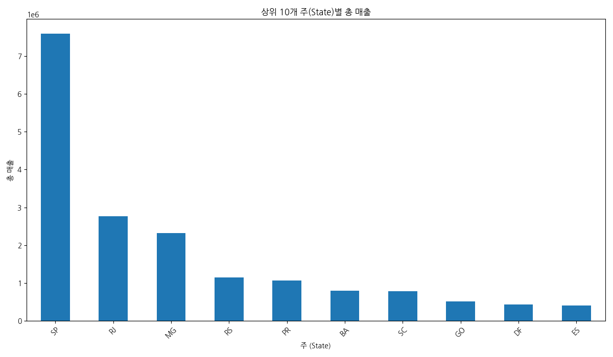

### 상위 10개 주별 매출 교차표

| customer_state   |    payment_value |
|:-----------------|-----------------:|
| SP               |      7.59721e+06 |
| RJ               |      2.76935e+06 |
| MG               |      2.32615e+06 |
| RS               |      1.14728e+06 |
| PR               |      1.0646e+06  |
| BA               | 797410           |
| SC               | 786344           |
| GO               | 513879           |
| DF               | 432624           |
| ES               | 405805           |

## 6. 인기 상품 카테고리 (매출 기준)

매출 기여도가 높은 상위 10개 상품 카테고리를 분석하여 인기 상품군을 파악합니다. 이를 통해 재고 관리 및 상품 추천 전략에 활용할 수 있습니다.

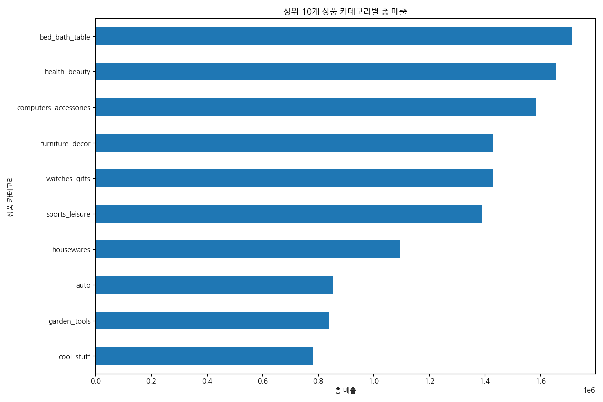

### 상위 10개 카테고리별 매출 교차표

| product_category_name_english   |    payment_value |
|:--------------------------------|-----------------:|
| bed_bath_table                  |      1.71255e+06 |
| health_beauty                   |      1.65737e+06 |
| computers_accessories           |      1.58533e+06 |
| furniture_decor                 |      1.43018e+06 |
| watches_gifts                   |      1.42922e+06 |
| sports_leisure                  |      1.39213e+06 |
| housewares                      |      1.09476e+06 |
| auto                            | 852294           |
| garden_tools                    | 838281           |
| cool_stuff                      | 779698           |

## 7. 시간대별 주문 분포

고객들이 주로 언제 주문하는지 파악하기 위해 시간대별 주문 분포를 분석합니다. 이를 통해 마케팅 메시지 발송 시간 등을 최적화할 수 있습니다.

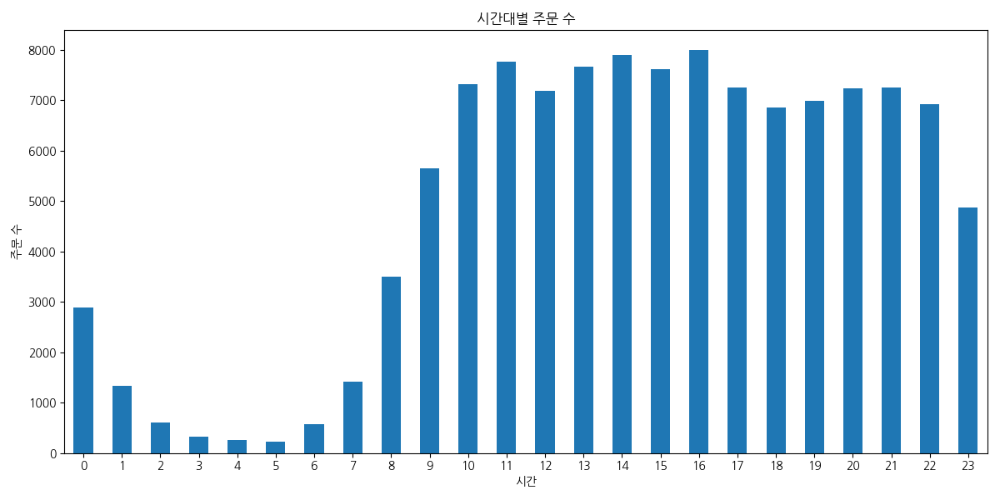

### 시간대별 주문 교차표

|   purchase_hour |   count |
|----------------:|--------:|
|               0 |    2894 |
|               1 |    1339 |
|               2 |     611 |
|               3 |     323 |
|               4 |     253 |
|               5 |     225 |
|               6 |     569 |
|               7 |    1419 |
|               8 |    3501 |
|               9 |    5644 |
|              10 |    7325 |
|              11 |    7769 |
|              12 |    7185 |
|              13 |    7671 |
|              14 |    7896 |
|              15 |    7612 |
|              16 |    7990 |
|              17 |    7255 |
|              18 |    6856 |
|              19 |    6983 |
|              20 |    7235 |
|              21 |    7249 |
|              22 |    6923 |
|              23 |    4874 |

## 8. 충성 고객 분석 (상위 10명)

가장 많이 주문한 상위 10명의 고객을 분석하여 충성 고객의 특성을 파악합니다. 고객 ID별 주문 수를 기준으로 합니다.

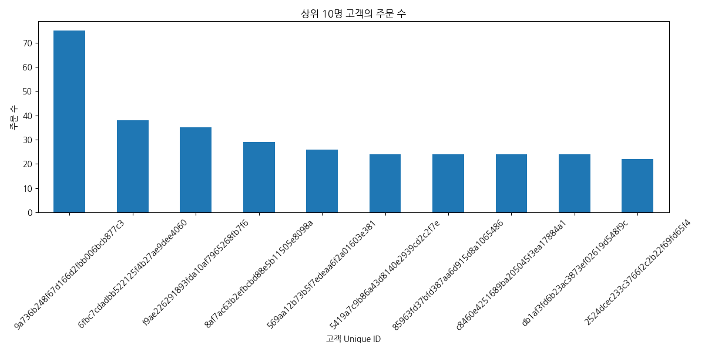

### 상위 10명 고객 주문 수 교차표

| customer_unique_id               |   count |
|:---------------------------------|--------:|
| 9a736b248f67d166d2fbb006bcb877c3 |      75 |
| 6fbc7cdadbb522125f4b27ae9dee4060 |      38 |
| f9ae226291893fda10af7965268fb7f6 |      35 |
| 8af7ac63b2efbcbd88e5b11505e8098a |      29 |
| 569aa12b73b5f7edeaa6f2a01603e381 |      26 |
| 5419a7c9b86a43d8140e2939cd2c2f7e |      24 |
| 85963fd37bfd387aa6d915d8a1065486 |      24 |
| c8460e4251689ba205045f3ea17884a1 |      24 |
| db1af3fd6b23ac3873ef02619d548f9c |      24 |
| 2524dcec233c3766f2c2b22f69fd65f4 |      22 |

## 9. 상품 가격 분포

판매되는 상품들의 가격대 분포를 확인합니다. 대부분의 상품이 어느 가격대에 집중되어 있는지 파악할 수 있습니다.

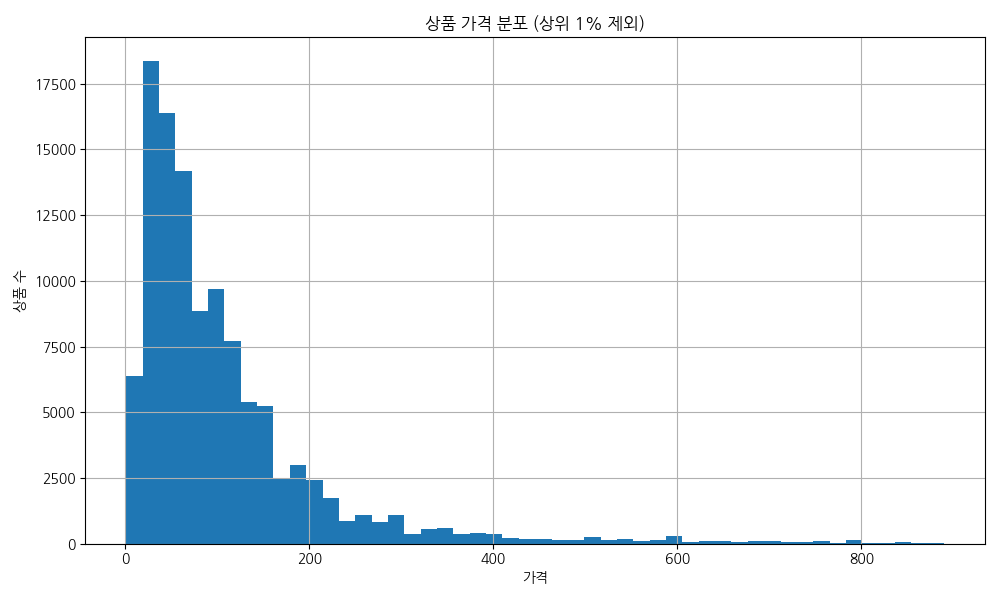

### 가격 기초 통계량

|       |      price |
|:------|-----------:|
| count | 112650     |
| mean  |    120.654 |
| std   |    183.634 |
| min   |      0.85  |
| 25%   |     39.9   |
| 50%   |     74.99  |
| 75%   |    134.9   |
| max   |   6735     |

## 10. 배송비 분포

배송비의 분포를 확인하여 평균적인 배송비 수준과 이상치를 파악합니다. 가격 정책 수립 시 참고할 수 있습니다.

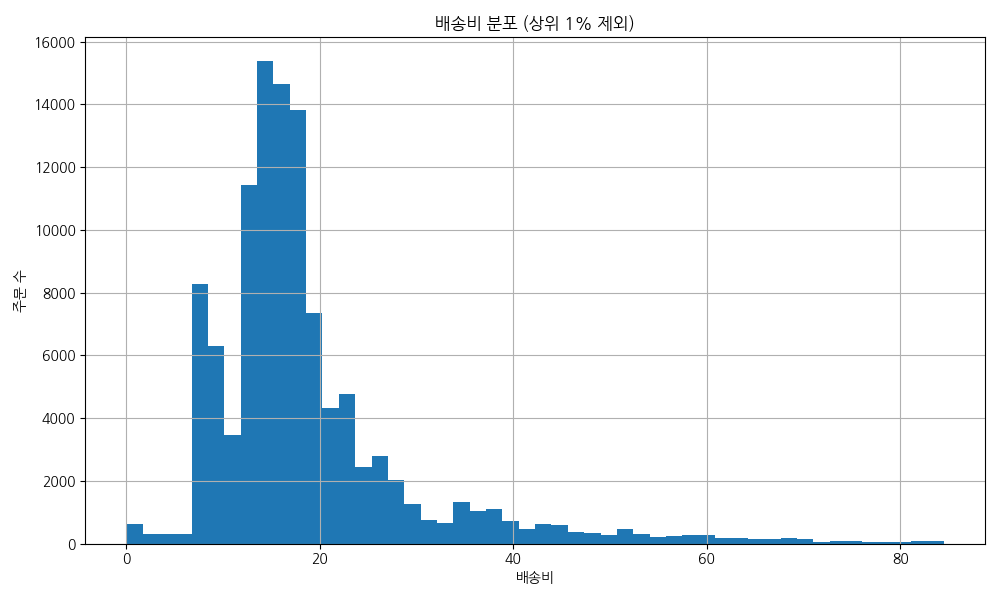

### 배송비 기초 통계량

|       |   freight_value |
|:------|----------------:|
| count |     112650      |
| mean  |         19.9903 |
| std   |         15.8064 |
| min   |          0      |
| 25%   |         13.08   |
| 50%   |         16.26   |
| 75%   |         21.15   |
| max   |        409.68   |

## 11. 인기 상품 (판매 수량 기준)

가장 많이 팔린 상위 10개 상품을 분석합니다. 상품 카테고리 이름을 기준으로 수량을 집계합니다.

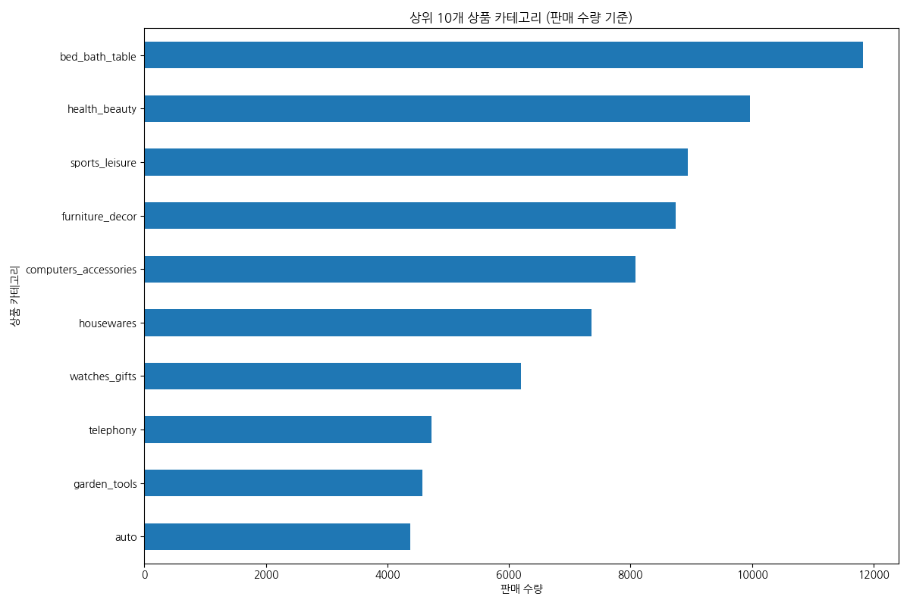

### 상위 10개 상품 판매 수량 교차표

| product_category_name_english   |   order_item_id |
|:--------------------------------|----------------:|
| bed_bath_table                  |           11823 |
| health_beauty                   |            9972 |
| sports_leisure                  |            8945 |
| furniture_decor                 |            8744 |
| computers_accessories           |            8082 |
| housewares                      |            7355 |
| watches_gifts                   |            6201 |
| telephony                       |            4721 |
| garden_tools                    |            4574 |
| auto                            |            4379 |

## 한국어로 답변할 것