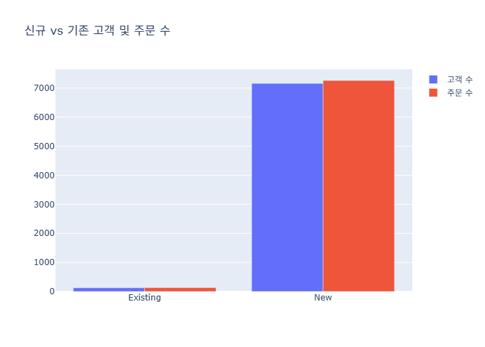
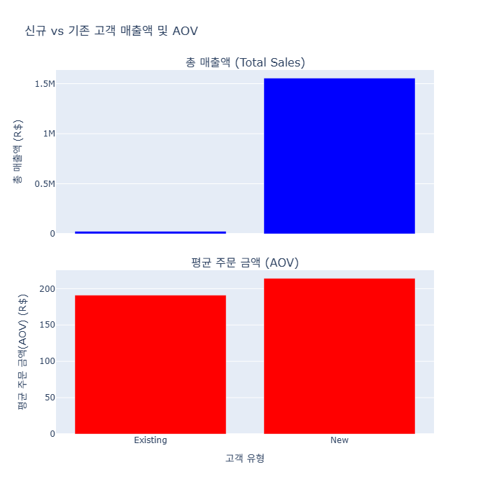
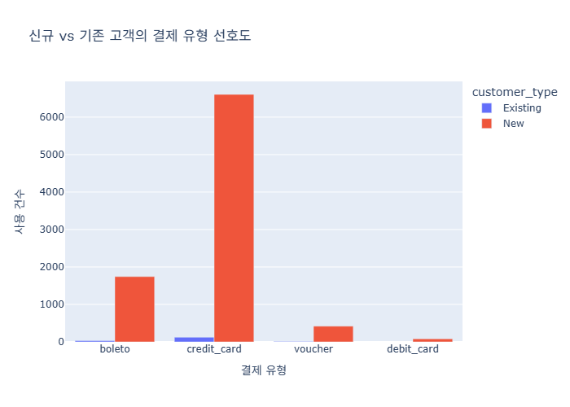
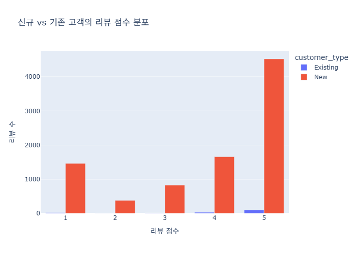
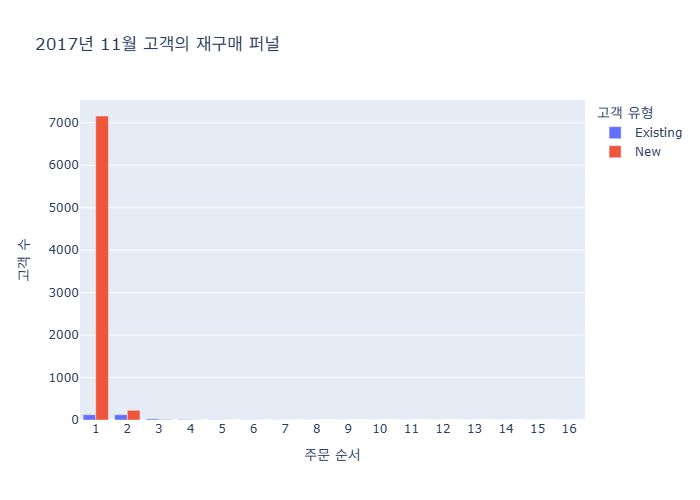
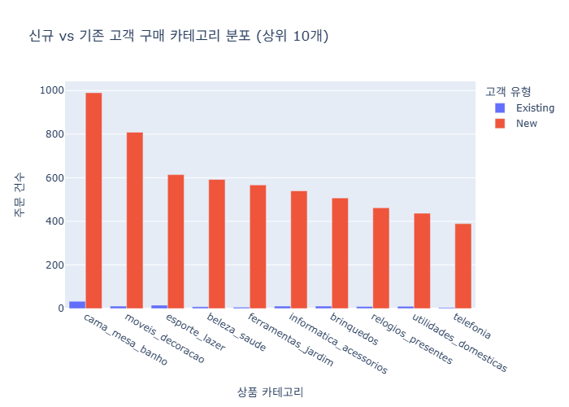
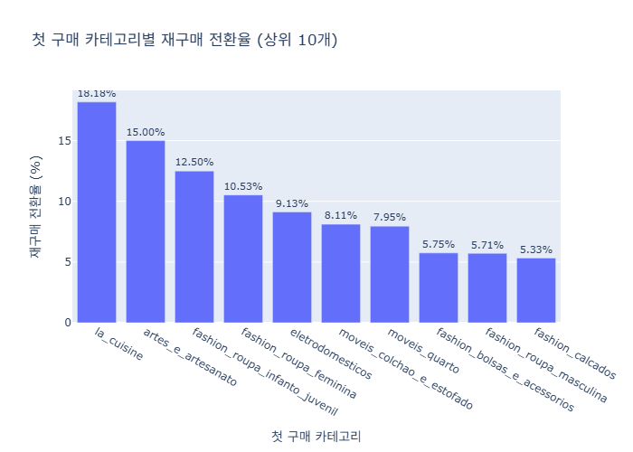

# 2017년 11월 신규 vs 기존 고객 행동 분석

이 보고서는 2017년 11월에 구매한 고객을 첫 구매 시점에 따라 '신규'와 '기존'으로 나누어 그들의 소비 패턴과 행동을 비교 분석합니다.

## 1. 고객 및 주문 수

2017년 11월의 구매 활동을 신규 고객과 기존 고객 그룹으로 나누어 고객 수와 총 주문 건수를 비교합니다.

### 요약표

| 고객 유형   |   고객 수 |   주문 수 |
|:------------|----------:|----------:|
| Existing    |       124 |       130 |
| New         |      7159 |      7260 |

## 2. 매출액 및 평균 주문 금액(AOV)

신규 고객과 기존 고객이 발생시킨 총 매출액과 1인당 평균 주문 금액(AOV)을 비교하여 그룹별 구매력 차이를 확인합니다.

### 요약표

| customer_type   |     total_sales |   total_orders |     aov |
|:----------------|----------------:|---------------:|--------:|
| Existing        | 24826.9         |            130 | 190.976 |
| New             |     1.55458e+06 |           7260 | 214.13  |

## 3. 결제 유형 선호도

각 고객 그룹이 선호하는 결제 수단에 차이가 있는지 확인합니다.

### 교차표

| payment_type   |   Existing |   New |
|:---------------|-----------:|------:|
| boleto         |         30 |  1742 |
| credit_card    |        123 |  6606 |
| debit_card     |          0 |    81 |
| voucher        |         13 |   419 |

## 4. 리뷰 점수

신규 고객과 기존 고객의 구매 경험 만족도에 차이가 있는지 리뷰 점수를 통해 확인합니다.

### 교차표

|   review_score |   Existing |   New |
|---------------:|-----------:|------:|
|              1 |         19 |  1461 |
|              2 |          5 |   378 |
|              3 |         11 |   827 |
|              4 |         29 |  1659 |
|              5 |        102 |  4523 |

## 5. 재구매 퍼널 분석

2017년 11월에 구매 활동을 한 고객들을 대상으로 재구매 행동을 분석하여 퍼널을 시각화합니다.

### 퍼널 요약표

| customer_category   |   order_sequence |   num_customers |
|:--------------------|-----------------:|----------------:|
| Existing            |                1 |             124 |
| Existing            |                2 |             124 |
| Existing            |                3 |              26 |
| Existing            |                4 |              11 |
| Existing            |                5 |               5 |
| Existing            |                6 |               4 |
| Existing            |                7 |               2 |
| Existing            |                8 |               1 |
| Existing            |                9 |               1 |
| Existing            |               10 |               1 |
| Existing            |               11 |               1 |
| Existing            |               12 |               1 |
| Existing            |               13 |               1 |
| Existing            |               14 |               1 |
| Existing            |               15 |               1 |
| Existing            |               16 |               1 |
| New                 |                1 |            7159 |
| New                 |                2 |             228 |
| New                 |                3 |              13 |
| New                 |                4 |               3 |
| New                 |                5 |               2 |
| New                 |                6 |               1 |
| New                 |                7 |               1 |

## 6. 구매 카테고리 분석

신규 및 기존 고객 그룹이 어떤 상품 카테고리를 주로 구매하는지 분석합니다. 이번 분석에서는 각 카테고리별로 신규 및 기존 고객의 주문 건수를 비교합니다.

### 카테고리별 주문 건수 요약표

| product_category_name   | customer_type   |   order_count |
|:------------------------|:----------------|--------------:|
| cama_mesa_banho         | Existing        |            33 |
| cama_mesa_banho         | New             |           990 |
| moveis_decoracao        | Existing        |            11 |
| moveis_decoracao        | New             |           809 |
| esporte_lazer           | Existing        |            15 |
| esporte_lazer           | New             |           614 |
| beleza_saude            | Existing        |             8 |
| beleza_saude            | New             |           592 |
| ferramentas_jardim      | Existing        |             6 |
| ferramentas_jardim      | New             |           567 |
| informatica_acessorios  | Existing        |            11 |
| informatica_acessorios  | New             |           540 |
| brinquedos              | Existing        |            11 |
| brinquedos              | New             |           507 |
| relogios_presentes      | Existing        |             9 |
| relogios_presentes      | New             |           462 |
| utilidades_domesticas   | Existing        |            10 |
| utilidades_domesticas   | New             |           437 |
| telefonia               | Existing        |             4 |
| telefonia               | New             |           389 |

## 7. 첫 구매 카테고리별 재구매 전환율

고객이 처음 구매한 상품 카테고리가 재구매에 어떤 영향을 미치는지 분석하여 카테고리별 재구매 전환율을 시각화합니다.

### 첫 구매 카테고리별 재구매 전환율 요약표

| first_purchase_category       |   total_first_time_customers |   repurchasing_customers |   repurchase_rate |
|:------------------------------|-----------------------------:|-------------------------:|------------------:|
| la_cuisine                    |                           11 |                        2 |          18.1818  |
| artes_e_artesanato            |                           20 |                        3 |          15       |
| fashion_roupa_infanto_juvenil |                            8 |                        1 |          12.5     |
| fashion_roupa_feminina        |                           38 |                        4 |          10.5263  |
| eletrodomesticos              |                          690 |                       63 |           9.13043 |
| moveis_colchao_e_estofado     |                           37 |                        3 |           8.10811 |
| moveis_quarto                 |                           88 |                        7 |           7.95455 |
| fashion_bolsas_e_acessorios   |                         1723 |                       99 |           5.74579 |
| fashion_roupa_masculina       |                          105 |                        6 |           5.71429 |
| fashion_calcados              |                          225 |                       12 |           5.33333 |

## 8. 데이터 분석 기반 전략 제안

위 분석 결과를 바탕으로, 2017년 11월 데이터에서 나타난 고객 행동에 대한 전략적 제안을 아래와 같이 정리합니다.

### 1. 고객 전략 (Customer Strategy)

**핵심 인사이트:** 신규 고객의 수가 압도적으로 많지만, 첫 구매 이후 재구매로 이어지는 비율이 매우 낮습니다. 반면, 기존 고객은 비록 수는 적지만 꾸준히 재구매를 하는 충성도 높은 행동을 보입니다. 따라서 핵심 과제는 **신규 고객을 충성도 높은 기존 고객으로 전환**하는 것입니다.

**액션 아이템:**
-   **재구매 유도 캠페인:** 첫 구매를 완료한 신규 고객에게 감사 메시지와 함께 다음 구매 시 사용할 수 있는 할인 쿠폰을 제공하는 이메일/앱 푸시 캠페인을 자동화합니다.
-   **충성도 프로그램 도입:** 구매 금액이나 횟수에 따라 포인트를 적립하고, 이를 현금처럼 사용할 수 있는 로열티 프로그램을 도입하여 재구매를 장려합니다.
-   **부정 리뷰 분석 및 개선:** 신규 고객이 남긴 1점 리뷰의 원인(배송 지연, 상품 불만, 고객 서비스 등)을 심층 분석하여 첫 구매 경험의 문제점을 파악하고 개선합니다.
-   **개인화 추천 강화:** 첫 구매 카테고리 데이터를 기반으로 고객이 관심을 가질 만한 상품을 추천하여 재구매를 유도합니다.

### 2. 셀러 전략 (Seller Strategy)

**핵심 인사이트:** 플랫폼의 성장은 결국 셀러들의 성장에 달려있습니다. 대부분의 고객이 신규 고객이라는 점은 셀러들에게도 '단골 확보'가 중요한 과제임을 시사합니다.

**액션 아이템:**
-   **셀러 교육 및 데이터 제공:** 셀러들에게 신규 고객과 기존 고객의 차이, 재구매의 중요성을 교육하고, 자신의 스토어에 방문한 고객의 재구매율 데이터를 확인할 수 있는 대시보드를 제공합니다.
-   **우수 셀러 인센티브:** 고객 재구매율이 높은 셀러나, 좋은 리뷰를 꾸준히 받는 셀러에게 수수료 할인, 광고 지원, 상위 노출 등의 혜택을 제공하여 동기를 부여합니다.
-   **고객 관계 관리(CRM) 기능 지원:** 셀러가 자신의 고객에게 할인 쿠폰이나 신상품 소식을 직접 발송할 수 있는 간단한 CRM 기능을 플랫폼 차원에서 제공하는 것을 고려합니다.
-   **재구매율이 높은 카테고리 셀러 지원:** '첫 구매 카테고리별 재구매 전환율' 분석(분석 7)에서 전환율이 높게 나타난 카테고리의 셀러들을 집중적으로 지원하여 이탈률을 낮추고 성공 사례를 만듭니다.

### 3. 운영 전략 (Operational Strategy)

**핵심 인사이트:** 플랫폼 운영의 핵심은 신규 고객이 불편함 없이 첫 구매를 마치고, 만족스러운 경험을 통해 다시 방문하도록 만드는 것입니다. 특히, 신규 고객의 유입이 많은 만큼 첫 구매와 관련된 프로세스 최적화가 중요합니다.

**액션 아이템:**
-   **첫 구매 경험 최적화:** 신규 고객의 회원가입, 상품 탐색, 주문, 결제 과정에서 이탈이 발생하는 지점을 데이터로 분석하고 사용자 인터페이스(UI/UX)를 개선합니다.
-   **물류 및 배송 프로세스 점검:** 부정적인 리뷰의 주요 원인이 배송 문제일 가능성이 높으므로, 특히 신규 고객 주문 건에 대한 배송 시간을 단축하고 배송 과정을 투명하게 추적할 수 있는 시스템을 강화합니다.
-   **핵심 카테고리 집중 관리:** 신규/기존 고객 모두에게 인기가 많은 상위 카테고리(`cama_mesa_banho`, `moveis_decoracao` 등)의 상품 재고가 부족하지 않도록 관리하고, 해당 카테고리 상품의 품질을 지속적으로 점검합니다.
-   **데이터 기반 의사결정 문화 확산:** 이와 같은 분석을 정기적으로 수행하고, 그 결과를 바탕으로 모든 부서(마케팅, 영업, 운영)가 데이터에 기반하여 전략을 수립하고 실행하도록 문화를 구축합니다.