# Instacart 데이터 EDA 분석 보고서 (계획 기반)

## 1. 데이터셋 기본 정보

### aisles.csv
- Shape: (134, 2)
- Missing values:
```
aisle_id    0
aisle       0
```
- Info:
```
<class 'pandas.core.frame.DataFrame'>
RangeIndex: 134 entries, 0 to 133
Data columns (total 2 columns):
 #   Column    Non-Null Count  Dtype 
---  ------    --------------  ----- 
 0   aisle_id  134 non-null    int64 
 1   aisle     134 non-null    object
dtypes: int64(1), object(1)
memory usage: 2.2+ KB

```
- Description:
```
         aisle_id
count  134.000000
mean    67.500000
std     38.826537
min      1.000000
25%     34.250000
50%     67.500000
75%    100.750000
max    134.000000
```

### departments.csv
- Shape: (21, 2)
- Missing values:
```
department_id    0
department       0
```
- Info:
```
<class 'pandas.core.frame.DataFrame'>
RangeIndex: 21 entries, 0 to 20
Data columns (total 2 columns):
 #   Column         Non-Null Count  Dtype 
---  ------         --------------  ----- 
 0   department_id  21 non-null     int64 
 1   department     21 non-null     object
dtypes: int64(1), object(1)
memory usage: 468.0+ bytes

```
- Description:
```
       department_id
count      21.000000
mean       11.000000
std         6.204837
min         1.000000
25%         6.000000
50%        11.000000
75%        16.000000
max        21.000000
```

### order_products_prior.csv
- Shape: (32434489, 4)
- Missing values:
```
order_id             0
product_id           0
add_to_cart_order    0
reordered            0
```
- Info:
```
<class 'pandas.core.frame.DataFrame'>
RangeIndex: 32434489 entries, 0 to 32434488
Data columns (total 4 columns):
 #   Column             Non-Null Count     Dtype
---  ------             --------------     -----
 0   order_id           32434489 non-null  int64
 1   product_id         32434489 non-null  int64
 2   add_to_cart_order  32434489 non-null  int64
 3   reordered          32434489 non-null  int64
dtypes: int64(4)
memory usage: 989.8 MB

```
- Description:
```
           order_id    product_id  add_to_cart_order     reordered
count  3.243449e+07  3.243449e+07       3.243449e+07  3.243449e+07
mean   1.710749e+06  2.557634e+04       8.351076e+00  5.896975e-01
std    9.873007e+05  1.409669e+04       7.126671e+00  4.918886e-01
min    2.000000e+00  1.000000e+00       1.000000e+00  0.000000e+00
25%    8.559430e+05  1.353000e+04       3.000000e+00  0.000000e+00
50%    1.711048e+06  2.525600e+04       6.000000e+00  1.000000e+00
75%    2.565514e+06  3.793500e+04       1.100000e+01  1.000000e+00
max    3.421083e+06  4.968800e+04       1.450000e+02  1.000000e+00
```

### order_products_train.csv
- Shape: (1384617, 4)
- Missing values:
```
order_id             0
product_id           0
add_to_cart_order    0
reordered            0
```
- Info:
```
<class 'pandas.core.frame.DataFrame'>
RangeIndex: 1384617 entries, 0 to 1384616
Data columns (total 4 columns):
 #   Column             Non-Null Count    Dtype
---  ------             --------------    -----
 0   order_id           1384617 non-null  int64
 1   product_id         1384617 non-null  int64
 2   add_to_cart_order  1384617 non-null  int64
 3   reordered          1384617 non-null  int64
dtypes: int64(4)
memory usage: 42.3 MB

```
- Description:
```
           order_id    product_id  add_to_cart_order     reordered
count  1.384617e+06  1.384617e+06       1.384617e+06  1.384617e+06
mean   1.706298e+06  2.555624e+04       8.758044e+00  5.985944e-01
std    9.897326e+05  1.412127e+04       7.423936e+00  4.901829e-01
min    1.000000e+00  1.000000e+00       1.000000e+00  0.000000e+00
25%    8.433700e+05  1.338000e+04       3.000000e+00  0.000000e+00
50%    1.701880e+06  2.529800e+04       7.000000e+00  1.000000e+00
75%    2.568023e+06  3.794000e+04       1.200000e+01  1.000000e+00
max    3.421070e+06  4.968800e+04       8.000000e+01  1.000000e+00
```

### orders.csv
- Shape: (3421083, 7)
- Missing values:
```
order_id                       0
user_id                        0
eval_set                       0
order_number                   0
order_dow                      0
order_hour_of_day              0
days_since_prior_order    206209
```
- Info:
```
<class 'pandas.core.frame.DataFrame'>
RangeIndex: 3421083 entries, 0 to 3421082
Data columns (total 7 columns):
 #   Column                  Non-Null Count    Dtype  
---  ------                  --------------    -----  
 0   order_id                3421083 non-null  int64  
 1   user_id                 3421083 non-null  int64  
 2   eval_set                3421083 non-null  object 
 3   order_number            3421083 non-null  int64  
 4   order_dow               3421083 non-null  int64  
 5   order_hour_of_day       3421083 non-null  int64  
 6   days_since_prior_order  3214874 non-null  float64
dtypes: float64(1), int64(5), object(1)
memory usage: 182.7+ MB

```
- Description:
```
           order_id       user_id  order_number     order_dow  order_hour_of_day  days_since_prior_order
count  3.421083e+06  3.421083e+06  3.421083e+06  3.421083e+06       3.421083e+06            3.214874e+06
mean   1.710542e+06  1.029782e+05  1.715486e+01  2.776219e+00       1.345202e+01            1.111484e+01
std    9.875817e+05  5.953372e+04  1.773316e+01  2.046829e+00       4.226088e+00            9.206737e+00
min    1.000000e+00  1.000000e+00  1.000000e+00  0.000000e+00       0.000000e+00            0.000000e+00
25%    8.552715e+05  5.139400e+04  5.000000e+00  1.000000e+00       1.000000e+01            4.000000e+00
50%    1.710542e+06  1.026890e+05  1.100000e+01  3.000000e+00       1.300000e+01            7.000000e+00
75%    2.565812e+06  1.543850e+05  2.300000e+01  5.000000e+00       1.600000e+01            1.500000e+01
max    3.421083e+06  2.062090e+05  1.000000e+02  6.000000e+00       2.300000e+01            3.000000e+01
```

### products.csv
- Shape: (49688, 4)
- Missing values:
```
product_id       0
product_name     0
aisle_id         0
department_id    0
```
- Info:
```
<class 'pandas.core.frame.DataFrame'>
RangeIndex: 49688 entries, 0 to 49687
Data columns (total 4 columns):
 #   Column         Non-Null Count  Dtype 
---  ------         --------------  ----- 
 0   product_id     49688 non-null  int64 
 1   product_name   49688 non-null  object
 2   aisle_id       49688 non-null  int64 
 3   department_id  49688 non-null  int64 
dtypes: int64(3), object(1)
memory usage: 1.5+ MB

```
- Description:
```
         product_id      aisle_id  department_id
count  49688.000000  49688.000000   49688.000000
mean   24844.500000     67.769582      11.728687
std    14343.834425     38.316162       5.850410
min        1.000000      1.000000       1.000000
25%    12422.750000     35.000000       7.000000
50%    24844.500000     69.000000      13.000000
75%    37266.250000    100.000000      17.000000
max    49688.000000    134.000000      21.000000
```

## 2. 주문 시간 분석

### 시간대별 주문량
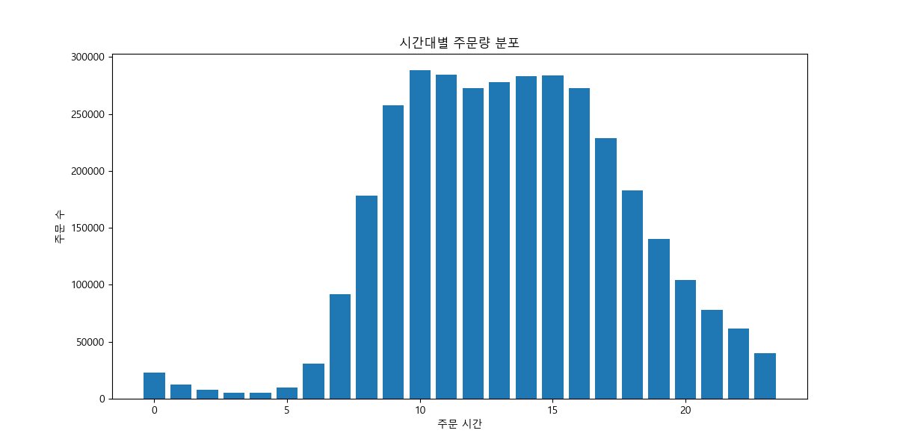
- 주문은 주로 오전 9시부터 오후 5시 사이에 집중됩니다.

### 요일별 주문량
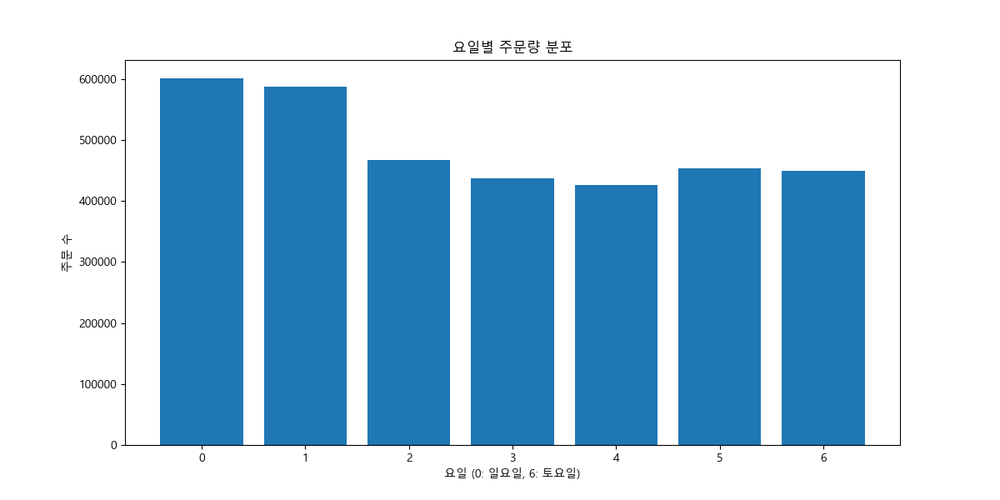
- 0(일요일)과 1(월요일)에 주문이 가장 많으며, 주말로 갈수록 주문량이 줄어드는 경향을 보입니다.

## 3. 상품 분석

### 가장 많이 팔린 상품 TOP 20
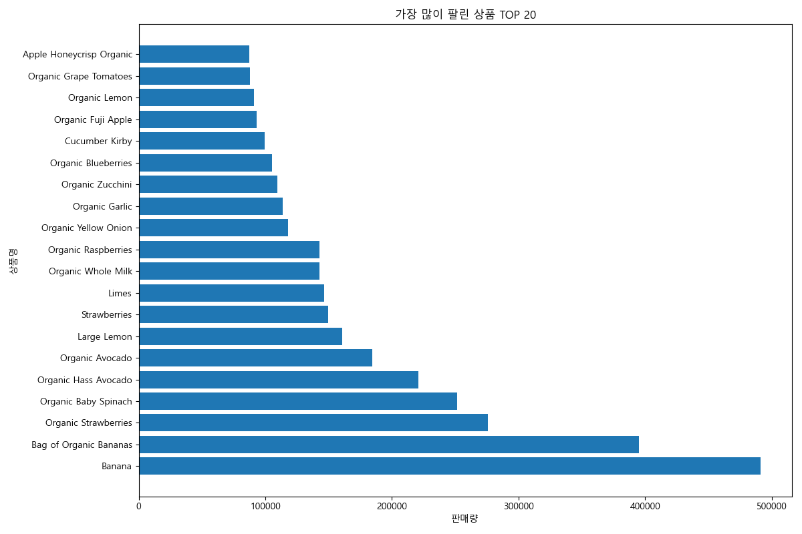
- 바나나, 유기농 딸기, 유기농 아보카도 등이 가장 인기가 많습니다.

### 가장 많이 재주문된 상품 TOP 20
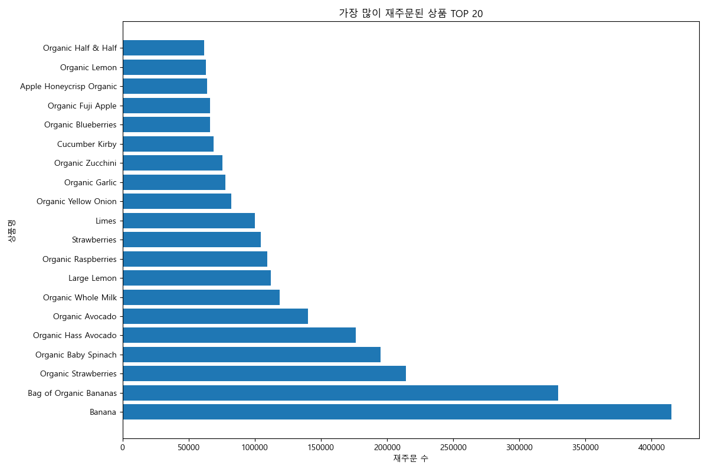
- 판매량 상위 상품들이 재주문 순위에서도 상위권을 차지하고 있습니다.

## 4. 재주문율 분석

### 전체 상품 재주문 비율
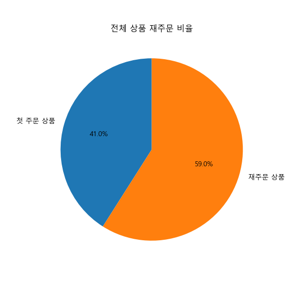
- 전체 주문 상품 중 약 59.0%가 재주문된 상품입니다.

## 5. 부서별 판매량 분석

### 부서별 판매량
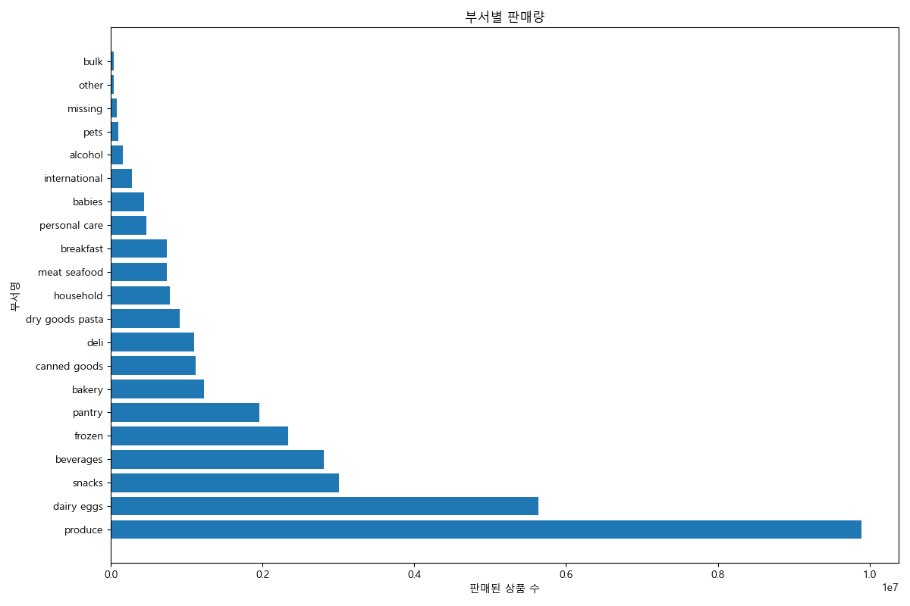
- `produce` 부서가 압도적으로 높은 판매량을 보입니다. 이어서 `dairy eggs`, `snacks` 등이 높은 판매량을 기록합니다.

## 6. 아이슬별 판매량 분석

### 아이슬별 판매량 (Top 20)
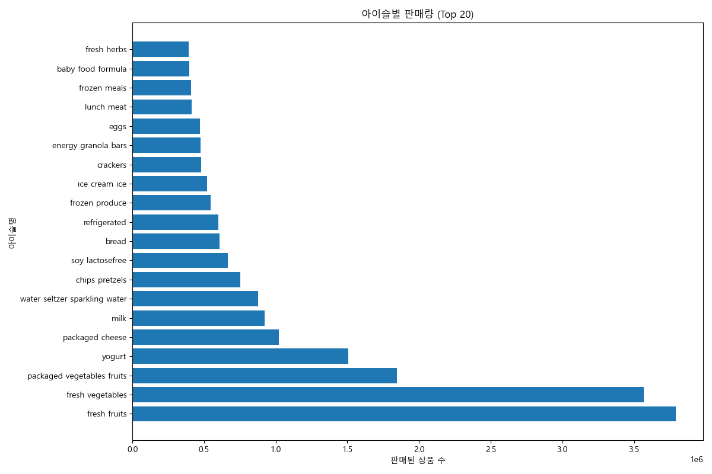
- `fresh fruits`, `fresh vegetables` 아이슬이 가장 높은 판매량을 보입니다.

## 7. 장바구니 순서와 재주문율 관계 분석

### 장바구니 순서별 재주문율
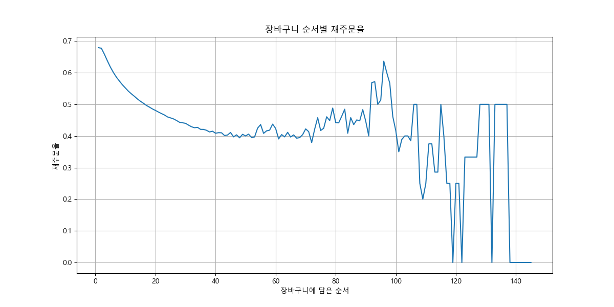
- 장바구니에 먼저 담는 상품일수록 재주문율이 높은 경향을 보입니다. 이는 소비자들이 자주 구매하는 품목을 먼저 장바구니에 담는 습관이 있음을 시사합니다.

## 8. 주문 규모 분석

### 주문당 상품 개수
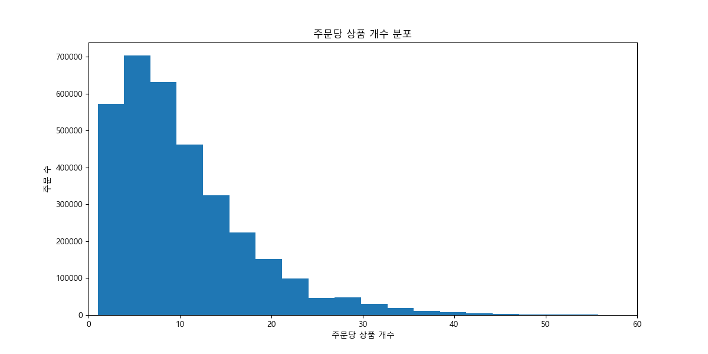
- 대부분의 주문은 5개에서 15개 사이의 상품을 포함하고 있습니다.

## 9. 사용자별 주문 행동 분석

### 사용자별 총 주문 수 분포
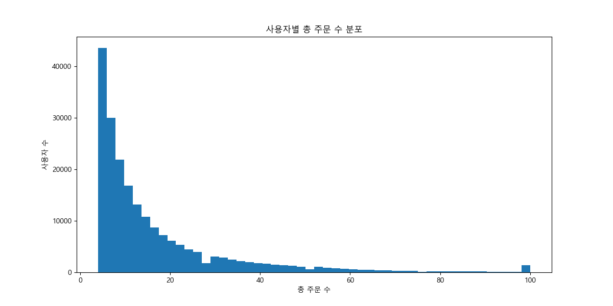
- 대부분의 사용자는 5회에서 20회 사이의 주문을 했습니다. 극소수의 활성 사용자가 매우 많은 주문을 한 것을 볼 수 있습니다.

### 사용자별 평균 재주문 간격 분포
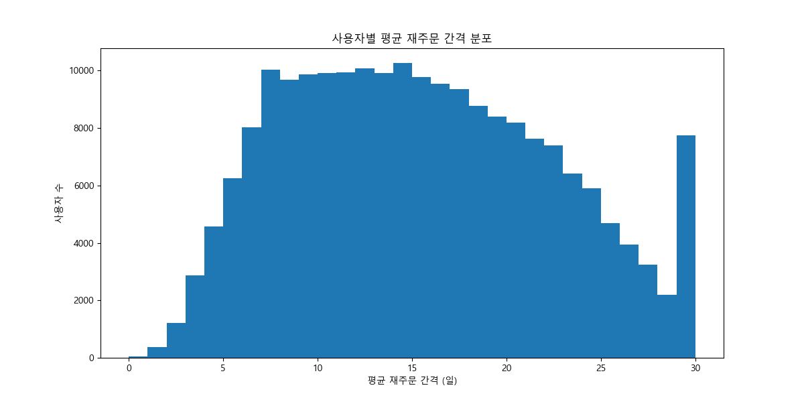
- 많은 사용자들이 7일 또는 30일 간격으로 주문하는 경향이 있습니다. 이는 주간 또는 월간 단위의 정기 구매 패턴을 시사합니다.

## 10. 사용자-상품별 재구매 분석

### 사용자별 상품 재주문 횟수 분포
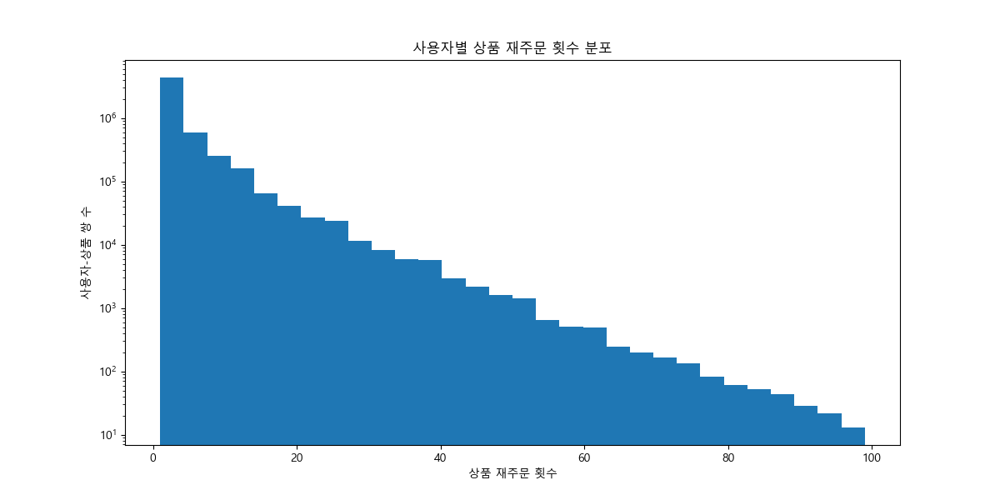
- 대부분의 사용자-상품 쌍은 1-2회의 재주문을 보입니다. 재주문 횟수가 증가할수록 해당 사용자-상품 쌍의 수는 급격히 감소합니다.

### 가장 많이 재주문된 사용자-상품 쌍 (상위 10개)
```
 user_id                            product_name  reorder_count
   41356        Yerba Mate Orange Exuberance Tea             99
   41356                  Enlighten Mint Organic             99
   41356 Oraganic Lemon Elation Yerba Mate Drink             99
   41356           Organic Bluephoria Yerba Mate             98
   17997                              Whole Milk             98
  141736                   Organic String Cheese             98
  103593                      Organic Fuji Apple             98
   99707                                  Banana             97
  120897                              Pinot Noir             97
   98085                                    Soda             96
```

- 특정 상품을 매우 자주 재주문하는 사용자 쌍이 존재합니다. 이는 충성도 높은 고객과 그들이 선호하는 상품을 파악하는 데 중요합니다.

