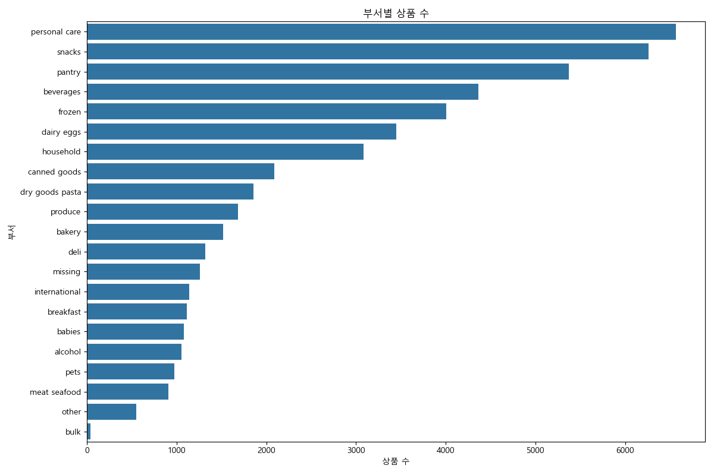

# Instacart 부서 데이터 EDA 분석 보고서

## 1. 개요
이 보고서는 Instacart의 `departments.csv` 데이터셋에 대한 탐색적 데이터 분석(EDA) 결과를 요약합니다.

## 2. 데이터 미리보기
### departments.csv
```
   department_id department
0              1     frozen
1              2      other
2              3     bakery
3              4    produce
4              5    alcohol
```

## 3. 분석 결과
### 3.1. 부서별 상품 수

- `personal care`, `snacks`, `pantry`, `beverages` 부서가 가장 많은 상품을 보유하고 있습니다.
- `bulk` 부서가 가장 적은 상품을 보유하고 있습니다.

