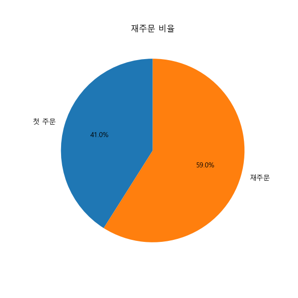
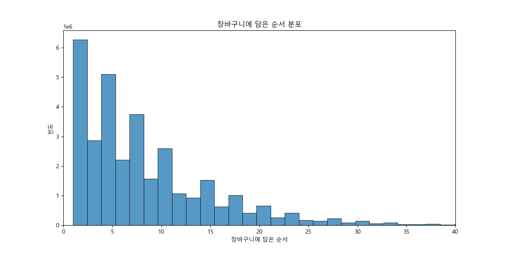
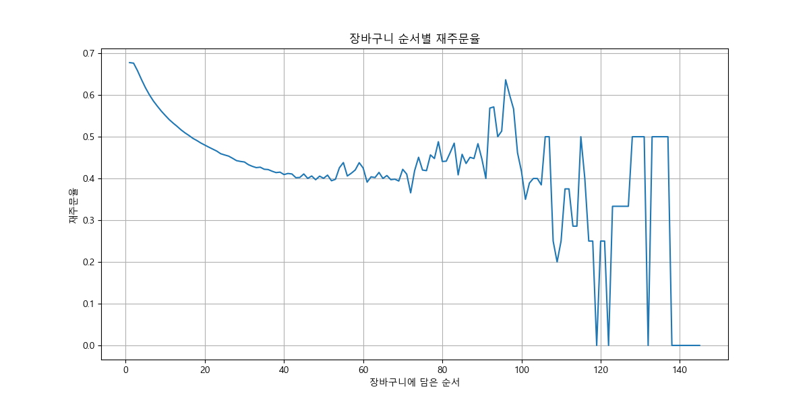

# Instacart 이전 주문 상품 데이터 EDA 분석 보고서

## 1. 개요
이 보고서는 Instacart의 `order_products__prior.csv` 데이터셋에 대한 탐색적 데이터 분석(EDA) 결과를 요약합니다.
이 데이터는 고객의 이전 주문 내역을 담고 있습니다.

## 2. 데이터 미리보기
### order_products__prior.csv
```
   order_id  product_id  add_to_cart_order  reordered
0         2       33120                  1          1
1         2       28985                  2          1
2         2        9327                  3          0
3         2       45918                  4          1
4         2       30035                  5          0
```

## 3. 분석 결과
### 3.1. 재주문 비율

- 이전 주문 상품 중 약 59.0%가 재주문된 상품입니다.

### 3.2. 장바구니에 담은 순서 분포

- 상품들은 대부분 장바구니 앞 순서에 담기는 경향이 있습니다.

### 3.3. 장바구니 순서별 재주문율

- 장바구니에 먼저 담기는 상품일수록 재주문율이 높게 나타납니다.
- 이는 고객들이 자주 구매하는 상품을 장바구니에 먼저 담는 경향이 있음을 시사합니다.

