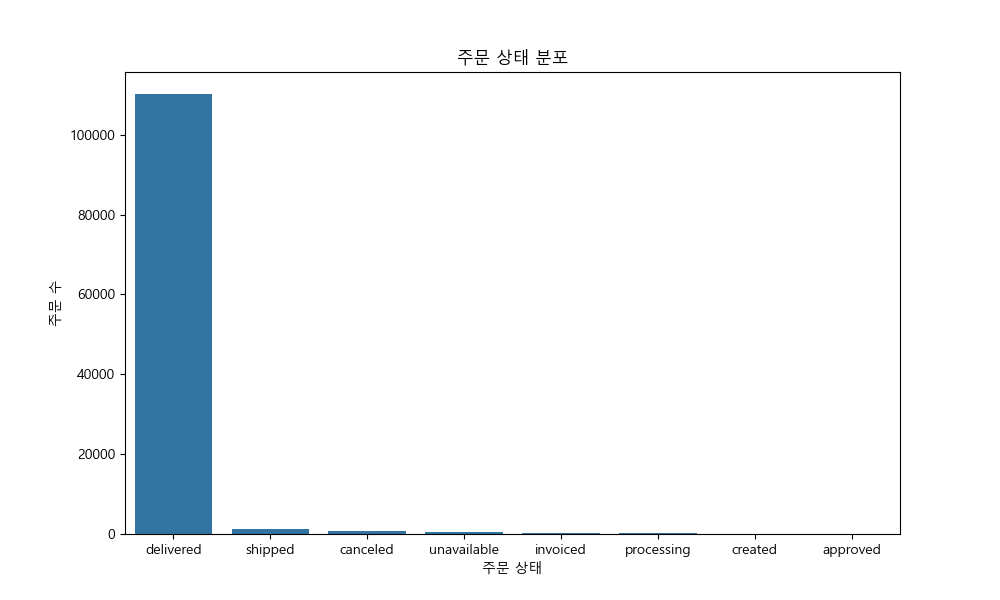
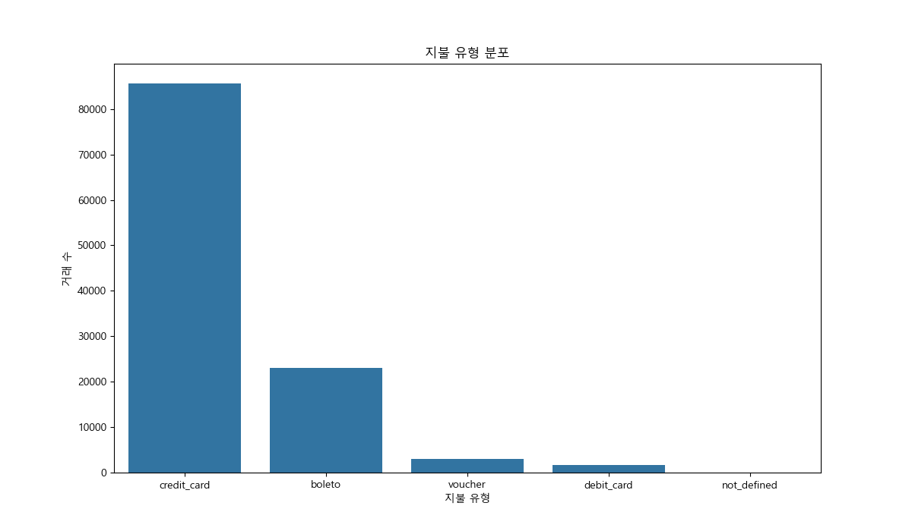
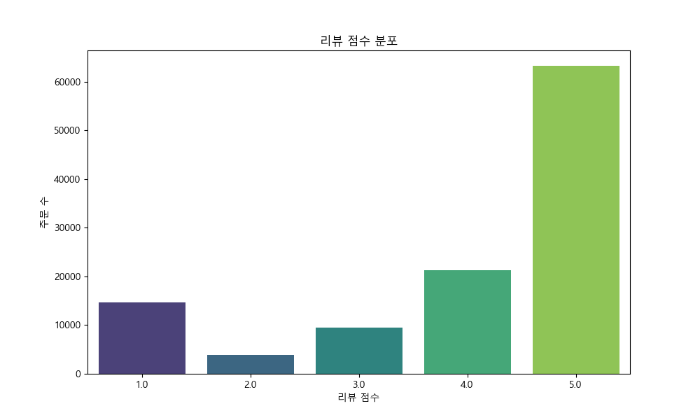
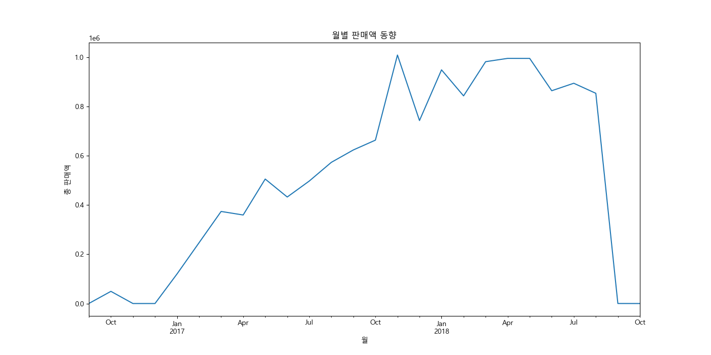
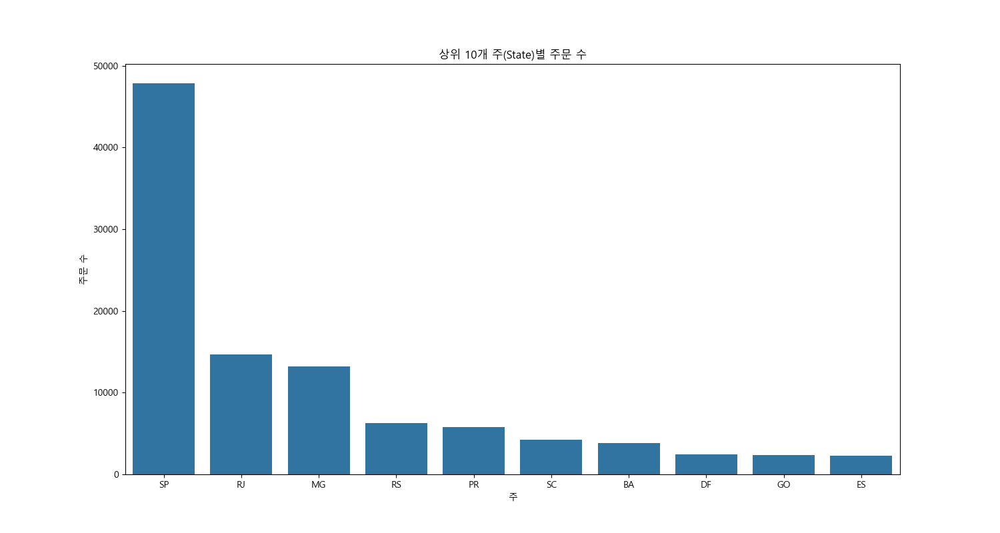
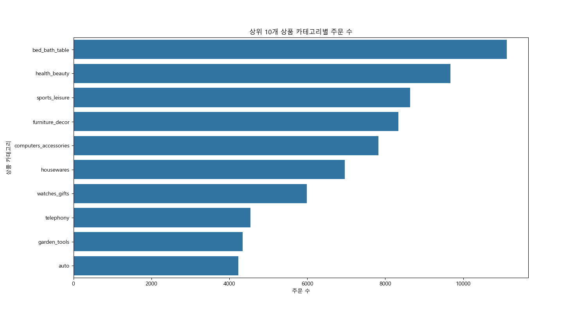
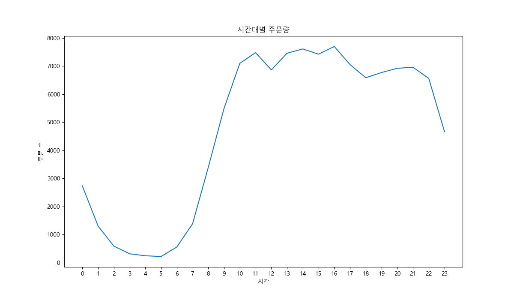
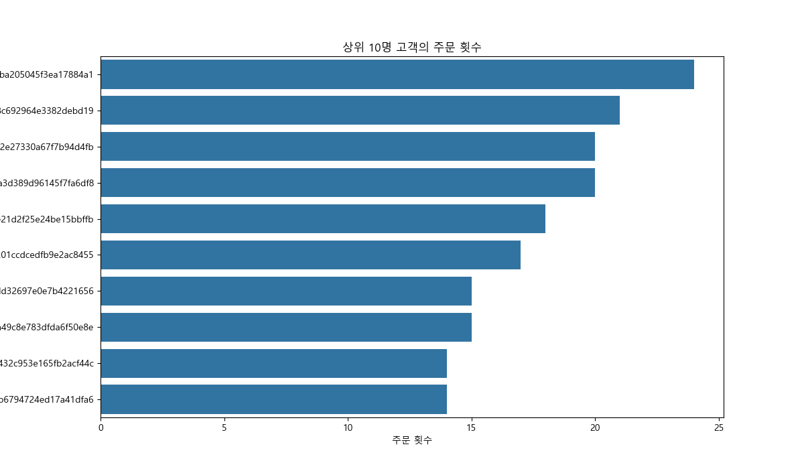
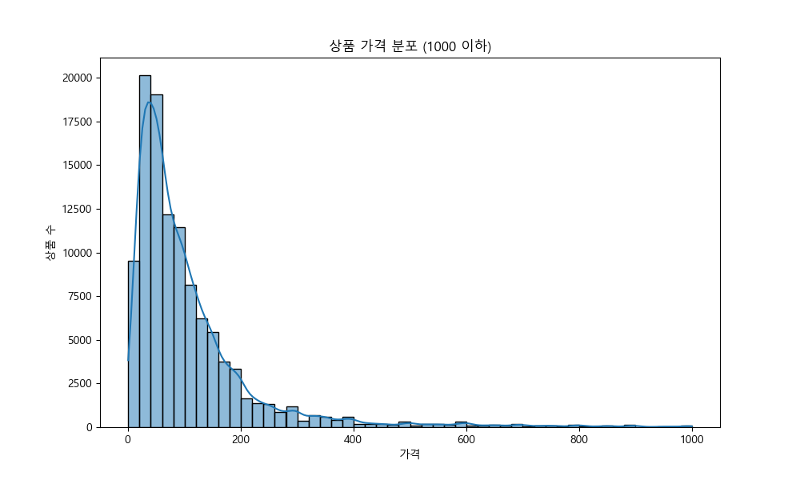
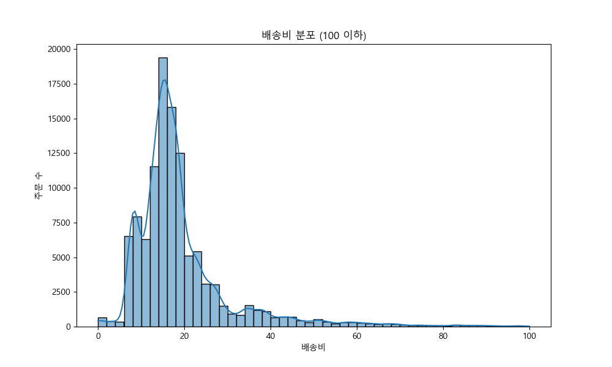

# Olist E-commerce 데이터셋 EDA 보고서

이 보고서는 Olist E-commerce 데이터셋에 대한 탐색적 데이터 분석(EDA) 결과를 요약합니다.

## 1. 데이터 기본 정보

### 처음 5개 행:
```
                           order_id                       customer_id order_status order_purchase_timestamp    order_approved_at order_delivered_carrier_date order_delivered_customer_date order_estimated_delivery_date                customer_unique_id  customer_zip_code_prefix            customer_city customer_state  order_item_id                        product_id                         seller_id  shipping_limit_date   price  freight_value  product_category_name  product_name_lenght  product_description_lenght  product_photos_qty  product_weight_g  product_length_cm  product_height_cm  product_width_cm product_category_name_english  payment_sequential payment_type  payment_installments  payment_value                         review_id  review_score review_comment_title                                                                                                                                                      review_comment_message review_creation_date review_answer_timestamp  seller_zip_code_prefix      seller_city seller_state
0  e481f51cbdc54678b7cc49136f2d6af7  9ef432eb6251297304e76186b10a928d    delivered      2017-10-02 10:56:33  2017-10-02 11:07:15          2017-10-04 19:55:00           2017-10-10 21:25:13           2017-10-18 00:00:00  7c396fd4830fd04220f754e42b4e5bff                      3149                sao paulo             SP            1.0  87285b34884572647811a353c7ac498a  3504c0cb71d7fa48d967e0e4c94d59d9  2017-10-06 11:07:15   29.99           8.72  utilidades_domesticas                 40.0                       268.0                 4.0             500.0               19.0                8.0              13.0                    housewares                 1.0  credit_card                   1.0          18.12  a54f0611adc9ed256b57ede6b6eb5114           4.0                  NaN  Não testei o produto ainda, mas ele veio correto e em boas condições. Apenas a caixa que veio bem amassada e danificada, o que ficará chato, pois se trata de um presente.  2017-10-11 00:00:00     2017-10-12 03:43:48                  9350.0             maua           SP
1  53cdb2fc8bc7dce0b6741e2150273451  b0830fb4747a6c6d20dea0b8c802d7ef    delivered      2018-07-24 20:41:37  2018-07-26 03:24:27          2018-07-26 14:31:00           2018-08-07 15:27:45           2018-08-13 00:00:00  af07308b275d755c9edb36a90c618231                     47813                barreiras             BA            1.0  595fac2a385ac33a80bd5114aec74eb8  289cdb325fb7e7f891c38608bf9e0962  2018-07-30 03:24:27  118.70          22.76             perfumaria                 29.0                       178.0                 1.0             400.0               19.0               13.0              19.0                     perfumery                 1.0       boleto                   1.0         141.46  8d5266042046a06655c8db133d120ba5           4.0     Muito boa a loja                                                                                                                                                        Muito bom o produto.  2018-08-08 00:00:00     2018-08-08 18:37:50                 31570.0   belo horizonte           SP
2  47770eb9100c2d0c44946d9cf07ec65d  41ce2a54c0b03bf3443c3d931a367089    delivered      2018-08-08 08:38:49  2018-08-08 08:55:23          2018-08-08 13:50:00           2018-08-17 18:06:29           2018-09-04 00:00:00  3a653a41f6f9fc3d2a113cf8398680e8                     75265               vianopolis             GO            1.0  aa4383b373c6aca5d8797843e5594415  4869f7a5dfa277a7dca6462dcf3b52b2  2018-08-13 08:55:23  159.90          19.22             automotivo                 46.0                       232.0                 1.0             420.0               24.0               19.0              21.0                          auto                 1.0  credit_card                   3.0         179.12  e73b67b67587f7644d5bd1a52deb1b01           5.0                  NaN                                                                                                                                                                         NaN  2018-08-18 00:00:00     2018-08-22 19:07:58                 14840.0          guariba           SP
3  949d5b44dbf5de918fe9c16f97b45f8a  f88197465ea7920adcdbec7375364d82    delivered      2017-11-18 19:28:06  2017-11-18 19:45:59          2017-11-22 13:39:59           2017-12-02 00:28:42           2017-12-15 00:00:00  7c142cf63193a1473d2e66489a9ae977                     59296  sao goncalo do amarante             RN            1.0  d0b61bfb1de832b15ba9d266ca96e5b0  66922902710d126a0e7d26b0e3805106  2017-11-23 19:45:59   45.00          27.20               pet_shop                 59.0                       468.0                 3.0             450.0               30.0               10.0              20.0                      pet_shop                 1.0  credit_card                   1.0          72.20  359d03e676b3c069f62cadba8dd3f6e8           5.0                  NaN                                                                   O produto foi exatamente o que eu esperava e estava descrito no site e chegou bem antes da data prevista.  2017-12-03 00:00:00     2017-12-05 19:21:58                 31842.0   belo horizonte           MG
4  ad21c59c0840e6cb83a9ceb5573f8159  8ab97904e6daea8866dbdbc4fb7aad2c    delivered      2018-02-13 21:18:39  2018-02-13 22:20:29          2018-02-14 19:46:34           2018-02-16 18:17:02           2018-02-26 00:00:00  72632f0f9dd73dfee390c9b22eb56dd6                      9195              santo andre             SP            1.0  65266b2da20d04dbe00c5c2d3bb7859e  2c9e548be18521d1c43cde1c582c6de8  2018-02-19 20:31:37   19.90           8.72              papelaria                 38.0                       316.0                 4.0             250.0               51.0               15.0              15.0                    stationery                 1.0  credit_card                   1.0          28.62  e50934924e227544ba8246aeb3770dd4           5.0                  NaN                                                                                                                                                                         NaN  2018-02-17 00:00:00     2018-02-18 13:02:51                  8752.0  mogi das cruzes           SP
```

### 데이터 정보:
```
<class 'pandas.core.frame.DataFrame'>
RangeIndex: 113425 entries, 0 to 113424
Data columns (total 40 columns):
 #   Column                         Non-Null Count   Dtype  
---  ------                         --------------   -----  
 0   order_id                       113425 non-null  object 
 1   customer_id                    113425 non-null  object 
 2   order_status                   113425 non-null  object 
 3   order_purchase_timestamp       113425 non-null  object 
 4   order_approved_at              113264 non-null  object 
 5   order_delivered_carrier_date   111457 non-null  object 
 6   order_delivered_customer_date  110196 non-null  object 
 7   order_estimated_delivery_date  113425 non-null  object 
 8   customer_unique_id             113425 non-null  object 
 9   customer_zip_code_prefix       113425 non-null  int64  
 10  customer_city                  113425 non-null  object 
 11  customer_state                 113425 non-null  object 
 12  order_item_id                  112650 non-null  float64
 13  product_id                     112650 non-null  object 
 14  seller_id                      112650 non-null  object 
 15  shipping_limit_date            112650 non-null  object 
 16  price                          112650 non-null  float64
 17  freight_value                  112650 non-null  float64
 18  product_category_name          111047 non-null  object 
 19  product_name_lenght            111047 non-null  float64
 20  product_description_lenght     111047 non-null  float64
 21  product_photos_qty             111047 non-null  float64
 22  product_weight_g               112632 non-null  float64
 23  product_length_cm              112632 non-null  float64
 24  product_height_cm              112632 non-null  float64
 25  product_width_cm               112632 non-null  float64
 26  product_category_name_english  111023 non-null  object 
 27  payment_sequential             113422 non-null  float64
 28  payment_type                   113422 non-null  object 
 29  payment_installments           113422 non-null  float64
 30  payment_value                  113422 non-null  float64
 31  review_id                      112464 non-null  object 
 32  review_score                   112464 non-null  float64
 33  review_comment_title           13505 non-null   object 
 34  review_comment_message         47928 non-null   object 
 35  review_creation_date           112464 non-null  object 
 36  review_answer_timestamp        112464 non-null  object 
 37  seller_zip_code_prefix         112650 non-null  float64
 38  seller_city                    112650 non-null  object 
 39  seller_state                   112650 non-null  object 
dtypes: float64(15), int64(1), object(24)
memory usage: 34.6+ MB

```

### 기술 통계 (수치형 변수):
```
       customer_zip_code_prefix  order_item_id          price  freight_value  product_name_lenght  product_description_lenght  product_photos_qty  product_weight_g  product_length_cm  product_height_cm  product_width_cm  payment_sequential  payment_installments  payment_value   review_score  seller_zip_code_prefix
count             113425.000000  112650.000000  112650.000000  112650.000000        111047.000000               111047.000000       111047.000000     112632.000000      112632.000000      112632.000000     112632.000000       113422.000000         113422.000000  113422.000000  112464.000000           112650.000000
mean               35102.472965       1.197834     120.653739      19.990320            48.775978                  787.867029            2.209713       2093.672047          30.153669          16.593766         22.996546            1.022676              3.001331     177.747531       4.017961            24439.170431
std                29864.919733       0.705124     183.633928      15.806405            10.025581                  652.135608            1.721438       3751.596884          16.153449          13.443483         11.707268            0.255595              2.796796     271.586944       1.399391            27596.030909
min                 1003.000000       1.000000       0.850000       0.000000             5.000000                    4.000000            1.000000          0.000000           7.000000           2.000000          6.000000            1.000000              0.000000       0.000000       1.000000             1001.000000
25%                11250.000000       1.000000      39.900000      13.080000            42.000000                  348.000000            1.000000        300.000000          18.000000           8.000000         15.000000            1.000000              1.000000      64.090000       4.000000             6429.000000
50%                24320.000000       1.000000      74.990000      16.260000            52.000000                  603.000000            1.000000        700.000000          25.000000          13.000000         20.000000            1.000000              2.000000     112.440000       5.000000            13568.000000
75%                59020.000000       1.000000     134.900000      21.150000            57.000000                  987.000000            3.000000       1800.000000          38.000000          20.000000         30.000000            1.000000              4.000000     193.447500       5.000000            27930.000000
max                99990.000000      21.000000    6735.000000     409.680000            76.000000                 3992.000000           20.000000      40425.000000         105.000000         105.000000        118.000000           27.000000             24.000000   13664.080000       5.000000            99730.000000
```

## 2. 데이터 시각화 및 분석

### 2.1. 주문 상태 분포

대부분의 주문이 'delivered'(배송 완료) 상태임을 알 수 있습니다. 'shipped'(배송 중)와 'processing'(처리 중) 상태도 일부 존재합니다.

#### 주문 상태별 교차표:
```
col_0          count
order_status        
approved           3
canceled         706
created            5
delivered     110197
invoiced         361
processing       357
shipped         1186
unavailable      610
```

### 2.2. 지불 유형 분포

신용카드(credit_card)가 가장 일반적인 지불 방법이며, 그 다음으로 boleto(브라질의 현금 결제 방식), 바우처, 직불카드 순입니다.

#### 지불 유형별 교차표:
```
col_0         count
payment_type       
boleto        23037
credit_card   85698
debit_card     1696
not_defined       3
voucher        2988
```

### 2.3. 리뷰 점수 분포

5점(만점) 리뷰가 압도적으로 많으며, 이는 고객 만족도가 전반적으로 높다는 것을 시사합니다. 반면, 1점 리뷰도 상당수 존재하여 불만족한 고객 경험도 있었음을 알 수 있습니다.

#### 리뷰 점수별 교차표:
```
col_0         count
review_score       
1.0           14666
2.0            3905
3.0            9415
4.0           21235
5.0           63243
```

### 2.4. 월별 판매액 동향

판매액은 시간에 따라 꾸준히 증가하는 추세를 보이며, 특정 월(특히 연말)에 급증하는 패턴이 나타납니다.

### 2.5. 상위 10개 주(State)별 주문 수

상파울루(SP) 주에서의 주문이 압도적으로 많으며, 이는 브라질의 경제 중심지임을 반영합니다. 리우데자네이루(RJ)와 미나스제라이스(MG)가 그 뒤를 잇고 있습니다.

### 2.6. 상위 10개 상품 카테고리별 주문 수

침구/욕실용품(bed_bath_table)이 가장 많이 팔렸으며, 건강/미용(health_beauty), 스포츠/레저(sports_leisure)가 뒤를 잇습니다. 이는 생활용품과 개인 관리 용품에 대한 수요가 높음을 보여줍니다.

### 2.7. 시간대별 주문량

주문은 주로 오후(13시~16시)와 저녁(20시~22시) 시간대에 집중되는 경향을 보입니다. 새벽 시간대에는 주문량이 현저히 낮습니다.

### 2.8. 상위 10명 고객의 주문 횟수

대부분의 고객은 한두 번의 주문만 하지만, 일부 고객은 여러 번의 재구매를 합니다. 이는 충성 고객을 식별하고 타겟 마케팅을 하는 데 활용될 수 있습니다.

### 2.9. 상품 가격 분포

상품 가격은 대부분 200 이하에 집중되어 있으며, 오른쪽으로 긴 꼬리를 가집니다. 이는 저가 상품이 대다수를 차지하지만 고가 상품도 일부 판매되고 있음을 의미합니다.

### 2.10. 배송비 분포

배송비는 주로 10-30 사이에 분포하고 있습니다. 배송비는 고객의 구매 결정에 중요한 요인이 될 수 있습니다.

