# Olist 전체 데이터셋 EDA 보고서
이 보고서는 Olist E-commerce 데이터셋의 9개 파일을 통합하여 심층 분석한 결과를 담고 있습니다.
## 1. 통합 데이터 개요
### 1.1. 데이터 크기
- 행: 115609, 열: 40
### 1.2. 데이터 미리보기 (상위 3개)
```
                           order_id                       customer_id order_status order_purchase_timestamp   order_approved_at order_delivered_carrier_date order_delivered_customer_date order_estimated_delivery_date                customer_unique_id  customer_zip_code_prefix customer_city customer_state  order_item_id                        product_id                         seller_id  shipping_limit_date  price  freight_value  payment_sequential payment_type  payment_installments  payment_value                         review_id  review_score review_comment_title                                                                                                                                                      review_comment_message review_creation_date review_answer_timestamp  product_category_name  product_name_lenght  product_description_lenght  product_photos_qty  product_weight_g  product_length_cm  product_height_cm  product_width_cm  seller_zip_code_prefix seller_city seller_state product_category_name_english
0  e481f51cbdc54678b7cc49136f2d6af7  9ef432eb6251297304e76186b10a928d    delivered      2017-10-02 10:56:33 2017-10-02 11:07:15          2017-10-04 19:55:00           2017-10-10 21:25:13                    2017-10-18  7c396fd4830fd04220f754e42b4e5bff                      3149     sao paulo             SP              1  87285b34884572647811a353c7ac498a  3504c0cb71d7fa48d967e0e4c94d59d9  2017-10-06 11:07:15  29.99           8.72                   1  credit_card                     1          18.12  a54f0611adc9ed256b57ede6b6eb5114             4                  NaN  Não testei o produto ainda, mas ele veio correto e em boas condições. Apenas a caixa que veio bem amassada e danificada, o que ficará chato, pois se trata de um presente.  2017-10-11 00:00:00     2017-10-12 03:43:48  utilidades_domesticas                 40.0                       268.0                 4.0             500.0               19.0                8.0              13.0                    9350        maua           SP                    housewares
1  e481f51cbdc54678b7cc49136f2d6af7  9ef432eb6251297304e76186b10a928d    delivered      2017-10-02 10:56:33 2017-10-02 11:07:15          2017-10-04 19:55:00           2017-10-10 21:25:13                    2017-10-18  7c396fd4830fd04220f754e42b4e5bff                      3149     sao paulo             SP              1  87285b34884572647811a353c7ac498a  3504c0cb71d7fa48d967e0e4c94d59d9  2017-10-06 11:07:15  29.99           8.72                   3      voucher                     1           2.00  a54f0611adc9ed256b57ede6b6eb5114             4                  NaN  Não testei o produto ainda, mas ele veio correto e em boas condições. Apenas a caixa que veio bem amassada e danificada, o que ficará chato, pois se trata de um presente.  2017-10-11 00:00:00     2017-10-12 03:43:48  utilidades_domesticas                 40.0                       268.0                 4.0             500.0               19.0                8.0              13.0                    9350        maua           SP                    housewares
2  e481f51cbdc54678b7cc49136f2d6af7  9ef432eb6251297304e76186b10a928d    delivered      2017-10-02 10:56:33 2017-10-02 11:07:15          2017-10-04 19:55:00           2017-10-10 21:25:13                    2017-10-18  7c396fd4830fd04220f754e42b4e5bff                      3149     sao paulo             SP              1  87285b34884572647811a353c7ac498a  3504c0cb71d7fa48d967e0e4c94d59d9  2017-10-06 11:07:15  29.99           8.72                   2      voucher                     1          18.59  a54f0611adc9ed256b57ede6b6eb5114             4                  NaN  Não testei o produto ainda, mas ele veio correto e em boas condições. Apenas a caixa que veio bem amassada e danificada, o que ficará chato, pois se trata de um presente.  2017-10-11 00:00:00     2017-10-12 03:43:48  utilidades_domesticas                 40.0                       268.0                 4.0             500.0               19.0                8.0              13.0                    9350        maua           SP                    housewares
```

### 1.3. 데이터 구조
```
<class 'pandas.core.frame.DataFrame'>
RangeIndex: 115609 entries, 0 to 115608
Data columns (total 40 columns):
 #   Column                         Non-Null Count   Dtype         
---  ------                         --------------   -----         
 0   order_id                       115609 non-null  object        
 1   customer_id                    115609 non-null  object        
 2   order_status                   115609 non-null  object        
 3   order_purchase_timestamp       115609 non-null  datetime64[ns]
 4   order_approved_at              115595 non-null  datetime64[ns]
 5   order_delivered_carrier_date   114414 non-null  datetime64[ns]
 6   order_delivered_customer_date  113209 non-null  datetime64[ns]
 7   order_estimated_delivery_date  115609 non-null  datetime64[ns]
 8   customer_unique_id             115609 non-null  object        
 9   customer_zip_code_prefix       115609 non-null  int64         
 10  customer_city                  115609 non-null  object        
 11  customer_state                 115609 non-null  object        
 12  order_item_id                  115609 non-null  int64         
 13  product_id                     115609 non-null  object        
 14  seller_id                      115609 non-null  object        
 15  shipping_limit_date            115609 non-null  object        
 16  price                          115609 non-null  float64       
 17  freight_value                  115609 non-null  float64       
 18  payment_sequential             115609 non-null  int64         
 19  payment_type                   115609 non-null  object        
 20  payment_installments           115609 non-null  int64         
 21  payment_value                  115609 non-null  float64       
 22  review_id                      115609 non-null  object        
 23  review_score                   115609 non-null  int64         
 24  review_comment_title           13801 non-null   object        
 25  review_comment_message         48906 non-null   object        
 26  review_creation_date           115609 non-null  object        
 27  review_answer_timestamp        115609 non-null  object        
 28  product_category_name          115609 non-null  object        
 29  product_name_lenght            115609 non-null  float64       
 30  product_description_lenght     115609 non-null  float64       
 31  product_photos_qty             115609 non-null  float64       
 32  product_weight_g               115608 non-null  float64       
 33  product_length_cm              115608 non-null  float64       
 34  product_height_cm              115608 non-null  float64       
 35  product_width_cm               115608 non-null  float64       
 36  seller_zip_code_prefix         115609 non-null  int64         
 37  seller_city                    115609 non-null  object        
 38  seller_state                   115609 non-null  object        
 39  product_category_name_english  115609 non-null  object        
dtypes: datetime64[ns](5), float64(10), int64(6), object(19)
memory usage: 35.3+ MB

```

### 1.4. 기술 통계
```
            order_purchase_timestamp              order_approved_at   order_delivered_carrier_date  order_delivered_customer_date  order_estimated_delivery_date  customer_zip_code_prefix  order_item_id          price  freight_value  payment_sequential  payment_installments  payment_value   review_score  product_name_lenght  product_description_lenght  product_photos_qty  product_weight_g  product_length_cm  product_height_cm  product_width_cm  seller_zip_code_prefix
count                         115609                         115595                         114414                         113209                         115609             115609.000000  115609.000000  115609.000000  115609.000000       115609.000000         115609.000000  115609.000000  115609.000000        115609.000000               115609.000000       115609.000000     115608.000000      115608.000000      115608.000000     115608.000000           115609.000000
mean   2017-12-31 04:27:50.933336064  2017-12-31 15:53:50.673195264  2018-01-04 05:48:14.275464448  2018-01-13 17:20:24.922400256  2018-01-24 01:15:13.973825792              35061.537597       1.194535     120.619850      20.056880            1.093747              2.946233     172.387379       4.034409            48.766541                  785.808198            2.205373       2113.907697          30.307903          16.638477         23.113167            24515.713958
min              2016-09-04 21:15:19            2016-10-04 09:43:32            2016-10-08 10:34:01            2016-10-11 13:46:32            2016-10-20 00:00:00               1003.000000       1.000000       0.850000       0.000000            1.000000              0.000000       0.000000       1.000000             5.000000                    4.000000            1.000000          0.000000           7.000000           2.000000          6.000000             1001.000000
25%              2017-09-12 11:14:11     2017-09-12 18:04:35.500000            2017-09-15 17:37:49            2017-09-25 18:12:25            2017-10-03 00:00:00              11310.000000       1.000000      39.900000      13.080000            1.000000              1.000000      60.870000       4.000000            42.000000                  346.000000            1.000000        300.000000          18.000000           8.000000         15.000000             6429.000000
50%              2018-01-19 03:30:43            2018-01-19 14:57:12            2018-01-23 23:48:29            2018-02-02 01:42:36            2018-02-15 00:00:00              24241.000000       1.000000      74.900000      16.320000            1.000000              2.000000     108.050000       5.000000            52.000000                  600.000000            1.000000        700.000000          25.000000          13.000000         20.000000            13660.000000
75%              2018-05-04 15:56:31            2018-05-05 02:13:51            2018-05-08 13:01:00            2018-05-15 19:54:56            2018-05-28 00:00:00              58745.000000       1.000000     134.900000      21.210000            1.000000              4.000000     189.480000       5.000000            57.000000                  983.000000            3.000000       1800.000000          38.000000          20.000000         30.000000            28605.000000
max              2018-09-03 09:06:57            2018-09-03 17:40:06            2018-09-11 19:48:28            2018-10-17 13:22:46            2018-10-25 00:00:00              99980.000000      21.000000    6735.000000     409.680000           29.000000             24.000000   13664.080000       5.000000            76.000000                 3992.000000           20.000000      40425.000000         105.000000         105.000000        118.000000            99730.000000
std                              NaN                            NaN                            NaN                            NaN                            NaN              29841.671732       0.685926     182.653476      15.836184            0.729849              2.781087     265.873969       1.385584            10.034187                  652.418619            1.717771       3781.754895          16.211108          13.473570         11.755083            27636.640968
```

### 1.5. 결측치 확인
```
order_id                              0
customer_id                           0
order_status                          0
order_purchase_timestamp              0
order_approved_at                    14
order_delivered_carrier_date       1195
order_delivered_customer_date      2400
order_estimated_delivery_date         0
customer_unique_id                    0
customer_zip_code_prefix              0
customer_city                         0
customer_state                        0
order_item_id                         0
product_id                            0
seller_id                             0
shipping_limit_date                   0
price                                 0
freight_value                         0
payment_sequential                    0
payment_type                          0
payment_installments                  0
payment_value                         0
review_id                             0
review_score                          0
review_comment_title             101808
review_comment_message            66703
review_creation_date                  0
review_answer_timestamp               0
product_category_name                 0
product_name_lenght                   0
product_description_lenght            0
product_photos_qty                    0
product_weight_g                      1
product_length_cm                     1
product_height_cm                     1
product_width_cm                      1
seller_zip_code_prefix                0
seller_city                           0
seller_state                          0
product_category_name_english         0
```

- `order_approved_at`, `order_delivered_carrier_date`, `order_delivered_customer_date` 등 배송 관련 열에 결측치가 존재합니다. 이는 주문 상태(예: 'canceled')와 관련이 있을 수 있습니다.
- `product` 관련 일부 열에도 소수의 결측치가 존재합니다.

## 2. 데이터 시각화 및 분석
### 2.1. 월별 총 매출 추이
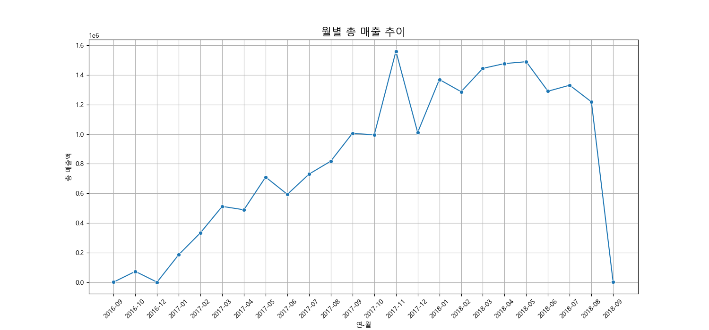
#### 해석:
- 2017년 초부터 2017년 11월까지 매출이 꾸준히 성장하다가, 2017년 11월에 급증하는 패턴을 보입니다. 이는 블랙프라이데이 등 연말 쇼핑 시즌의 영향으로 보입니다.
- 2018년에도 전반적인 성장세를 유지하지만, 특정 월에 매출 변동이 있습니다.


### 2.2. 상위 15개 상품 카테고리 (판매량 기준)
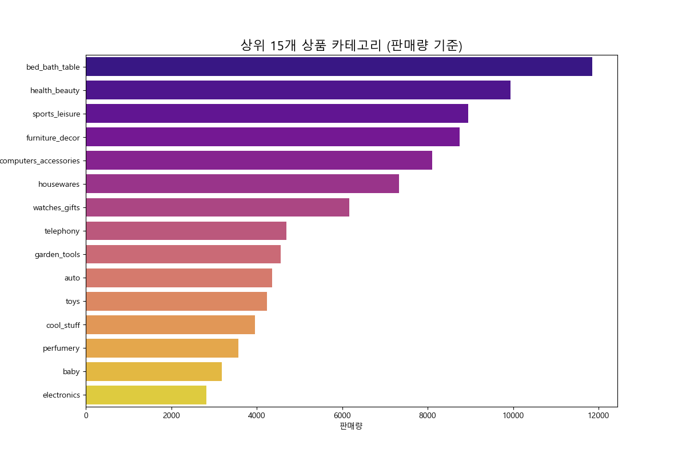
#### 교차표:
```
                               count
product_category_name_english       
bed_bath_table                 11847
health_beauty                   9944
sports_leisure                  8942
furniture_decor                 8743
computers_accessories           8105
housewares                      7331
watches_gifts                   6161
telephony                       4692
garden_tools                    4558
auto                            4356
toys                            4246
cool_stuff                      3964
perfumery                       3575
baby                            3178
electronics                     2827
```
#### 해석:
- 'bed_bath_table'(침실/욕실/테이블용품) 카테고리가 압도적인 판매량을 보입니다.
- 그 뒤를 이어 'health_beauty'(건강/미용), 'sports_leisure'(스포츠/레저), 'furniture_decor'(가구/인테리어), 'computers_accessories'(컴퓨터/액세서리) 등이 인기 있는 카테고리임을 알 수 있습니다.


### 2.3. 결제 수단 분포
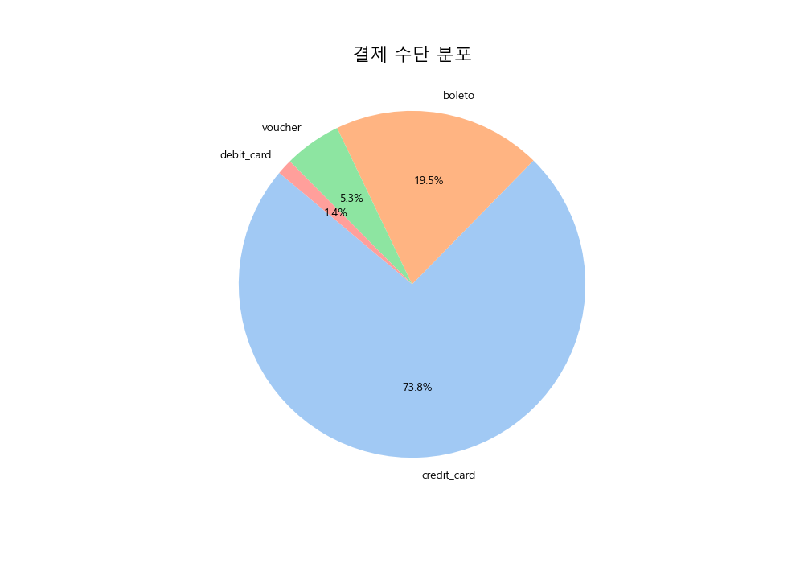
#### 교차표:
```
              count
payment_type       
credit_card   85278
boleto        22510
voucher        6162
debit_card     1659
```
#### 해석:
- 'credit_card'(신용카드)가 전체 결제의 약 73.9%를 차지하며 가장 보편적인 결제 수단입니다.
- 'boleto'(브라질의 현금 결제 방식)가 그 뒤를 잇고, 'voucher'와 'debit_card'의 사용률은 상대적으로 낮습니다.


### 2.4. 리뷰 점수 분포
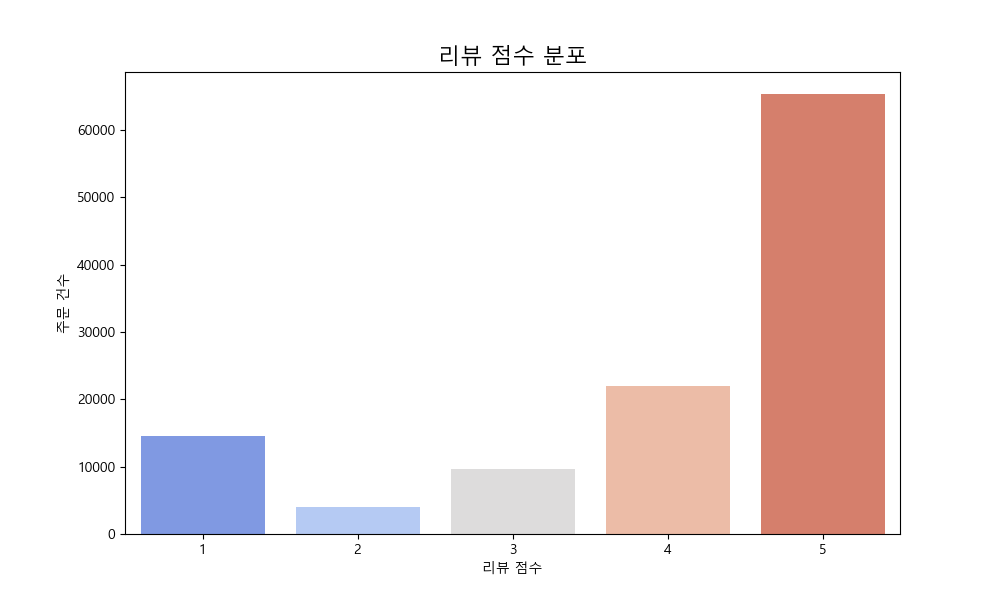
#### 교차표:
```
              count
review_score       
1             14546
2              4020
3              9718
4             21951
5             65374
```
#### 해석:
- 5점(매우 만족)을 준 고객이 압도적으로 많아, 전반적인 고객 만족도가 높다는 것을 알 수 있습니다.
- 1점(매우 불만족)을 준 고객도 상당수 존재하여, 불만족 원인에 대한 추가 분석이 필요해 보입니다.


### 2.5. 요일별 주문량
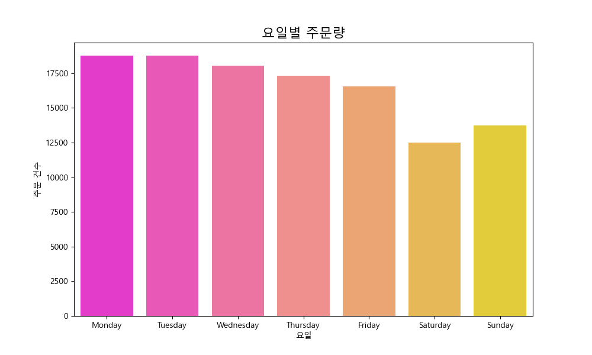
#### 교차표:
```
           count
order_dow       
Monday     18769
Tuesday    18768
Wednesday  18033
Thursday   17301
Friday     16532
Saturday   12484
Sunday     13722
```
#### 해석:
- 주 초반인 월요일에 주문량이 가장 많고, 주말로 갈수록 점차 감소하는 경향을 보입니다.
- 특히 일요일에 주문량이 가장 적습니다. 이는 주말 동안 쇼핑을 마친 후 주중에 주문하는 패턴을 시사합니다.


### 2.6. 시간대별 주문량
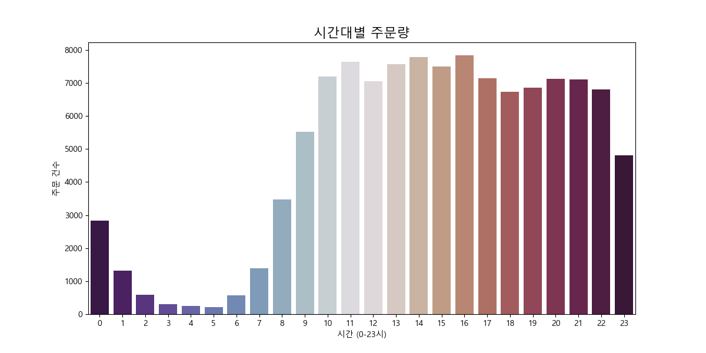
#### 교차표:
```
            count
order_hour       
0            2835
1            1310
2             594
3             311
4             251
5             213
6             561
7            1396
8            3469
9            5513
10           7200
11           7636
12           7056
13           7569
14           7776
15           7497
16           7835
17           7138
18           6738
19           6858
20           7127
21           7105
22           6810
23           4811
```
#### 해석:
- 점심시간 이후인 오후 1시부터 4시 사이에 주문이 가장 활발하게 일어납니다.
- 저녁 시간인 8시에서 9시 사이에도 작은 피크가 나타납니다. 새벽 시간에는 주문량이 급격히 감소합니다.


### 2.7. 상위 10개 주의 주문 건수
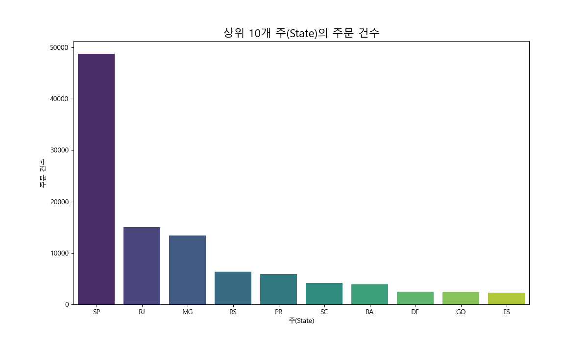
#### 교차표:
```
                count
customer_state       
SP              48797
RJ              14987
MG              13429
RS               6413
PR               5879
SC               4218
BA               3942
DF               2449
GO               2359
ES               2300
```
#### 해석:
- 상파울루(SP) 주가 다른 주에 비해 압도적으로 많은 주문 건수를 기록하며, Olist의 가장 큰 시장임을 보여줍니다.
- 리우데자네이루(RJ)와 미나스제라이스(MG)가 그 뒤를 잇고 있습니다. 이는 브라질의 인구 및 경제 중심지와 일치하는 결과입니다.


### 2.8. 리뷰 점수별 배송 소요 기간
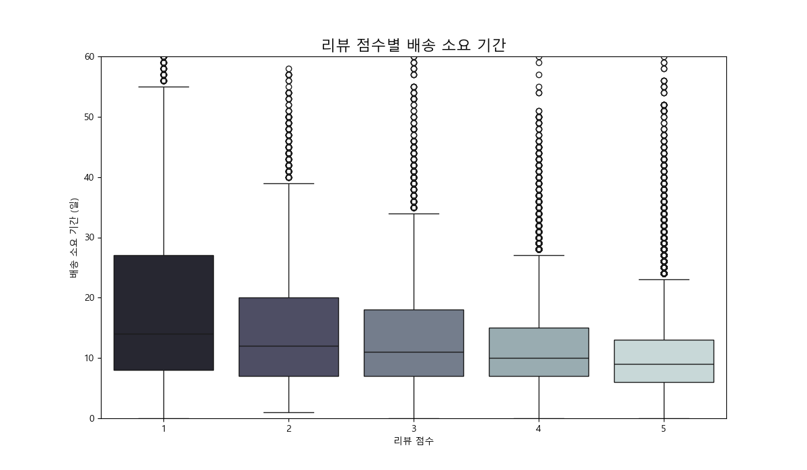
#### 해석:
- 리뷰 점수가 낮을수록(1, 2점) 평균 배송 소요 기간이 길어지는 뚜렷한 경향을 보입니다.
- 반면, 5점 만점을 준 고객들은 평균적으로 훨씬 빠른 배송을 경험했습니다.
- 이는 **빠르고 정확한 배송이 고객 만족도에 매우 중요한 요소**임을 강력하게 시사합니다.


### 2.9. 상품 가격과 배송비의 관계
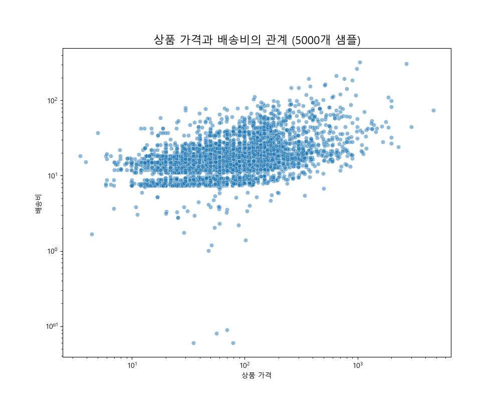
#### 해석:
- 상품 가격과 배송비 사이에는 양의 상관관계가 희미하게 보이지만, 전반적으로 뚜렷한 패턴은 없습니다.
- 가격이 낮은 상품이라도 배송비가 높을 수 있고, 그 반대의 경우도 많습니다. 이는 배송비가 가격보다는 상품의 무게, 부피, 그리고 배송 거리에 더 큰 영향을 받기 때문일 것으로 추정됩니다.
- (x, y축 모두 로그 스케일로 변환하여 분포를 더 명확하게 확인)


### 2.10. 신용카드 할부 개월 수 분포
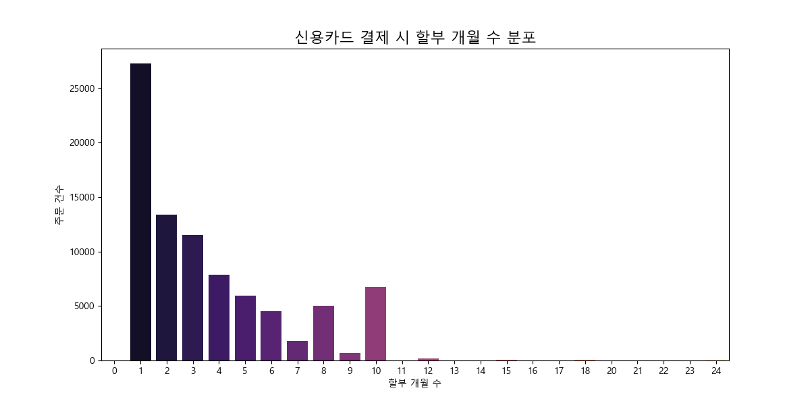
#### 교차표:
```
                      count
payment_installments       
0                         3
1                     27268
2                     13404
3                     11551
4                      7855
5                      5928
6                      4546
7                      1789
8                      5013
9                       710
10                     6785
11                       22
12                      164
13                       19
14                       16
15                       91
16                        7
17                        7
18                       38
20                       20
21                        6
22                        1
23                        1
24                       34
```
#### 해석:
- 일시불(1개월) 결제가 가장 많지만, 2~3개월과 8, 10개월 할부 결제도 많이 사용됩니다.
- 고객들은 비교적 다양한 할부 옵션을 활용하고 있으며, 특히 고가의 상품 구매 시 장기 할부를 선호할 가능성이 있습니다.


### 2.11. 가격대별 주문 및 매출 분석
상품 가격을 여러 구간으로 나누어 각 구간의 주문 건수와 매출액 규모를 분석합니다.
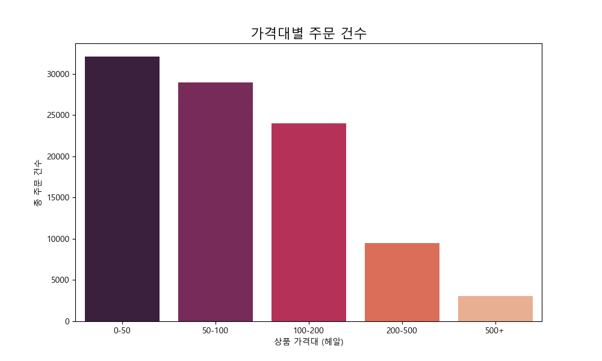
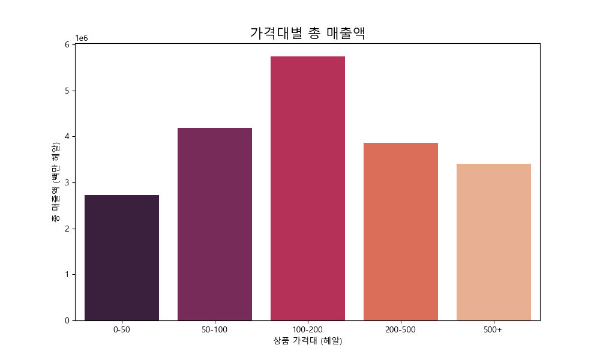
#### 교차표:
```
  price_range  order_count  total_sales
0        0-50        32105   2728455.92
1      50-100        28945   4193073.11
2     100-200        24041   5740584.28
3     200-500         9519   3857629.07
4        500+         3061   3402860.81
```
#### 해석:
- **주문 건수**: 0~50 헤알 사이의 저가 상품에서 가장 많은 주문이 발생했습니다. 상품 가격이 상승할수록 주문 건수는 감소하는 경향을 보입니다.
- **매출액**: 주문 건수와 달리, 총 매출액은 50-100 헤알 구간에서 가장 높게 나타났습니다. 100-200 헤알 구간도 상당한 매출 비중을 차지합니다.
- 이는 저가 상품이 판매량은 높지만(박리다매), 실제 매출을 견인하는 주력 상품군은 50-200 헤알 사이의 중가 상품임을 의미합니다. 500헤알 이상의 고가 상품은 판매량은 적지만, 매출 기여도는 무시할 수 없는 수준입니다.


## 3. 결론 및 요약
- **주요 시장**: 브라질 남동부 지역, 특히 상파울루(SP) 주가 Olist의 핵심 시장입니다.
- **고객 만족**: 전반적인 리뷰 점수는 높지만, **배송 지연이 낮은 리뷰 점수의 주요 원인**으로 강력하게 작용하고 있습니다. 배송 시스템 최적화가 고객 만족도 향상의 핵심 과제입니다.
- **인기 상품**: '침실/욕실/테이블용품', '건강/미용', '스포츠/레저' 등이 높은 판매량을 보이는 주요 카테고리입니다.
- **구매 패턴**: 주문은 주중에 집중되며, 특히 오후 시간대에 가장 활발합니다. 결제는 신용카드가 압도적이며, 고객들은 다양한 할부 옵션을 사용합니다.
- **향후 분석**: 이 통합 데이터를 바탕으로 RFM 분석을 통한 고객 세분화, 카테고리별 수익성 분석, 배송 지연 예측 모델링 등 더 구체적인 비즈니스 문제 해결을 위한 분석을 진행할 수 있습니다.