# Online Retail 데이터 분석 보고서

이 보고서는 Online Retail 데이터셋에 대한 탐색적 데이터 분석(EDA) 결과를 요약합니다.

## 1. 데이터 기본 정보

### 데이터 샘플 (상위 5개)
```
  InvoiceNo StockCode                          Description  Quantity         InvoiceDate  UnitPrice CustomerID         Country  TotalPrice YearMonth  DayOfWeek  Hour        Date OrderMonth CohortMonth
0    536365    85123A   WHITE HANGING HEART T-LIGHT HOLDER         6 2010-12-01 08:26:00       2.55      17850  United Kingdom       15.30   2010-12  Wednesday     8  2010-12-01    2010-12     2010-12
1    536365     71053                  WHITE METAL LANTERN         6 2010-12-01 08:26:00       3.39      17850  United Kingdom       20.34   2010-12  Wednesday     8  2010-12-01    2010-12     2010-12
2    536365    84406B       CREAM CUPID HEARTS COAT HANGER         8 2010-12-01 08:26:00       2.75      17850  United Kingdom       22.00   2010-12  Wednesday     8  2010-12-01    2010-12     2010-12
3    536365    84029G  KNITTED UNION FLAG HOT WATER BOTTLE         6 2010-12-01 08:26:00       3.39      17850  United Kingdom       20.34   2010-12  Wednesday     8  2010-12-01    2010-12     2010-12
4    536365    84029E       RED WOOLLY HOTTIE WHITE HEART.         6 2010-12-01 08:26:00       3.39      17850  United Kingdom       20.34   2010-12  Wednesday     8  2010-12-01    2010-12     2010-12
```

### 데이터 통계 요약
```
            Quantity                    InvoiceDate      UnitPrice     TotalPrice           Hour
count  397924.000000                         397924  397924.000000  397924.000000  397924.000000
mean       13.021823  2011-07-10 23:43:36.912475648       3.116174      22.394749      12.728247
min         1.000000            2010-12-01 08:26:00       0.000000       0.000000       6.000000
25%         2.000000            2011-04-07 11:12:00       1.250000       4.680000      11.000000
50%         6.000000            2011-07-31 14:39:00       1.950000      11.800000      13.000000
75%        12.000000            2011-10-20 14:33:00       3.750000      19.800000      14.000000
max     80995.000000            2011-12-09 12:50:00    8142.750000  168469.600000      20.000000
std       180.420210                            NaN      22.096788     309.055588       2.273535
```

---

## 2. 국가별 주문 분석

### 주문 건수 상위 10개국
United Kingdom이 압도적으로 많은 주문을 차지하고 있으며, 그 뒤를 독일, 프랑스, EIRE(아일랜드)가 잇고 있습니다.

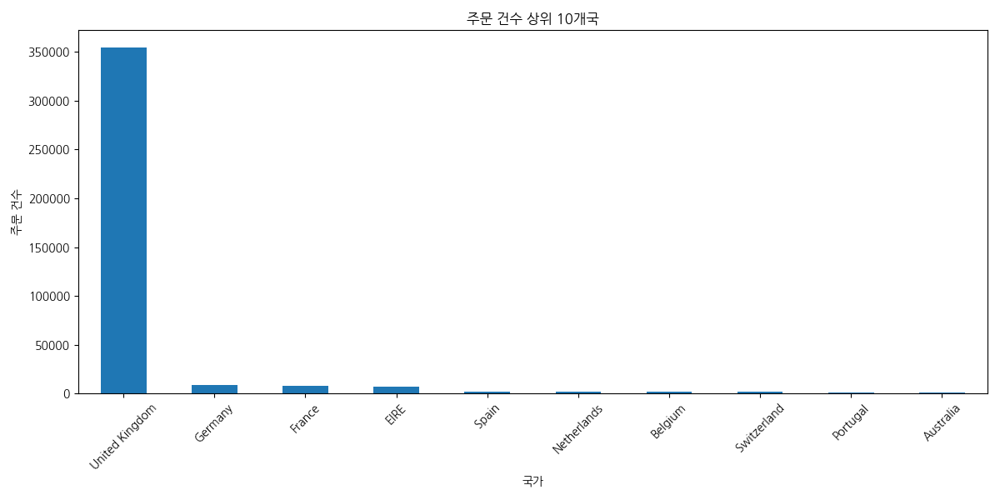

#### 교차표: 국가별 주문 건수
| Country        |   count |
|:---------------|--------:|
| United Kingdom |  354345 |
| Germany        |    9042 |
| France         |    8342 |
| EIRE           |    7238 |
| Spain          |    2485 |
| Netherlands    |    2363 |
| Belgium        |    2031 |
| Switzerland    |    1842 |
| Portugal       |    1462 |
| Australia      |    1185 |
---

## 3. 국가별 매출 분석

### 매출액 상위 10개국
주문 건수와 마찬가지로 매출액 역시 United Kingdom이 가장 높습니다. 네덜란드와 EIRE(아일랜드)가 영국 다음으로 높은 매출을 보입니다.

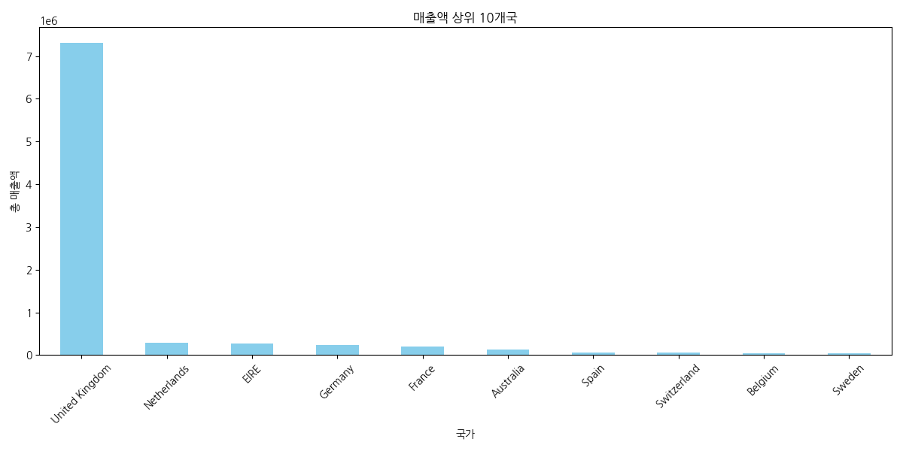

#### 피봇 테이블: 국가별 매출액
| Country        |       TotalPrice |
|:---------------|-----------------:|
| United Kingdom |      7.30839e+06 |
| Netherlands    | 285446           |
| EIRE           | 265546           |
| Germany        | 228867           |
| France         | 209024           |
| Australia      | 138521           |
| Spain          |  61577.1         |
| Switzerland    |  56443.9         |
| Belgium        |  41196.3         |
| Sweden         |  38378.3         |
---

## 4. 시간 흐름에 따른 매출 분석

### 월별 매출 추이
2011년 데이터가 대부분이며, 11월에 매출이 가장 정점을 찍는 것을 볼 수 있습니다. 이는 연말 쇼핑 시즌의 영향으로 보입니다.

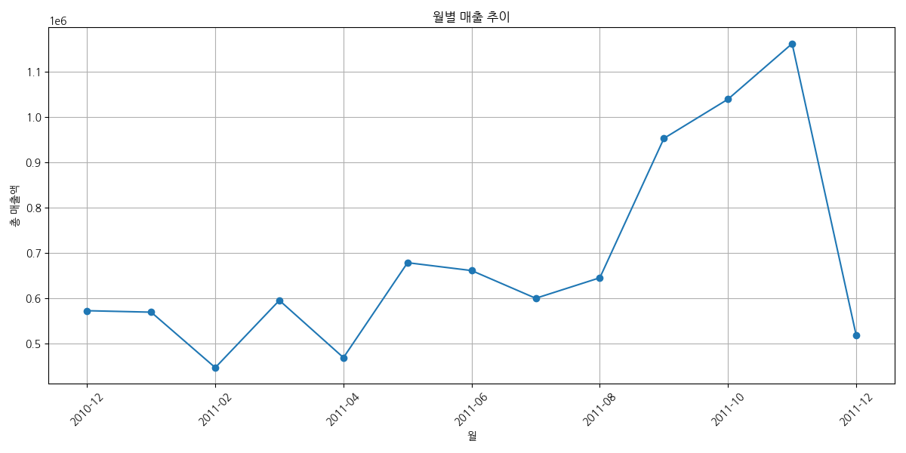

#### 피봇 테이블: 월별 매출액
| YearMonth   |       TotalPrice |
|:------------|-----------------:|
| 2010-12     | 572714           |
| 2011-01     | 569445           |
| 2011-02     | 447137           |
| 2011-03     | 595501           |
| 2011-04     | 469200           |
| 2011-05     | 678595           |
| 2011-06     | 661214           |
| 2011-07     | 600091           |
| 2011-08     | 645344           |
| 2011-09     | 952838           |
| 2011-10     |      1.03932e+06 |
| 2011-11     |      1.16182e+06 |
| 2011-12     | 518193           |
---

### 요일별 주문 건수
주문은 주중에 집중되어 있으며, 특히 목요일에 가장 많은 주문이 발생합니다. 주말인 토요일은 주문이 현저히 적고, 일요일 주문 데이터는 없습니다.

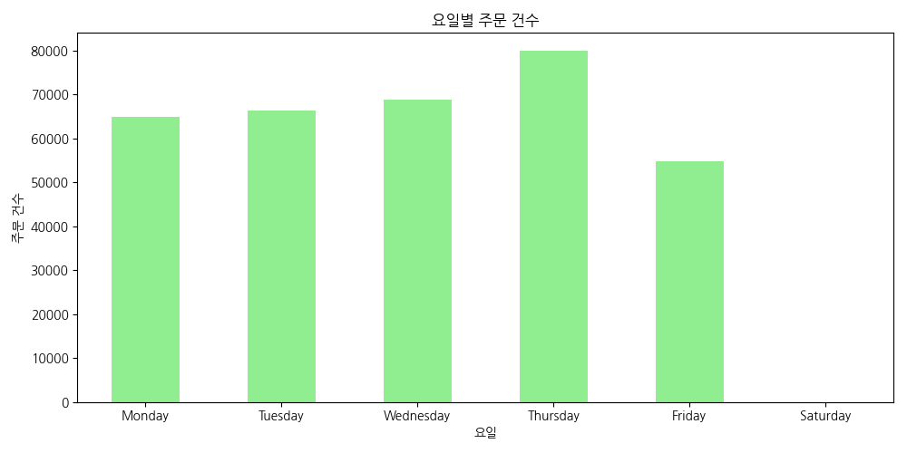

#### 교차표: 요일별 주문 건수
| DayOfWeek   |   count |
|:------------|--------:|
| Monday      |   64899 |
| Tuesday     |   66476 |
| Wednesday   |   68888 |
| Thursday    |   80052 |
| Friday      |   54834 |
| Saturday    |     nan |
---

### 시간대별 주문 건수
오후 12시(정오)에 주문이 가장 많으며, 대체로 점심시간을 포함한 오후 시간대에 주문이 집중되는 경향을 보입니다.

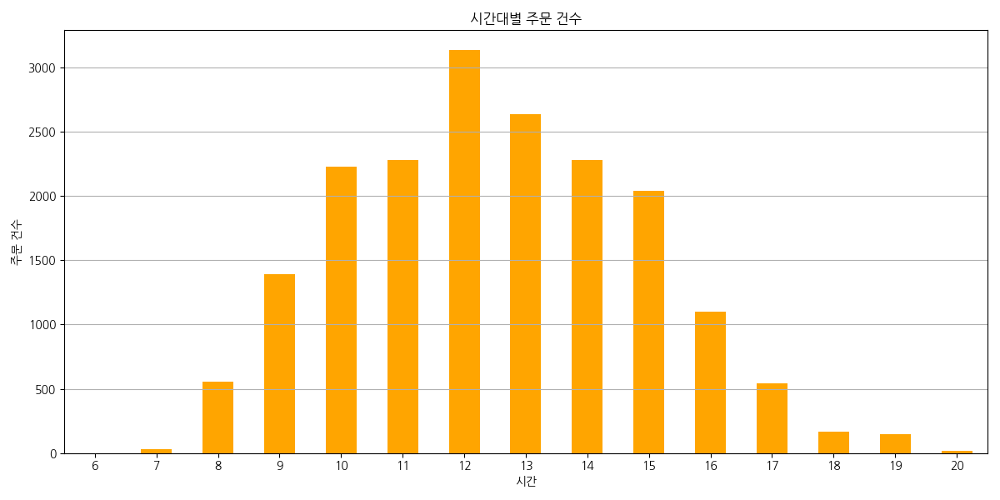

#### 피봇 테이블: 시간대별 주문 건수
|   Hour |   InvoiceNo |
|-------:|------------:|
|      6 |           1 |
|      7 |          29 |
|      8 |         555 |
|      9 |        1394 |
|     10 |        2226 |
|     11 |        2277 |
|     12 |        3130 |
|     13 |        2637 |
|     14 |        2275 |
|     15 |        2038 |
|     16 |        1100 |
|     17 |         544 |
|     18 |         169 |
|     19 |         144 |
|     20 |          18 |
---

## 5. 상품 분석

### 판매 수량 상위 10개 상품
'WORLD WAR 2 GLIDERS ASSTD DESIGNS', 'JUMBO BAG RED RETROSPOT' 등 부피가 크거나 묶음 상품으로 보이는 제품들이 상위권을 차지하고 있습니다.

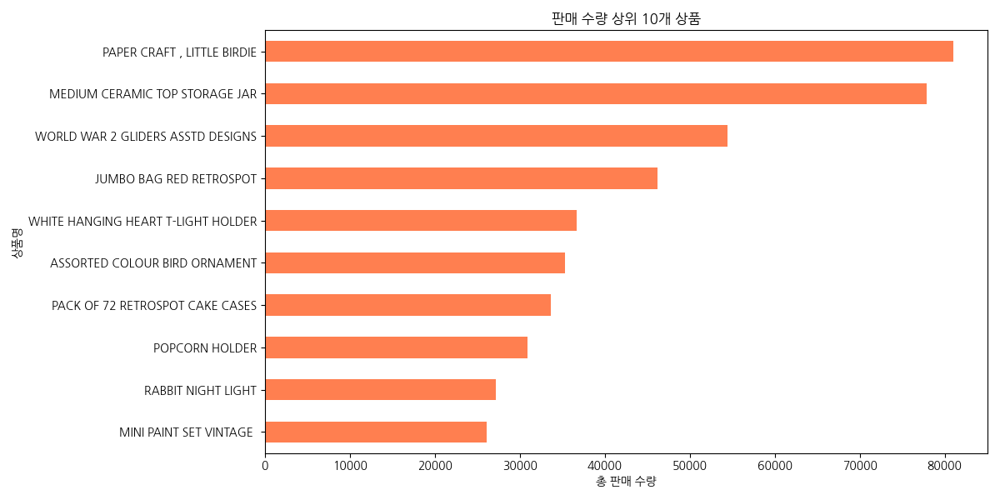

#### 피봇 테이블: 판매 수량 상위 10개 상품
| Description                        |   Quantity |
|:-----------------------------------|-----------:|
| PAPER CRAFT , LITTLE BIRDIE        |      80995 |
| MEDIUM CERAMIC TOP STORAGE JAR     |      77916 |
| WORLD WAR 2 GLIDERS ASSTD DESIGNS  |      54415 |
| JUMBO BAG RED RETROSPOT            |      46181 |
| WHITE HANGING HEART T-LIGHT HOLDER |      36725 |
| ASSORTED COLOUR BIRD ORNAMENT      |      35362 |
| PACK OF 72 RETROSPOT CAKE CASES    |      33693 |
| POPCORN HOLDER                     |      30931 |
| RABBIT NIGHT LIGHT                 |      27202 |
| MINI PAINT SET VINTAGE             |      26076 |
---

### 판매 매출액 상위 10개 상품
'DOTCOM POSTAGE'가 가장 높은 매출을 기록했으며, 이는 배송료 관련 항목으로 추정됩니다. 그 외에는 'REGENCY CAKESTAND 3 TIER'와 같은 고가 상품이 상위권에 있습니다.

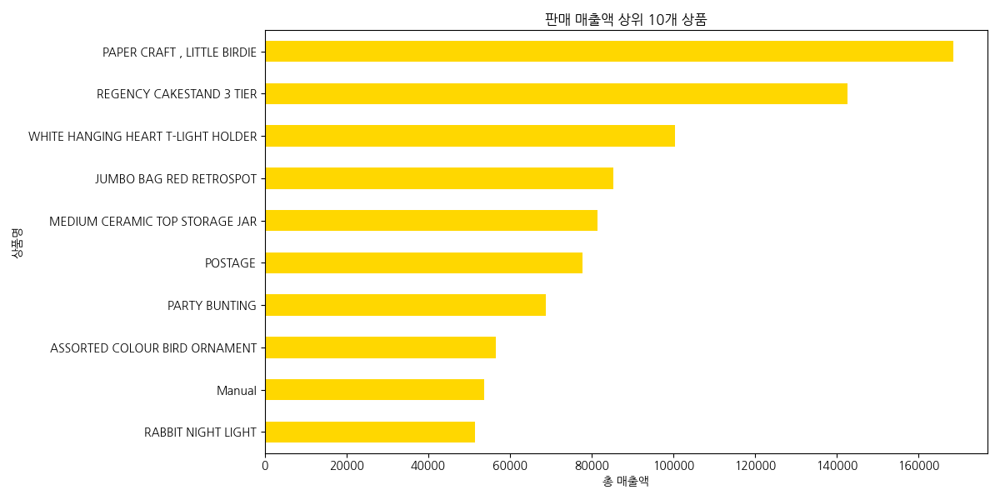

#### 피봇 테이블: 판매 매출액 상위 10개 상품
| Description                        |   TotalPrice |
|:-----------------------------------|-------------:|
| PAPER CRAFT , LITTLE BIRDIE        |     168470   |
| REGENCY CAKESTAND 3 TIER           |     142593   |
| WHITE HANGING HEART T-LIGHT HOLDER |     100448   |
| JUMBO BAG RED RETROSPOT            |      85220.8 |
| MEDIUM CERAMIC TOP STORAGE JAR     |      81416.7 |
| POSTAGE                            |      77804   |
| PARTY BUNTING                      |      68844.3 |
| ASSORTED COLOUR BIRD ORNAMENT      |      56580.3 |
| Manual                             |      53779.9 |
| RABBIT NIGHT LIGHT                 |      51346.2 |
---

## 6. 가격 분석

### 상품 단가 분포
대부분의 상품이 0에 가까운 낮은 단가를 가지고 있으며, 일부 고가 상품이 존재합니다. 분석의 편의를 위해 단가 50 이하인 상품들만 따로 시각화했습니다.

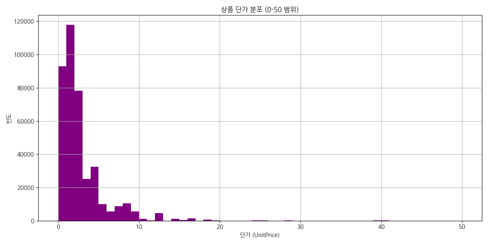

단가가 0인 경우는 비정상적인 데이터일 수 있으므로 추가적인 확인이 필요합니다.
---

## 7. 고객 분석

### 총 구매액 상위 10명 고객
특정 고객들이 전체 매출에 큰 기여를 하고 있음을 알 수 있습니다. 상위 고객 관리가 중요한 전략이 될 수 있습니다.

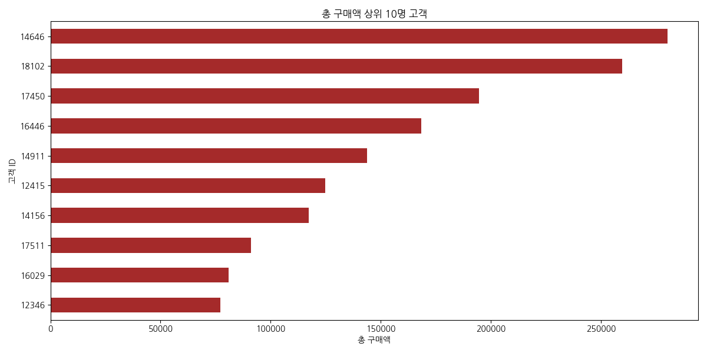

#### 피봇 테이블: 총 구매액 상위 10명 고객
|   CustomerID |   TotalPrice |
|-------------:|-------------:|
|        14646 |     280206   |
|        18102 |     259657   |
|        17450 |     194551   |
|        16446 |     168472   |
|        14911 |     143825   |
|        12415 |     124915   |
|        14156 |     117380   |
|        17511 |      91062.4 |
|        16029 |      81024.8 |
|        12346 |      77183.6 |
---

## 8. 주문 특성 분석

### 주문당 평균 상품 수량
한 번의 주문에 평균적으로 약 12개의 상품을 구매하는 것으로 나타났습니다.

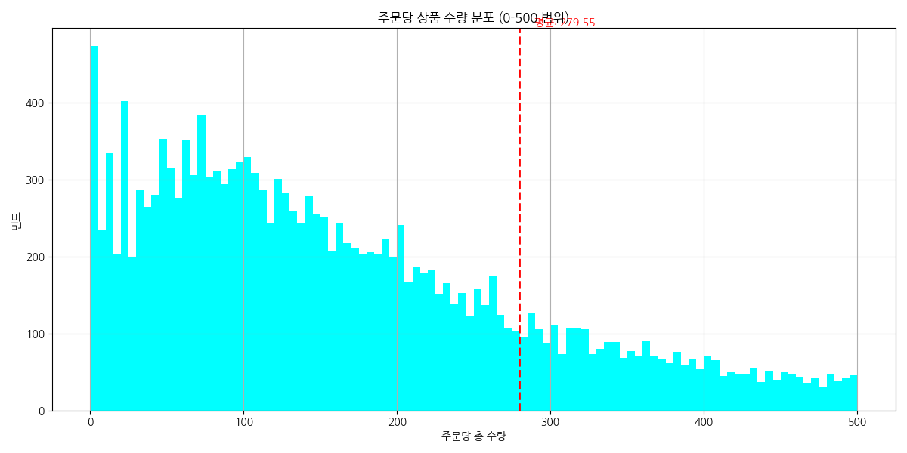

평균값(빨간 점선)을 통해 대부분의 주문이 평균 이하의 수량을 가짐을 알 수 있습니다.
---

## 9. 월별 사용자당 평균 매출(ARPU)

월별 사용자당 평균 매출(ARPU)은 전체 매출을 해당 월의 활성 사용자 수로 나누어 계산합니다. 이를 통해 사용자 한 명이 평균적으로 얼마의 매출을 발생시키는지 파악할 수 있습니다.

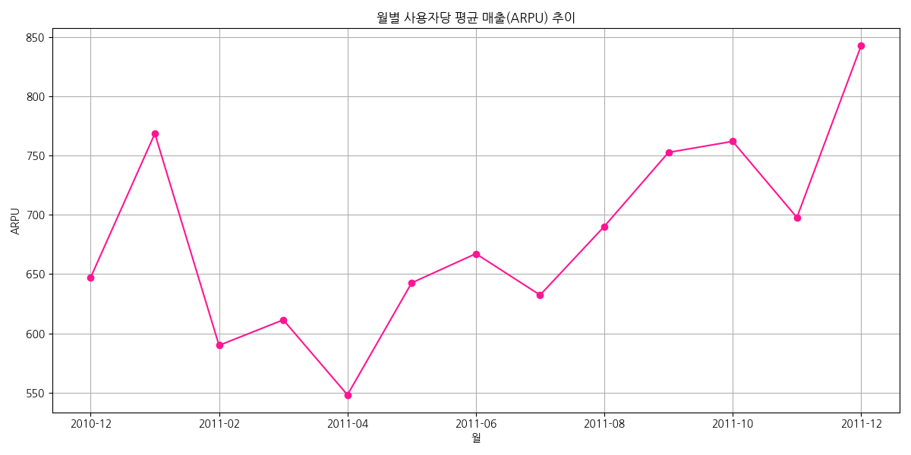

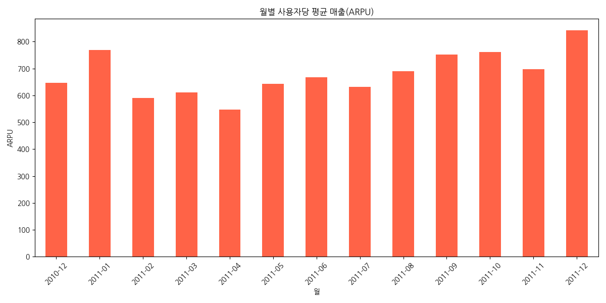

#### 피봇 테이블: 월별 ARPU
| YearMonth   |       0 |
|:------------|--------:|
| 2010-12     | 647.134 |
| 2011-01     | 768.482 |
| 2011-02     | 589.891 |
| 2011-03     | 611.397 |
| 2011-04     | 548.131 |
| 2011-05     | 642.608 |
| 2011-06     | 667.219 |
| 2011-07     | 632.34  |
| 2011-08     | 690.207 |
| 2011-09     | 752.637 |
| 2011-10     | 761.964 |
| 2011-11     | 697.788 |
| 2011-12     | 842.59  |
---

## 10. 활성 사용자 분석 (DAU/MAU)

일별/월별 활성 사용자 수(DAU/MAU)를 통해 서비스 활성도를 파악할 수 있습니다.

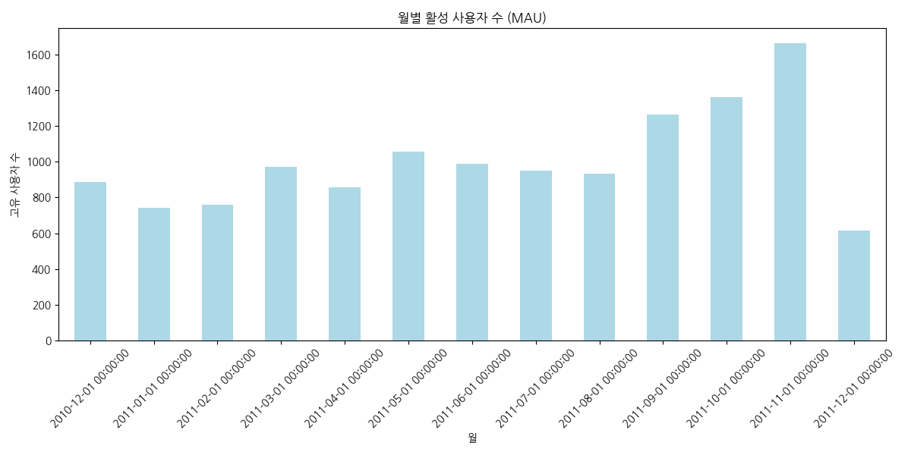

- **평균 DAU:** 54.97
- **평균 MAU:** 1004.23
- **DAU/MAU 비율 (Stickiness):** 5.47%

#### 월별 활성 사용자 수 (MAU) 교차표
| YearMonth           |   CustomerID |
|:--------------------|-------------:|
| 2010-12-01 00:00:00 |          885 |
| 2011-01-01 00:00:00 |          741 |
| 2011-02-01 00:00:00 |          758 |
| 2011-03-01 00:00:00 |          974 |
| 2011-04-01 00:00:00 |          856 |
| 2011-05-01 00:00:00 |         1056 |
| 2011-06-01 00:00:00 |          991 |
| 2011-07-01 00:00:00 |          949 |
| 2011-08-01 00:00:00 |          935 |
| 2011-09-01 00:00:00 |         1266 |
| 2011-10-01 00:00:00 |         1364 |
| 2011-11-01 00:00:00 |         1665 |
| 2011-12-01 00:00:00 |          615 |
---

## 11. 시간-요일 교차 분석 (히트맵)

시간대와 요일별 주문 분포를 히트맵으로 시각화하여 특정 시간/요일의 주문 집중도를 파악합니다.

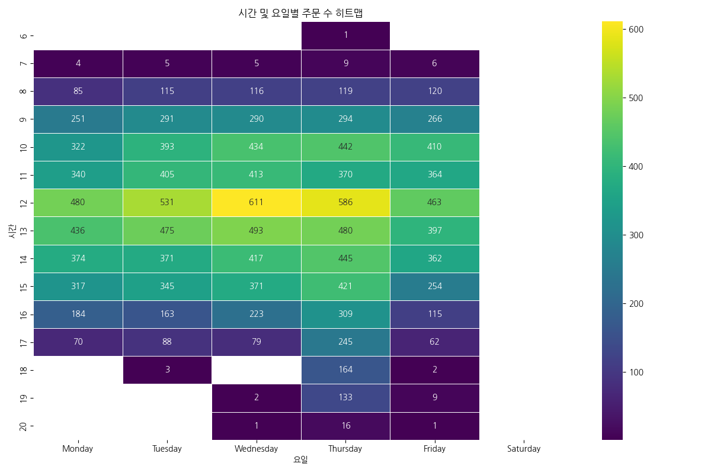

#### 시간-요일 교차표
|   Hour |   Monday |   Tuesday |   Wednesday |   Thursday |   Friday |   Saturday |
|-------:|---------:|----------:|------------:|-----------:|---------:|-----------:|
|      6 |      nan |       nan |         nan |          1 |      nan |        nan |
|      7 |        4 |         5 |           5 |          9 |        6 |        nan |
|      8 |       85 |       115 |         116 |        119 |      120 |        nan |
|      9 |      251 |       291 |         290 |        294 |      266 |        nan |
|     10 |      322 |       393 |         434 |        442 |      410 |        nan |
|     11 |      340 |       405 |         413 |        370 |      364 |        nan |
|     12 |      480 |       531 |         611 |        586 |      463 |        nan |
|     13 |      436 |       475 |         493 |        480 |      397 |        nan |
|     14 |      374 |       371 |         417 |        445 |      362 |        nan |
|     15 |      317 |       345 |         371 |        421 |      254 |        nan |
|     16 |      184 |       163 |         223 |        309 |      115 |        nan |
|     17 |       70 |        88 |          79 |        245 |       62 |        nan |
|     18 |      nan |         3 |         nan |        164 |        2 |        nan |
|     19 |      nan |       nan |           2 |        133 |        9 |        nan |
|     20 |      nan |       nan |           1 |         16 |        1 |        nan |
---

## 12. 월별 고객 리텐션 분석

첫 구매를 한 고객 코호트가 시간의 흐름에 따라 얼마나 재방문(재구매)하는지를 분석합니다.

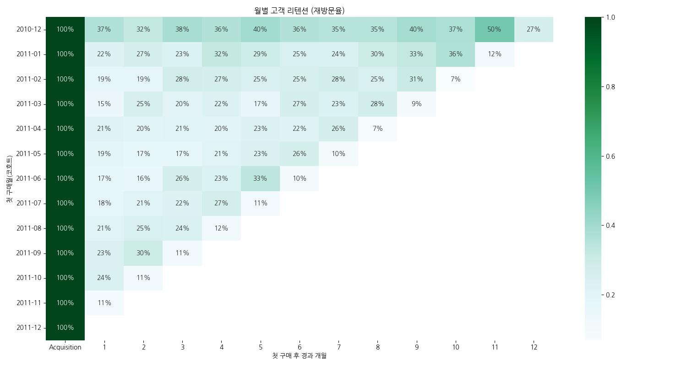

#### 리텐션 교차표 (비율)
| CohortMonth   |   Acquisition |      1 |      2 |      3 |      4 |      5 |      6 |      7 |      8 |      9 |     10 |     11 |     12 |
|:--------------|--------------:|-------:|-------:|-------:|-------:|-------:|-------:|-------:|-------:|-------:|-------:|-------:|-------:|
| 2010-12       |       100.00% | 36.61% | 32.32% | 38.42% | 36.27% | 39.77% | 36.27% | 34.92% | 35.37% | 39.55% | 37.40% | 50.28% | 26.55% |
| 2011-01       |       100.00% | 22.06% | 26.62% | 23.02% | 32.13% | 28.78% | 24.70% | 24.22% | 29.98% | 32.61% | 36.45% | 11.75% |   nan% |
| 2011-02       |       100.00% | 18.68% | 18.68% | 28.42% | 27.11% | 24.74% | 25.26% | 27.89% | 24.74% | 30.53% |  6.84% |   nan% |   nan% |
| 2011-03       |       100.00% | 15.04% | 25.22% | 19.91% | 22.35% | 16.81% | 26.77% | 23.01% | 27.88% |  8.63% |   nan% |   nan% |   nan% |
| 2011-04       |       100.00% | 21.33% | 20.33% | 21.00% | 19.67% | 22.67% | 21.67% | 26.00% |  7.33% |   nan% |   nan% |   nan% |   nan% |
| 2011-05       |       100.00% | 19.01% | 17.25% | 17.25% | 20.77% | 23.24% | 26.41% |  9.51% |   nan% |   nan% |   nan% |   nan% |   nan% |
| 2011-06       |       100.00% | 17.36% | 15.70% | 26.45% | 23.14% | 33.47% |  9.50% |   nan% |   nan% |   nan% |   nan% |   nan% |   nan% |
| 2011-07       |       100.00% | 18.09% | 20.74% | 22.34% | 27.13% | 11.17% |   nan% |   nan% |   nan% |   nan% |   nan% |   nan% |   nan% |
| 2011-08       |       100.00% | 20.71% | 24.85% | 24.26% | 12.43% |   nan% |   nan% |   nan% |   nan% |   nan% |   nan% |   nan% |   nan% |
| 2011-09       |       100.00% | 23.41% | 30.10% | 11.37% |   nan% |   nan% |   nan% |   nan% |   nan% |   nan% |   nan% |   nan% |   nan% |
| 2011-10       |       100.00% | 24.02% | 11.45% |   nan% |   nan% |   nan% |   nan% |   nan% |   nan% |   nan% |   nan% |   nan% |   nan% |
| 2011-11       |       100.00% | 11.11% |   nan% |   nan% |   nan% |   nan% |   nan% |   nan% |   nan% |   nan% |   nan% |   nan% |   nan% |
| 2011-12       |       100.00% |   nan% |   nan% |   nan% |   nan% |   nan% |   nan% |   nan% |   nan% |   nan% |   nan% |   nan% |   nan% |

#### 리텐션 교차표 (고객 수)
| CohortMonth   |   0 |   1 |   2 |   3 |   4 |   5 |   6 |   7 |   8 |   9 |   10 |   11 |   12 |
|:--------------|----:|----:|----:|----:|----:|----:|----:|----:|----:|----:|-----:|-----:|-----:|
| 2010-12       | 885 | 324 | 286 | 340 | 321 | 352 | 321 | 309 | 313 | 350 |  331 |  445 |  235 |
| 2011-01       | 417 |  92 | 111 |  96 | 134 | 120 | 103 | 101 | 125 | 136 |  152 |   49 |  nan |
| 2011-02       | 380 |  71 |  71 | 108 | 103 |  94 |  96 | 106 |  94 | 116 |   26 |  nan |  nan |
| 2011-03       | 452 |  68 | 114 |  90 | 101 |  76 | 121 | 104 | 126 |  39 |  nan |  nan |  nan |
| 2011-04       | 300 |  64 |  61 |  63 |  59 |  68 |  65 |  78 |  22 | nan |  nan |  nan |  nan |
| 2011-05       | 284 |  54 |  49 |  49 |  59 |  66 |  75 |  27 | nan | nan |  nan |  nan |  nan |
| 2011-06       | 242 |  42 |  38 |  64 |  56 |  81 |  23 | nan | nan | nan |  nan |  nan |  nan |
| 2011-07       | 188 |  34 |  39 |  42 |  51 |  21 | nan | nan | nan | nan |  nan |  nan |  nan |
| 2011-08       | 169 |  35 |  42 |  41 |  21 | nan | nan | nan | nan | nan |  nan |  nan |  nan |
| 2011-09       | 299 |  70 |  90 |  34 | nan | nan | nan | nan | nan | nan |  nan |  nan |  nan |
| 2011-10       | 358 |  86 |  41 | nan | nan | nan | nan | nan | nan | nan |  nan |  nan |  nan |
| 2011-11       | 324 |  36 | nan | nan | nan | nan | nan | nan | nan | nan |  nan |  nan |  nan |
| 2011-12       |  41 | nan | nan | nan | nan | nan | nan | nan | nan | nan |  nan |  nan |  nan |
---

분석을 마칩니다.
