# Rocket 데이터셋 탐색적 데이터 분석(EDA) 보고서

이 보고서는 `rocket` 폴더에 있는 CSV 파일들을 분석한 결과를 담고 있습니다.
요구사항에 맞춰 `koreanize-matplotlib`을 사용하여 그래프의 한글을 처리했으며, `seaborn` 스타일은 사용하지 않았습니다.

## 1. `events.csv` 분석

사용자 행동 이벤트(조회, 장바구니 추가, 구매) 데이터를 담고 있습니다.

### 1.1. 데이터 샘플
|     timestamp |   visitorid | event   |   itemid |   transactionid |
|--------------:|------------:|:--------|---------:|----------------:|
| 1433221332117 |      257597 | view    |   355908 |             nan |
| 1433224214164 |      992329 | view    |   248676 |             nan |
| 1433221999827 |      111016 | view    |   318965 |             nan |
| 1433221955914 |      483717 | view    |   253185 |             nan |
| 1433221337106 |      951259 | view    |   367447 |             nan |

### 1.2. 데이터 정보
```
<class 'pandas.core.frame.DataFrame'>
RangeIndex: 2756101 entries, 0 to 2756100
Data columns (total 5 columns):
 #   Column         Dtype  
---  ------         -----  
 0   timestamp      int64  
 1   visitorid      int64  
 2   event          object 
 3   itemid         int64  
 4   transactionid  float64
dtypes: float64(1), int64(3), object(1)
memory usage: 105.1+ MB

```

### 1.3. 기술 통계
```
          timestamp     visitorid        itemid  transactionid
count  2.756101e+06  2.756101e+06  2.756101e+06   22457.000000
mean   1.436424e+12  7.019229e+05  2.349225e+05    8826.497796
std    3.366312e+09  4.056875e+05  1.341954e+05    5098.996290
min    1.430622e+12  0.000000e+00  3.000000e+00       0.000000
25%    1.433478e+12  3.505660e+05  1.181200e+05    4411.000000
50%    1.436453e+12  7.020600e+05  2.360670e+05    8813.000000
75%    1.439225e+12  1.053437e+06  3.507150e+05   13224.000000
max    1.442545e+12  1.407579e+06  4.668670e+05   17671.000000
```

### 1.4. 결측치 확인
|               |   결측치 수 |
|:--------------|------------:|
| timestamp     | 0           |
| visitorid     | 0           |
| event         | 0           |
| itemid        | 0           |
| transactionid | 2.73364e+06 |

`transactionid`는 구매 이벤트에서만 생성되므로, 대부분의 행에서 결측치인 것은 자연스러운 현상입니다.

## 2. `category_tree.csv` 분석

상품 카테고리의 계층 구조(부모-자식 관계)를 나타냅니다.

### 2.1. 데이터 샘플
|   categoryid |   parentid |
|-------------:|-----------:|
|         1016 |        213 |
|          809 |        169 |
|          570 |          9 |
|         1691 |        885 |
|          536 |       1691 |

### 2.2. 데이터 정보
```
<class 'pandas.core.frame.DataFrame'>
RangeIndex: 1669 entries, 0 to 1668
Data columns (total 2 columns):
 #   Column      Non-Null Count  Dtype  
---  ------      --------------  -----  
 0   categoryid  1669 non-null   int64  
 1   parentid    1644 non-null   float64
dtypes: float64(1), int64(1)
memory usage: 26.2 KB

```

### 2.3. 기술 통계
```
        categoryid     parentid
count  1669.000000  1644.000000
mean    849.285201   847.571168
std     490.195116   505.058485
min       0.000000     8.000000
25%     427.000000   381.000000
50%     848.000000   866.000000
75%    1273.000000  1291.000000
max    1698.000000  1698.000000
```

### 2.4. 결측치 확인
|            |   결측치 수 |
|:-----------|------------:|
| categoryid |           0 |
| parentid   |          25 |

 최상위 카테고리는 부모 카테고리가 없으므로 `parentid`가 결측치일 수 있습니다.

## 3. `item_properties.csv` 분석

개별 상품의 속성(프로퍼티) 정보를 담고 있습니다. 두 개의 파일(`part1`, `part2`)을 병합하여 분석합니다.

### 3.1. 데이터 샘플
|     timestamp |   itemid | property   | value                           |
|--------------:|---------:|:-----------|:--------------------------------|
| 1435460400000 |   460429 | categoryid | 1338                            |
| 1441508400000 |   206783 | 888        | 1116713 960601 n277.200         |
| 1439089200000 |   395014 | 400        | n552.000 639502 n720.000 424566 |
| 1431226800000 |    59481 | 790        | n15360.000                      |
| 1431831600000 |   156781 | 917        | 828513                          |

### 3.2. 데이터 정보
```
<class 'pandas.core.frame.DataFrame'>
RangeIndex: 20275902 entries, 0 to 20275901
Data columns (total 4 columns):
 #   Column     Dtype 
---  ------     ----- 
 0   timestamp  int64 
 1   itemid     int64 
 2   property   object
 3   value      object
dtypes: int64(2), object(2)
memory usage: 618.8+ MB

```

### 3.3. 기술 통계
```
          timestamp        itemid
count  2.027590e+07  2.027590e+07
mean   1.435157e+12  2.333904e+05
std    3.327798e+09  1.348452e+05
min    1.431227e+12  0.000000e+00
25%    1.432436e+12  1.165160e+05
50%    1.433646e+12  2.334830e+05
75%    1.437880e+12  3.503040e+05
max    1.442113e+12  4.668660e+05
```

### 3.4. 결측치 확인
|           |   결측치 수 |
|:----------|------------:|
| timestamp |           0 |
| itemid    |           0 |
| property  |           0 |
| value     |           0 |

결측치가 없는 것을 확인했습니다.

## 4. 데이터 시각화 및 심층 분석

### 4.1. 이벤트 유형 분포

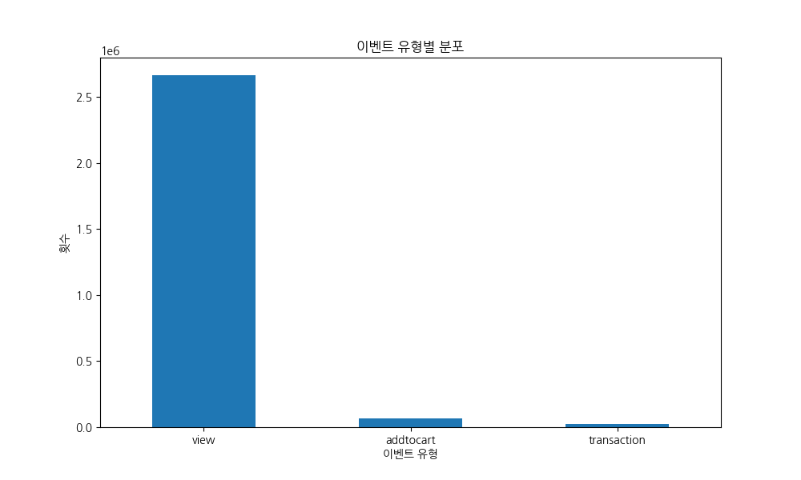

가장 많은 이벤트는 'view'이며, 'addtocart'와 'transaction'이 그 뒤를 잇습니다. 이는 일반적인 이커머스 funnel 형태를 보여줍니다.

**교차표:**
| event       |            횟수 |
|:------------|----------------:|
| view        |     2.66431e+06 |
| addtocart   | 69332           |
| transaction | 22457           |

### 4.2. 상위 20개 카테고리 (조회수 기준)

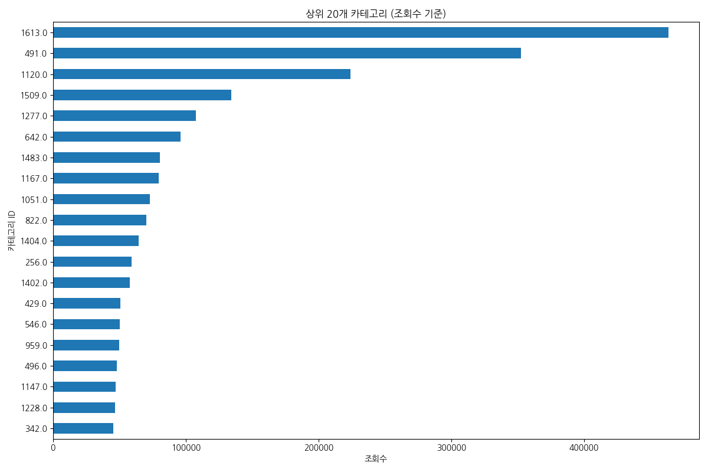

조회수가 가장 높은 상위 20개 카테고리입니다. 어떤 카테고리가 사용자들의 관심을 많이 끄는지 알 수 있습니다.

**피봇 테이블:**
|   categoryid |   조회수 |
|-------------:|---------:|
|         1613 |   463474 |
|          491 |   352296 |
|         1120 |   224280 |
|         1509 |   134288 |
|         1277 |   107573 |
|          642 |    95906 |
|         1483 |    80625 |
|         1167 |    79854 |
|         1051 |    73016 |
|          822 |    70493 |
|         1404 |    64706 |
|          256 |    59349 |
|         1402 |    57923 |
|          429 |    50739 |
|          546 |    50317 |
|          959 |    50112 |
|          496 |    47918 |
|         1147 |    47266 |
|         1228 |    46711 |
|          342 |    45288 |

### 4.3. 상위 20개 카테고리 (장바구니 추가 기준)

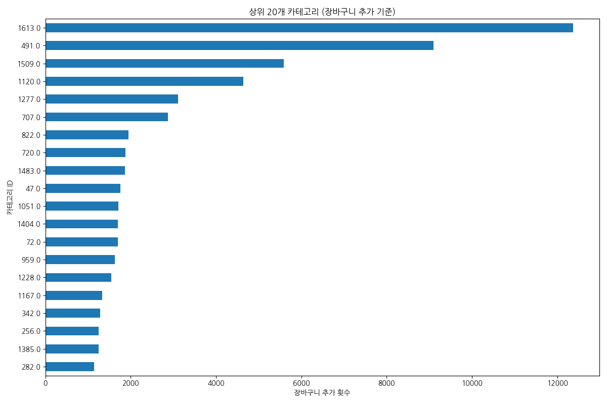

장바구니에 가장 많이 추가된 상위 20개 카테고리입니다. 이는 잠재적 구매 가능성이 높은 카테고리를 의미합니다.

**피봇 테이블:**
|   categoryid |   장바구니 추가 횟수 |
|-------------:|---------------------:|
|         1613 |                12370 |
|          491 |                 9096 |
|         1509 |                 5584 |
|         1120 |                 4644 |
|         1277 |                 3115 |
|          707 |                 2869 |
|          822 |                 1944 |
|          720 |                 1878 |
|         1483 |                 1867 |
|           47 |                 1761 |
|         1051 |                 1715 |
|         1404 |                 1703 |
|           72 |                 1699 |
|          959 |                 1634 |
|         1228 |                 1540 |
|         1167 |                 1329 |
|          342 |                 1283 |
|          256 |                 1253 |
|         1385 |                 1252 |
|          282 |                 1146 |

### 4.4. 상위 20개 카테고리 (구매 완료 기준)

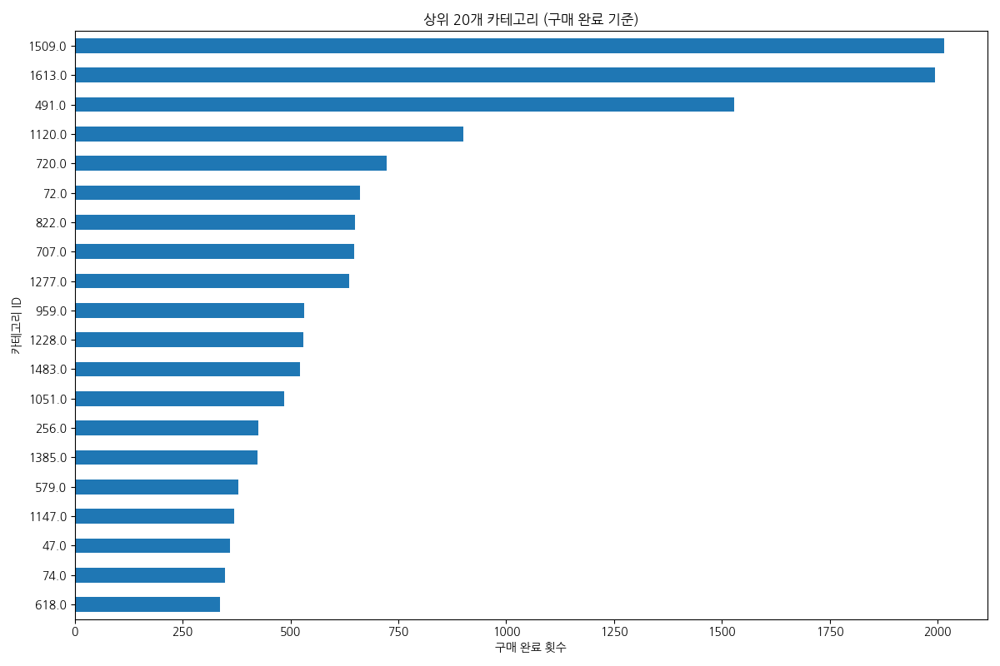

실제로 구매가 가장 많이 일어난 상위 20개 카테고리입니다. 이는 비즈니스의 핵심 수익원을 파악하는 데 중요합니다.

**피봇 테이블:**
|   categoryid |   구매 완료 횟수 |
|-------------:|-----------------:|
|         1509 |             2015 |
|         1613 |             1994 |
|          491 |             1528 |
|         1120 |              900 |
|          720 |              724 |
|           72 |              661 |
|          822 |              649 |
|          707 |              648 |
|         1277 |              637 |
|          959 |              532 |
|         1228 |              530 |
|         1483 |              523 |
|         1051 |              485 |
|          256 |              425 |
|         1385 |              424 |
|          579 |              379 |
|         1147 |              369 |
|           47 |              360 |
|           74 |              348 |
|          618 |              336 |

### 4.5. 일별 총 이벤트 발생 횟수

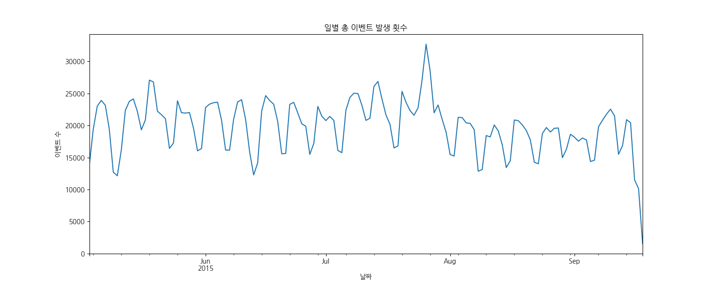

시간에 따른 전체 이벤트 수의 추이를 보여줍니다. 특정 기간에 이벤트가 급증하거나 급감하는 패턴을 파악할 수 있습니다.

**교차표 (상위 10일):**
| timestamp_dt        |   이벤트 수 |
|:--------------------|------------:|
| 2015-07-26 00:00:00 |       32703 |
| 2015-07-27 00:00:00 |       28562 |
| 2015-07-25 00:00:00 |       27106 |
| 2015-05-18 00:00:00 |       27084 |
| 2015-07-14 00:00:00 |       26872 |
| 2015-05-19 00:00:00 |       26799 |
| 2015-07-13 00:00:00 |       26119 |
| 2015-07-20 00:00:00 |       25332 |
| 2015-07-08 00:00:00 |       25035 |
| 2015-07-09 00:00:00 |       24997 |

### 4.6. 시간대별 총 이벤트 발생 횟수

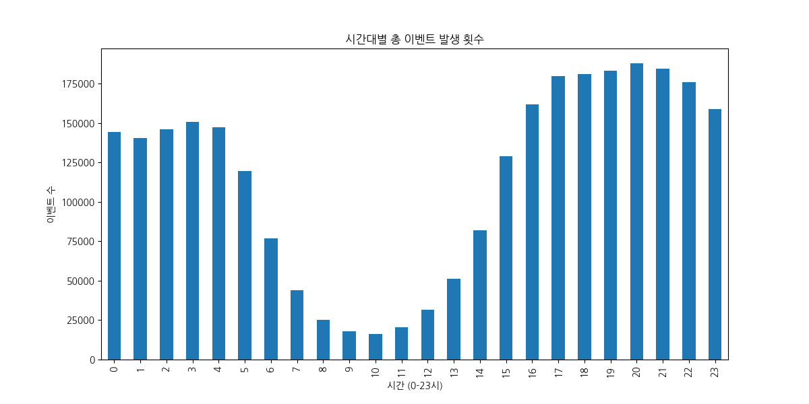

하루 중 어떤 시간대에 사용자들이 가장 활발하게 활동하는지 보여줍니다. 마케팅 캠페인 시간 설정 등에 활용할 수 있습니다.

**교차표:**
|   hour |   이벤트 수 |
|-------:|------------:|
|      0 |      144303 |
|      1 |      140702 |
|      2 |      145879 |
|      3 |      150860 |
|      4 |      147184 |
|      5 |      119572 |
|      6 |       76972 |
|      7 |       43944 |
|      8 |       25309 |
|      9 |       17909 |
|     10 |       16408 |
|     11 |       20330 |
|     12 |       31486 |
|     13 |       51089 |
|     14 |       81823 |
|     15 |      129092 |
|     16 |      161784 |
|     17 |      179651 |
|     18 |      181200 |
|     19 |      183348 |
|     20 |      187919 |
|     21 |      184297 |
|     22 |      175956 |
|     23 |      159084 |

### 4.7. 요일별 총 이벤트 발생 횟수

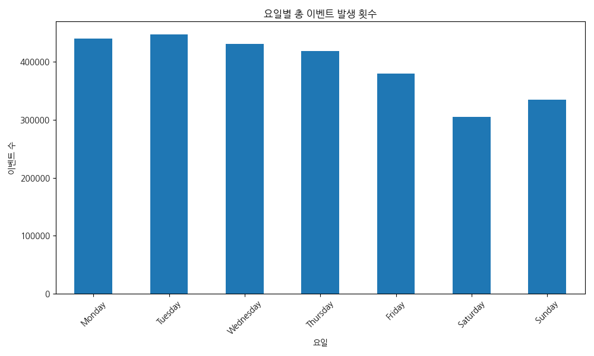

주중과 주말 중 사용자의 활동성에 차이가 있는지 파악할 수 있습니다.

**교차표:**
| dayofweek   |   이벤트 수 |
|:------------|------------:|
| Monday      |      439813 |
| Tuesday     |      447077 |
| Wednesday   |      431114 |
| Thursday    |      418761 |
| Friday      |      379699 |
| Saturday    |      305215 |
| Sunday      |      334422 |

### 4.8. 상위 20개 상품 속성(Property) 분포

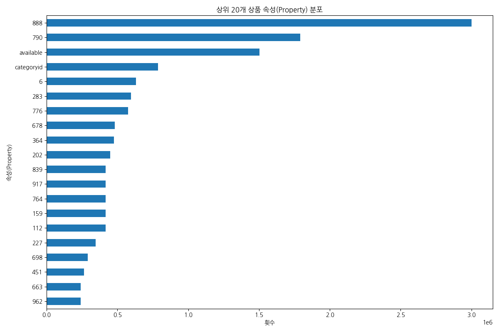

상품들이 어떤 종류의 속성을 가장 많이 가지고 있는지 보여줍니다. 'available', 'categoryid' 등이 많이 사용되는 것을 볼 수 있습니다.

**피봇 테이블:**
| property   |             횟수 |
|:-----------|-----------------:|
| 888        |      3.0004e+06  |
| 790        |      1.79052e+06 |
| available  |      1.50364e+06 |
| categoryid | 788214           |
| 6          | 631471           |
| 283        | 597419           |
| 776        | 574220           |
| 678        | 481966           |
| 364        | 476486           |
| 202        | 448938           |
| 839        | 417239           |
| 917        | 417227           |
| 764        | 417053           |
| 159        | 417053           |
| 112        | 417053           |
| 227        | 347492           |
| 698        | 289849           |
| 451        | 264416           |
| 663        | 240813           |
| 962        | 239372           |

### 4.9. 사용자별 이벤트 수 분포

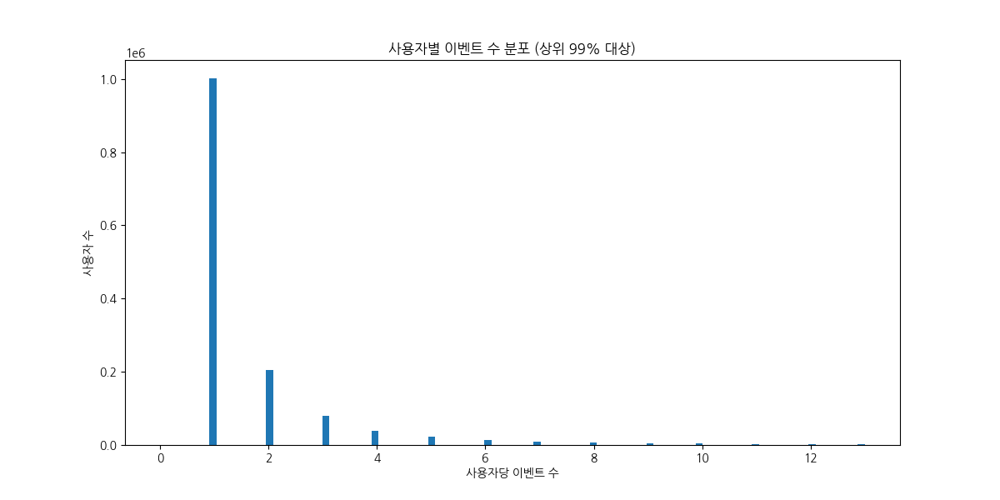

대부분의 사용자는 적은 수의 이벤트를 발생시키며, 소수의 '헤비 유저'가 매우 많은 이벤트를 발생시키는 롱테일 분포를 보입니다.

**피봇 테이블 (상위 10명):**
|   visitorid |   이벤트 수 |
|------------:|------------:|
|     1150086 |        7757 |
|      530559 |        4328 |
|      152963 |        3024 |
|      895999 |        2474 |
|      163561 |        2410 |
|      371606 |        2345 |
|      286616 |        2252 |
|      684514 |        2246 |
|      892013 |        2024 |
|      861299 |        1991 |

### 4.10. 상품별 이벤트 수 분포

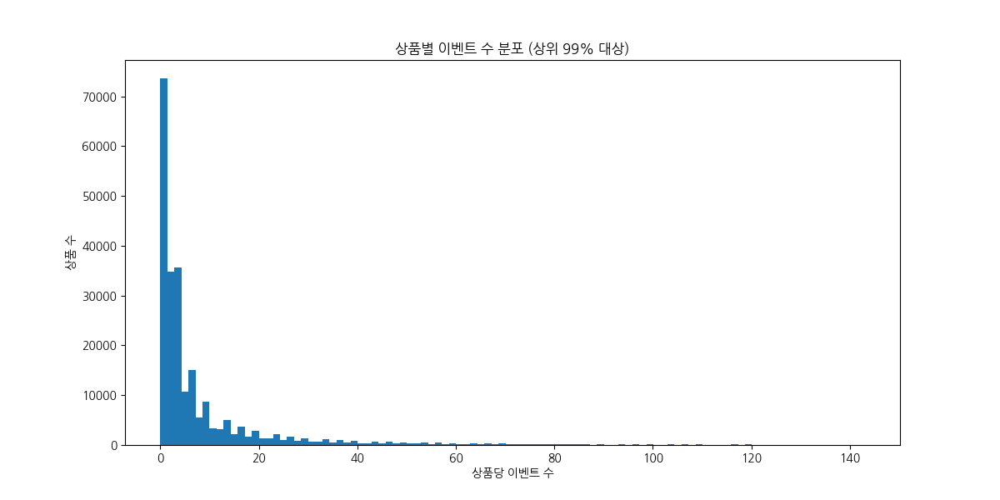

사용자 분포와 유사하게, 대부분의 상품은 적은 수의 이벤트를 받으며, 소수의 인기 상품이 많은 주목을 받는 것을 알 수 있습니다.

**피봇 테이블 (상위 10개):**
|   itemid |   이벤트 수 |
|---------:|------------:|
|   187946 |        3412 |
|   461686 |        2978 |
|     5411 |        2334 |
|   370653 |        1854 |
|   219512 |        1800 |
|   257040 |        1647 |
|   298009 |        1642 |
|    96924 |        1633 |
|   309778 |        1628 |
|   384302 |        1608 |

### 4.11. 시간대별 이벤트 심층 분석

#### 시간대별 이벤트 유형 비교

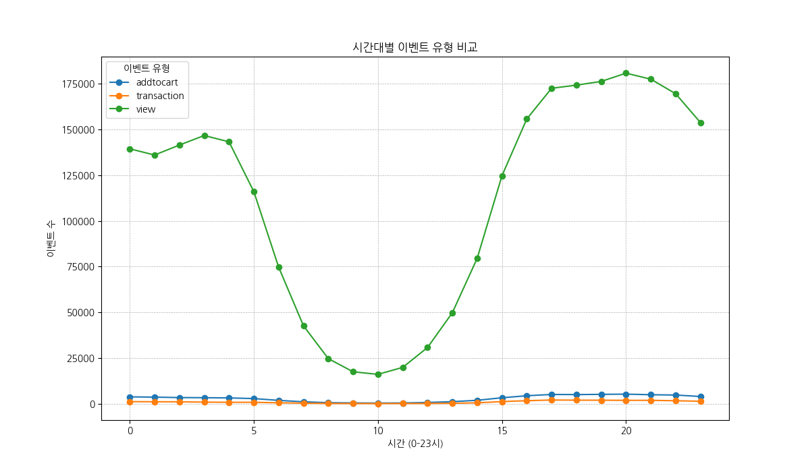

모든 이벤트 유형(view, addtocart, transaction)이 비슷한 시간대 패턴을 보입니다. 새벽 시간(6-14시)에 활동이 저조하다가, 늦은 오후부터 새벽 3시까지 활발한 활동이 이어집니다.

**피봇 테이블:**
|   hour |   addtocart |   transaction |   view |
|-------:|------------:|--------------:|-------:|
|      0 |        3725 |          1119 | 139459 |
|      1 |        3578 |          1037 | 136087 |
|      2 |        3337 |          1012 | 141530 |
|      3 |        3266 |           836 | 146758 |
|      4 |        3141 |           747 | 143296 |
|      5 |        2786 |           747 | 116039 |
|      6 |        1803 |           477 |  74692 |
|      7 |        1028 |           278 |  42638 |
|      8 |         540 |           106 |  24663 |
|      9 |         399 |            70 |  17440 |
|     10 |         306 |            57 |  16045 |
|     11 |         389 |            84 |  19857 |
|     12 |         647 |           103 |  30736 |
|     13 |        1106 |           215 |  49768 |
|     14 |        1844 |           455 |  79524 |
|     15 |        3233 |          1138 | 124721 |
|     16 |        4341 |          1621 | 155822 |
|     17 |        5040 |          2000 | 172611 |
|     18 |        4973 |          1907 | 174320 |
|     19 |        5094 |          1891 | 176363 |
|     20 |        5222 |          1817 | 180880 |
|     21 |        4891 |          1829 | 177577 |
|     22 |        4723 |          1600 | 169633 |
|     23 |        3920 |          1311 | 153853 |

#### 시간대별 전환율 분석

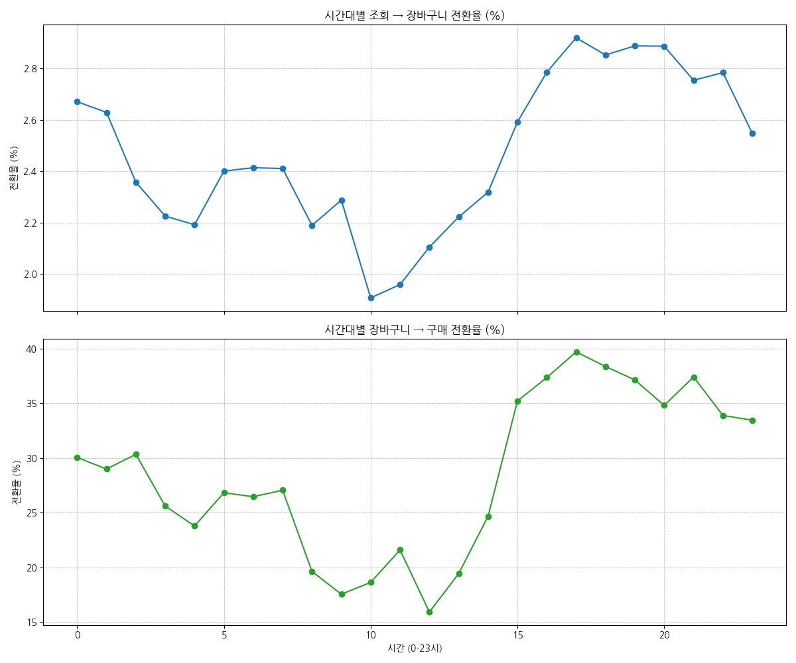

**조회 → 장바구니 전환율:** 사용자들이 가장 적게 활동하는 오전 8-10시 사이에 가장 높은 전환율을 보입니다. 이는 해당 시간대 사용자들이 뚜렷한 목적을 가지고 쇼핑할 가능성이 높음을 시사합니다.
**장바구니 → 구매 전환율:** 이른 새벽(2-4시)과 오전(8-11시) 시간대에 구매 전환율이 높게 나타납니다. 특히 활동량이 적은 오전 시간대의 구매 결정력이 주목할 만합니다.

**피봇 테이블 (전환율 포함):**
|   hour |   view_to_cart_rate |   cart_to_transaction_rate |
|-------:|--------------------:|---------------------------:|
|      0 |                2.67 |                      30.04 |
|      1 |                2.63 |                      28.98 |
|      2 |                2.36 |                      30.33 |
|      3 |                2.23 |                      25.60 |
|      4 |                2.19 |                      23.78 |
|      5 |                2.40 |                      26.81 |
|      6 |                2.41 |                      26.46 |
|      7 |                2.41 |                      27.04 |
|      8 |                2.19 |                      19.63 |
|      9 |                2.29 |                      17.54 |
|     10 |                1.91 |                      18.63 |
|     11 |                1.96 |                      21.59 |
|     12 |                2.11 |                      15.92 |
|     13 |                2.22 |                      19.44 |
|     14 |                2.32 |                      24.67 |
|     15 |                2.59 |                      35.20 |
|     16 |                2.79 |                      37.34 |
|     17 |                2.92 |                      39.68 |
|     18 |                2.85 |                      38.35 |
|     19 |                2.89 |                      37.12 |
|     20 |                2.89 |                      34.80 |
|     21 |                2.75 |                      37.40 |
|     22 |                2.78 |                      33.88 |
|     23 |                2.55 |                      33.44 |

### 4.12. 야간 장바구니 사용자의 재방문 패턴 분석

#### 재방문 소요 시간

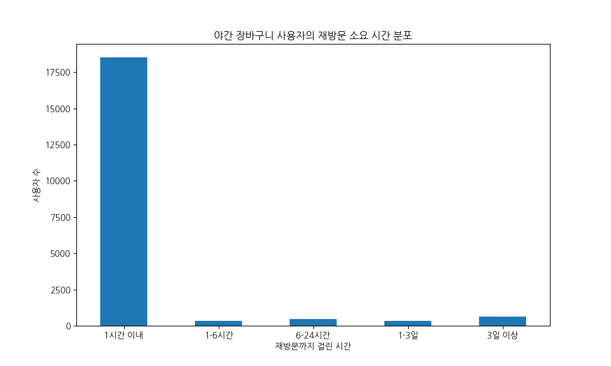

밤에 장바구니에 상품을 담은 사용자들의 상당수가 1시간 이내에 다시 사이트를 방문하는 것을 볼 수 있습니다. 이는 장바구니에 상품을 담은 직후 다른 상품을 탐색하거나 구매를 결정하는 경향이 있음을 보여줍니다.

**교차표:**
| revisit_time_bin   |   사용자 수 |
|:-------------------|------------:|
| 1시간 이내         |       18523 |
| 1-6시간            |         344 |
| 6-24시간           |         463 |
| 1-3일              |         322 |
| 3일 이상           |         629 |

#### 재방문 시 첫 행동 유형

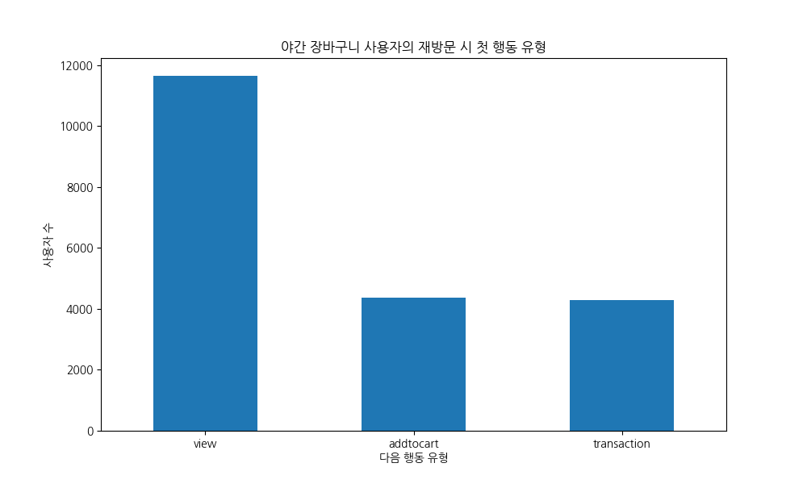

재방문한 사용자의 가장 흔한 첫 행동은 'view' 입니다. 이는 장바구니에 담은 상품과 연관된 다른 상품을 보거나, 다른 상품과 비교하는 행동으로 해석할 수 있습니다. 'addtocart'가 두 번째로 높은 것은 추가적인 상품을 장바구니에 담는 행동 패턴을 보여줍니다.

**교차표:**
| next_event_type   |   사용자 수 |
|:------------------|------------:|
| view              |       11643 |
| addtocart         |        4356 |
| transaction       |        4282 |

