# UCI 폴더 전체 EDA 리포트

생성일: 2026-01-07T22:42:49.723817

이 리포트는 `uci` 폴더 내 모든 CSV 파일을 자동으로 읽고 요약, 통계, 시각화를 생성합니다.

---

## 데이터셋: category_tree

파일경로: ./uci/category_tree.csv

형상: (1669, 2)

### 상위 5개 행

## head()

```
   categoryid  parentid
0        1016     213.0
1         809     169.0
2         570       9.0
3        1691     885.0
4         536    1691.0
``

### 데이터 정보 (info)

## info()

```
<class 'pandas.core.frame.DataFrame'>
RangeIndex: 1669 entries, 0 to 1668
Data columns (total 2 columns):
 #   Column      Non-Null Count  Dtype  
---  ------      --------------  -----  
 0   categoryid  1669 non-null   int64  
 1   parentid    1644 non-null   float64
dtypes: float64(1), int64(1)
memory usage: 26.2 KB
``

### 기술 통계 (`describe()`)

## describe()

```
        categoryid     parentid
count  1669.000000  1644.000000
mean    849.285201   847.571168
std     490.195116   505.058485
min       0.000000     8.000000
25%     427.000000   381.000000
50%     848.000000   866.000000
75%    1273.000000  1291.000000
max    1698.000000  1698.000000
``

### 결측치 현황

## missing values (count)

```
parentid      25
categoryid     0
``

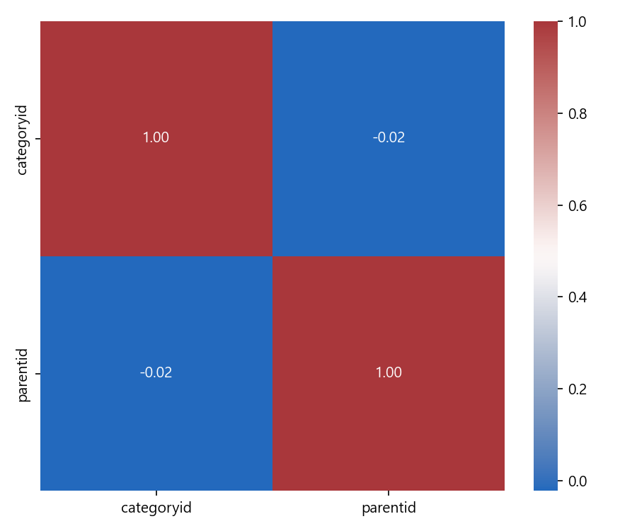

## category depth counts

```
0     25
1    174
2    702
3    665
4     90
5     13
``

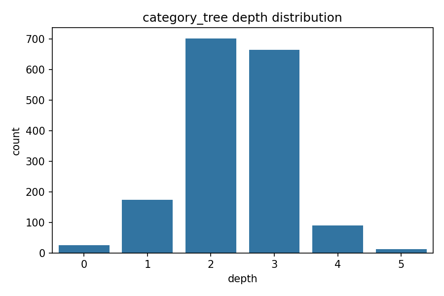

## top parents by child count

```
250     31
1009    22
362     22
351     19
1259    18
1687    17
945     15
312     15
92      13
1482    13
893     13
540     12
593     12
131     11
1224    11
1600    10
653     10
1490    10
587     10
381     10
``

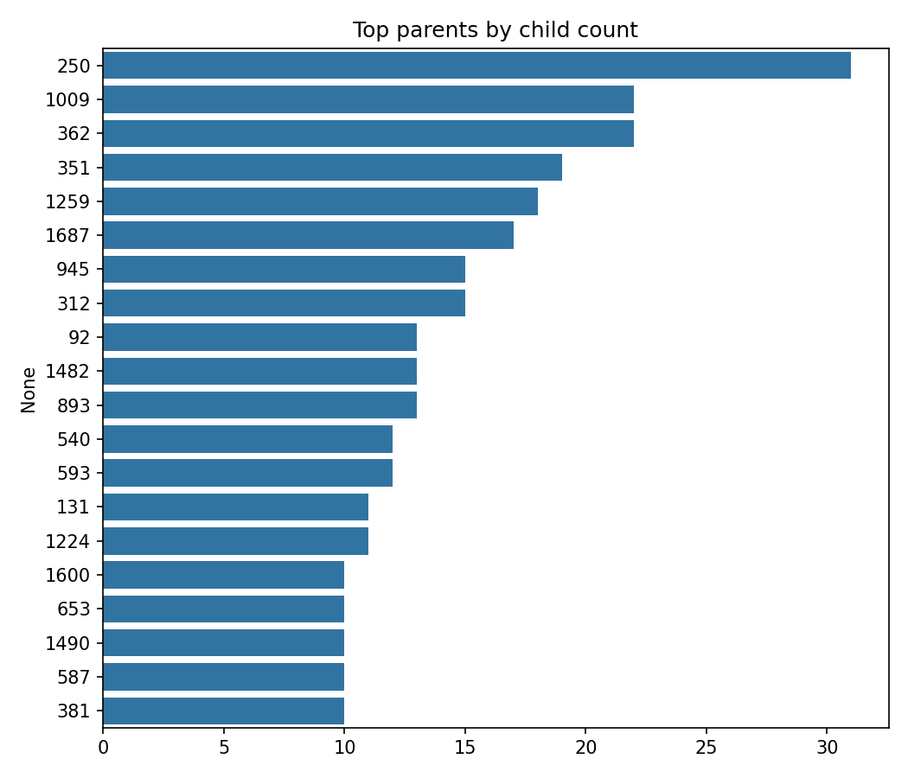

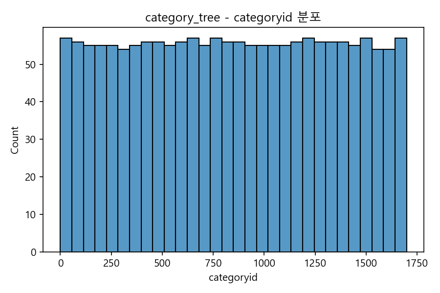

## categoryid 기초통계

```
count    1669.000000
mean      849.285201
std       490.195116
min         0.000000
25%       427.000000
50%       848.000000
75%      1273.000000
max      1698.000000
``

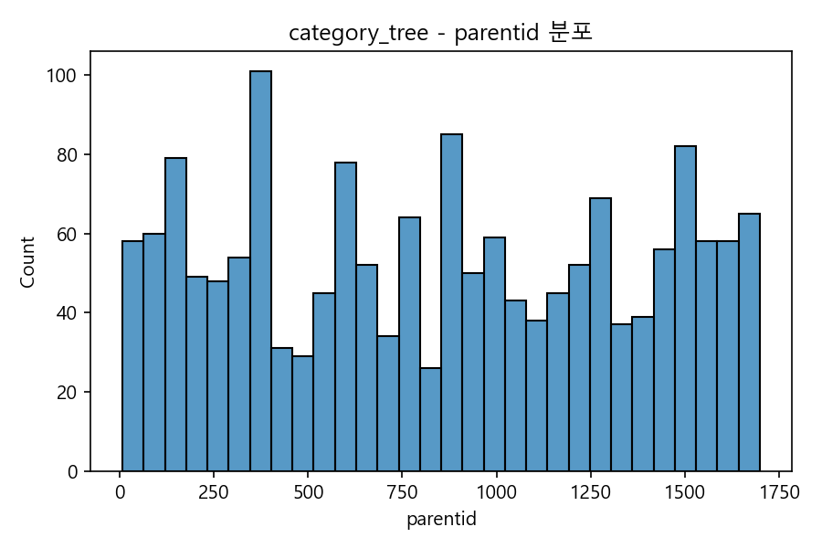

## parentid 기초통계

```
count    1644.000000
mean      847.571168
std       505.058485
min         8.000000
25%       381.000000
50%       866.000000
75%      1291.000000
max      1698.000000
``

### 간단한 해석


- 데이터셋 `category_tree` 은(는) 총 1669개의 행과 2개의 열을 가집니다.
- 결측치가 많은 열이 있다면 전처리(삭제/대체)가 필요합니다.
- 상위 범주 및 수치 분포 이미지는 위에 포함되어 있습니다.
---

## 데이터셋: events

파일경로: ./uci/events.csv

형상: (2756101, 5)

### 상위 5개 행

## head()

```
       timestamp  visitorid event  itemid  transactionid
0  1433221332117     257597  view  355908            NaN
1  1433224214164     992329  view  248676            NaN
2  1433221999827     111016  view  318965            NaN
3  1433221955914     483717  view  253185            NaN
4  1433221337106     951259  view  367447            NaN
``

### 데이터 정보 (info)

## info()

```
<class 'pandas.core.frame.DataFrame'>
RangeIndex: 2756101 entries, 0 to 2756100
Data columns (total 5 columns):
 #   Column         Dtype  
---  ------         -----  
 0   timestamp      int64  
 1   visitorid      int64  
 2   event          object 
 3   itemid         int64  
 4   transactionid  float64
dtypes: float64(1), int64(3), object(1)
memory usage: 105.1+ MB
``

### 기술 통계 (`describe()`)

## describe()

```
           timestamp     visitorid    event        itemid  transactionid
count   2.756101e+06  2.756101e+06  2756101  2.756101e+06   22457.000000
unique           NaN           NaN        3           NaN            NaN
top              NaN           NaN     view           NaN            NaN
freq             NaN           NaN  2664312           NaN            NaN
mean    1.436424e+12  7.019229e+05      NaN  2.349225e+05    8826.497796
std     3.366312e+09  4.056875e+05      NaN  1.341954e+05    5098.996290
min     1.430622e+12  0.000000e+00      NaN  3.000000e+00       0.000000
25%     1.433478e+12  3.505660e+05      NaN  1.181200e+05    4411.000000
50%     1.436453e+12  7.020600e+05      NaN  2.360670e+05    8813.000000
75%     1.439225e+12  1.053437e+06      NaN  3.507150e+05   13224.000000
max     1.442545e+12  1.407579e+06      NaN  4.668670e+05   17671.000000
``

### 결측치 현황

## missing values (count)

```
transactionid    2733644
timestamp              0
visitorid              0
event                  0
itemid                 0
``

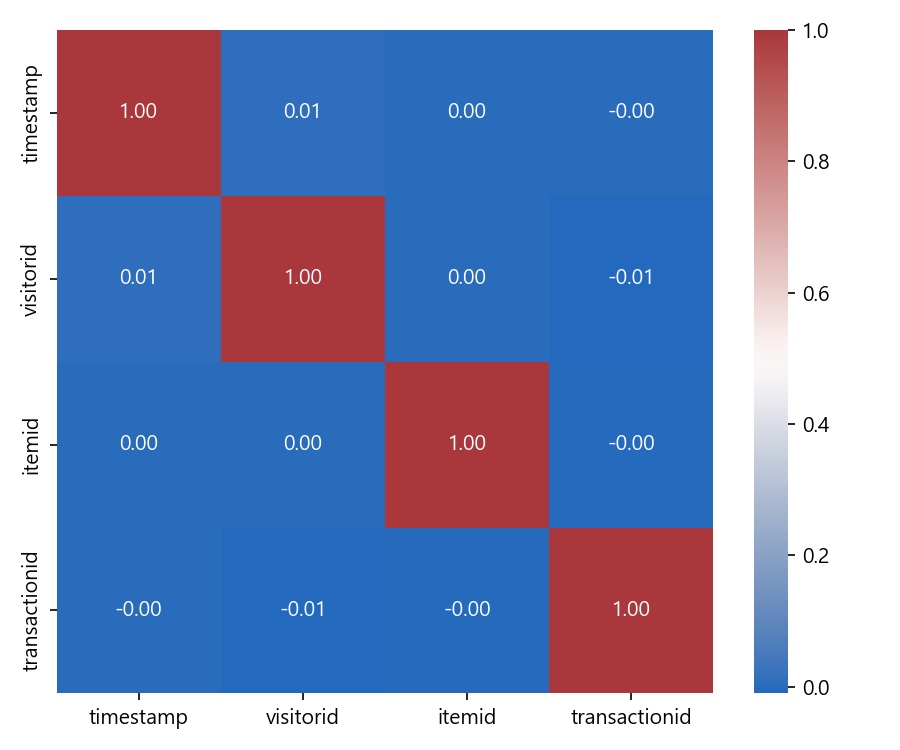

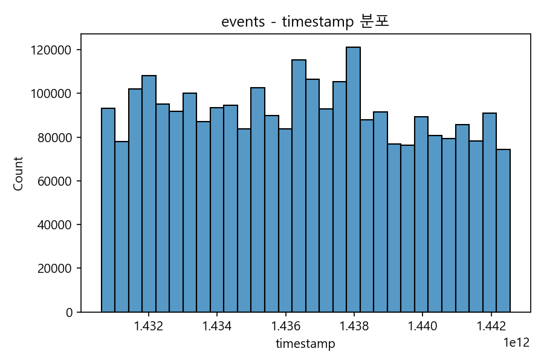

## timestamp 기초통계

```
count    2.756101e+06
mean     1.436424e+12
std      3.366312e+09
min      1.430622e+12
25%      1.433478e+12
50%      1.436453e+12
75%      1.439225e+12
max      1.442545e+12
``

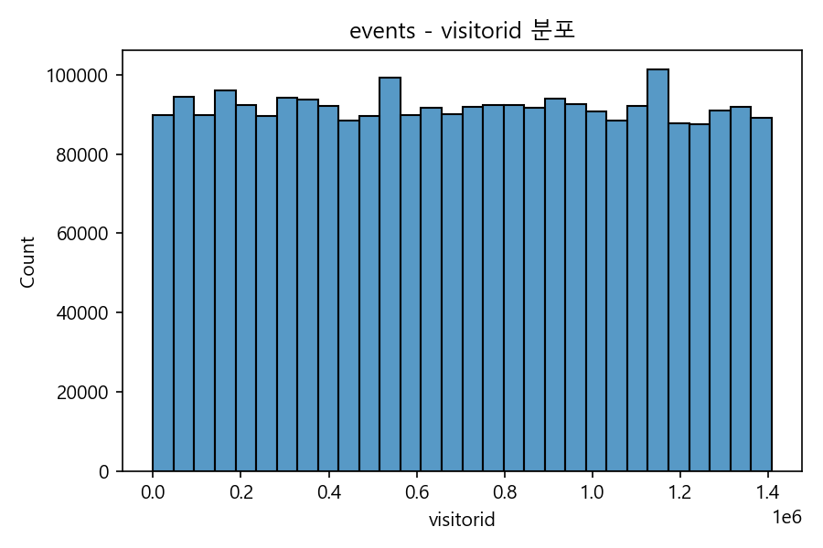

## visitorid 기초통계

```
count    2.756101e+06
mean     7.019229e+05
std      4.056875e+05
min      0.000000e+00
25%      3.505660e+05
50%      7.020600e+05
75%      1.053437e+06
max      1.407579e+06
``

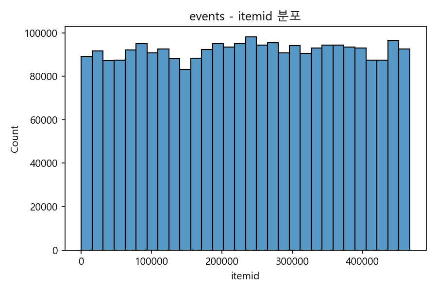

## itemid 기초통계

```
count    2.756101e+06
mean     2.349225e+05
std      1.341954e+05
min      3.000000e+00
25%      1.181200e+05
50%      2.360670e+05
75%      3.507150e+05
max      4.668670e+05
``

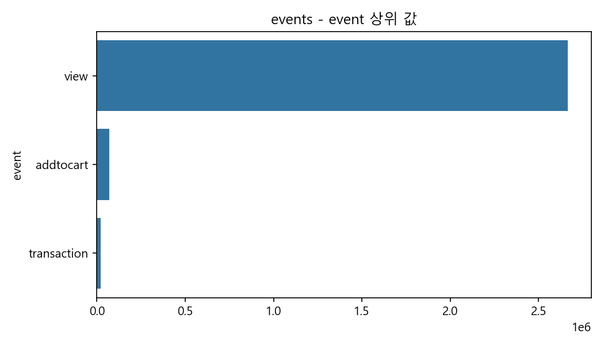

#### 해당 막대그래프에 대한 값표 (상위 20)

## event value_counts

```
event
view           2664312
addtocart        69332
transaction      22457
``

## event vs timestamp (count/mean)

```
               count          mean
event                             
view         2664312  1.436422e+12
addtocart      69332  1.436514e+12
transaction    22457  1.436469e+12
``

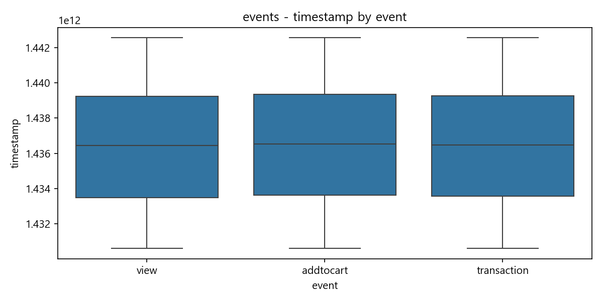

### 간단한 해석


- 데이터셋 `events` 은(는) 총 2756101개의 행과 5개의 열을 가집니다.
- 결측치가 많은 열이 있다면 전처리(삭제/대체)가 필요합니다.
- 상위 범주 및 수치 분포 이미지는 위에 포함되어 있습니다.
---

## 데이터셋: item_properties_part1

파일경로: ./uci/item_properties_part1.csv

형상: (10999999, 4)

### 상위 5개 행

## head()

```
       timestamp  itemid    property                            value
0  1435460400000  460429  categoryid                             1338
1  1441508400000  206783         888          1116713 960601 n277.200
2  1439089200000  395014         400  n552.000 639502 n720.000 424566
3  1431226800000   59481         790                       n15360.000
4  1431831600000  156781         917                           828513
``

### 데이터 정보 (info)

## info()

```
<class 'pandas.core.frame.DataFrame'>
RangeIndex: 10999999 entries, 0 to 10999998
Data columns (total 4 columns):
 #   Column     Dtype 
---  ------     ----- 
 0   timestamp  int64 
 1   itemid     int64 
 2   property   object
 3   value      object
dtypes: int64(2), object(2)
memory usage: 335.7+ MB
``

### 기술 통계 (`describe()`)

## describe()

```
           timestamp        itemid  property     value
count   1.100000e+07  1.100000e+07  10999999  10999999
unique           NaN           NaN      1097   1231581
top              NaN           NaN       888    769062
freq             NaN           NaN   1629817    833710
mean    1.435158e+12  2.333851e+05       NaN       NaN
std     3.327653e+09  1.348258e+05       NaN       NaN
min     1.431227e+12  0.000000e+00       NaN       NaN
25%     1.432436e+12  1.165150e+05       NaN       NaN
50%     1.433646e+12  2.334990e+05       NaN       NaN
75%     1.437880e+12  3.501860e+05       NaN       NaN
max     1.442113e+12  4.668660e+05       NaN       NaN
``

### 결측치 현황

## missing values (count)

```
timestamp    0
itemid       0
property     0
value        0
``

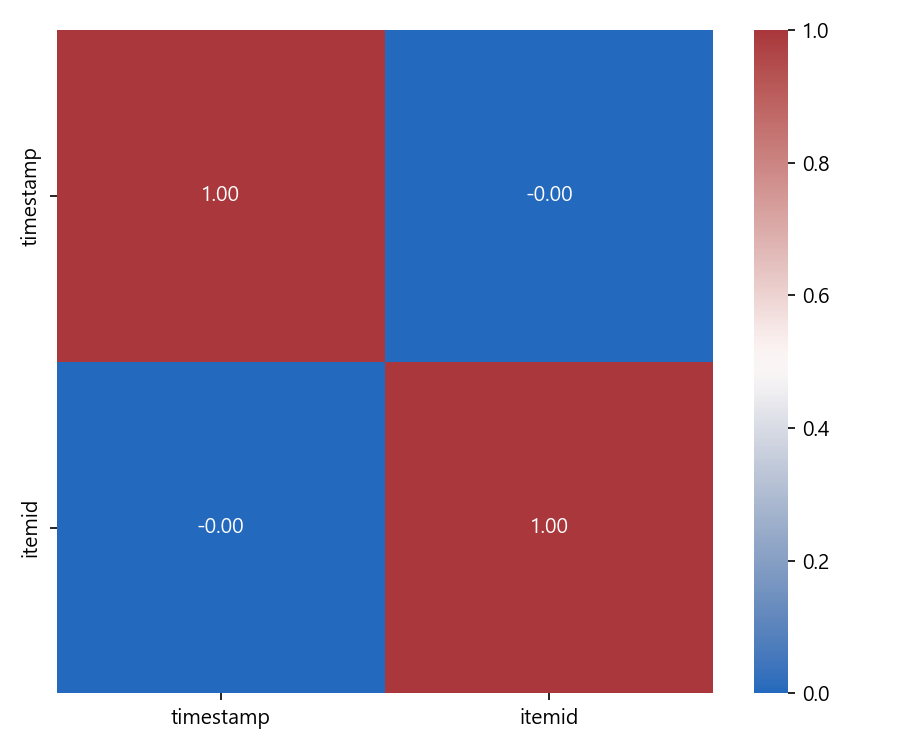


## timestamp 기초통계

```
count    1.100000e+07
mean     1.435158e+12
std      3.327653e+09
min      1.431227e+12
25%      1.432436e+12
50%      1.433646e+12
75%      1.437880e+12
max      1.442113e+12
``

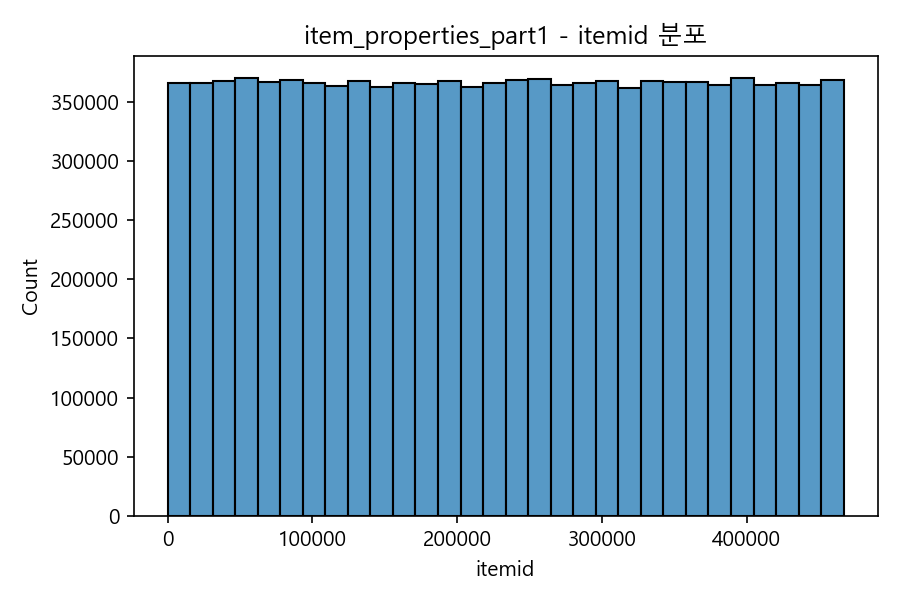

## itemid 기초통계

```
count    1.100000e+07
mean     2.333851e+05
std      1.348258e+05
min      0.000000e+00
25%      1.165150e+05
50%      2.334990e+05
75%      3.501860e+05
max      4.668660e+05
``


#### 해당 막대그래프에 대한 값표 (상위 20)

## property value_counts

```
property
888           1629817
790            970800
available      817387
categoryid     426305
6              343207
283            323681
776            311654
678            261829
364            256340
202            242984
839            226921
159            226502
917            226437
764            226242
112            226102
227            188209
698            157281
451            142388
663            131331
962            128976
``

## property vs timestamp (count/mean)

```
              count          mean
property                         
888         1629817  1.436446e+12
790          970800  1.436099e+12
available    817387  1.435914e+12
categoryid   426305  1.434699e+12
6            343207  1.434305e+12
283          323681  1.434004e+12
776          311654  1.433997e+12
678          261829  1.433278e+12
364          256340  1.433214e+12
202          242984  1.434872e+12
839          226921  1.434788e+12
159          226502  1.432696e+12
917          226437  1.432701e+12
764          226242  1.432692e+12
112          226102  1.432692e+12
227          188209  1.434644e+12
698          157281  1.434822e+12
451          142388  1.437148e+12
663          131331  1.437195e+12
962          128976  1.437251e+12
``

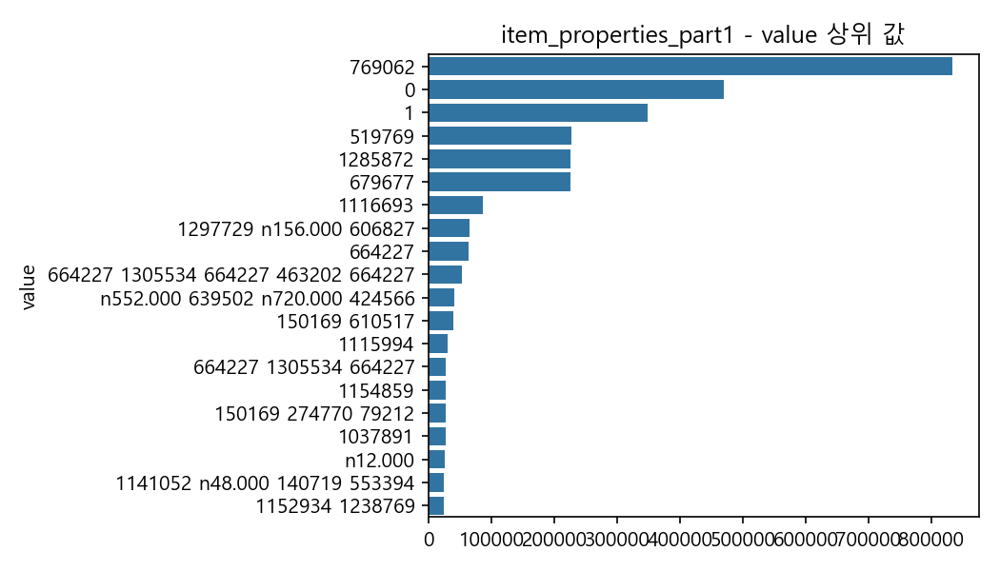

#### 해당 막대그래프에 대한 값표 (상위 20)

## value value_counts

```
value
769062                                 833710
0                                      469704
1                                      348216
519769                                 226502
1285872                                226242
679677                                 226102
1116693                                 85354
1297729 n156.000 606827                 65224
664227                                  63768
664227 1305534 664227 463202 664227     52404
n552.000 639502 n720.000 424566         40680
150169 610517                           39789
1115994                                 29810
664227 1305534 664227                   27589
1154859                                 27067
150169 274770 79212                     26663
1037891                                 26384
n12.000                                 25179
1141052 n48.000 140719 553394           23466
1152934 1238769                         23434
``

## value vs timestamp (count/mean)

```
                                      count          mean
value                                                    
769062                               833710  1.434739e+12
0                                    469704  1.435495e+12
1                                    348216  1.436474e+12
519769                               226502  1.432696e+12
1285872                              226242  1.432692e+12
679677                               226102  1.432692e+12
1116693                               85354  1.436290e+12
1297729 n156.000 606827               65224  1.439375e+12
664227                                63768  1.434559e+12
664227 1305534 664227 463202 664227   52404  1.439446e+12
n552.000 639502 n720.000 424566       40680  1.438490e+12
150169 610517                         39789  1.434678e+12
1115994                               29810  1.435879e+12
664227 1305534 664227                 27589  1.439468e+12
1154859                               27067  1.434960e+12
150169 274770 79212                   26663  1.434755e+12
1037891                               26384  1.434114e+12
n12.000                               25179  1.434381e+12
1141052 n48.000 140719 553394         23466  1.439594e+12
1152934 1238769                       23434  1.435882e+12
``

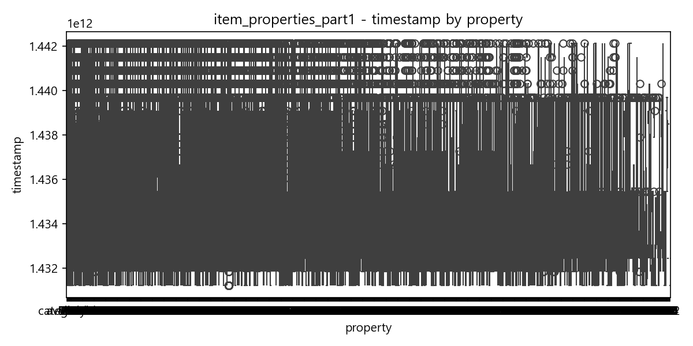

### 간단한 해석


- 데이터셋 `item_properties_part1` 은(는) 총 10999999개의 행과 4개의 열을 가집니다.
- 결측치가 많은 열이 있다면 전처리(삭제/대체)가 필요합니다.
- 상위 범주 및 수치 분포 이미지는 위에 포함되어 있습니다.
---

## 데이터셋: item_properties_part2

파일경로: ./uci/item_properties_part2.csv

형상: (9275903, 4)

### 상위 5개 행

## head()

```
       timestamp  itemid property            value
0  1433041200000  183478      561           769062
1  1439694000000  132256      976  n26.400 1135780
2  1435460400000  420307      921  1149317 1257525
3  1431831600000  403324      917          1204143
4  1435460400000  230701      521           769062
``

### 데이터 정보 (info)

## info()

```
<class 'pandas.core.frame.DataFrame'>
RangeIndex: 9275903 entries, 0 to 9275902
Data columns (total 4 columns):
 #   Column     Dtype 
---  ------     ----- 
 0   timestamp  int64 
 1   itemid     int64 
 2   property   object
 3   value      object
dtypes: int64(2), object(2)
memory usage: 283.1+ MB
``

### 기술 통계 (`describe()`)

## describe()

```
           timestamp        itemid property    value
count   9.275903e+06  9.275903e+06  9275903  9275903
unique           NaN           NaN     1094  1075730
top              NaN           NaN      888   769062
freq             NaN           NaN  1370581   703537
mean    1.435156e+12  2.333968e+05      NaN      NaN
std     3.327970e+09  1.348682e+05      NaN      NaN
min     1.431227e+12  0.000000e+00      NaN      NaN
25%     1.432436e+12  1.165175e+05      NaN      NaN
50%     1.433646e+12  2.334620e+05      NaN      NaN
75%     1.437880e+12  3.504470e+05      NaN      NaN
max     1.442113e+12  4.668660e+05      NaN      NaN
``

### 결측치 현황

## missing values (count)

```
timestamp    0
itemid       0
property     0
value        0
``

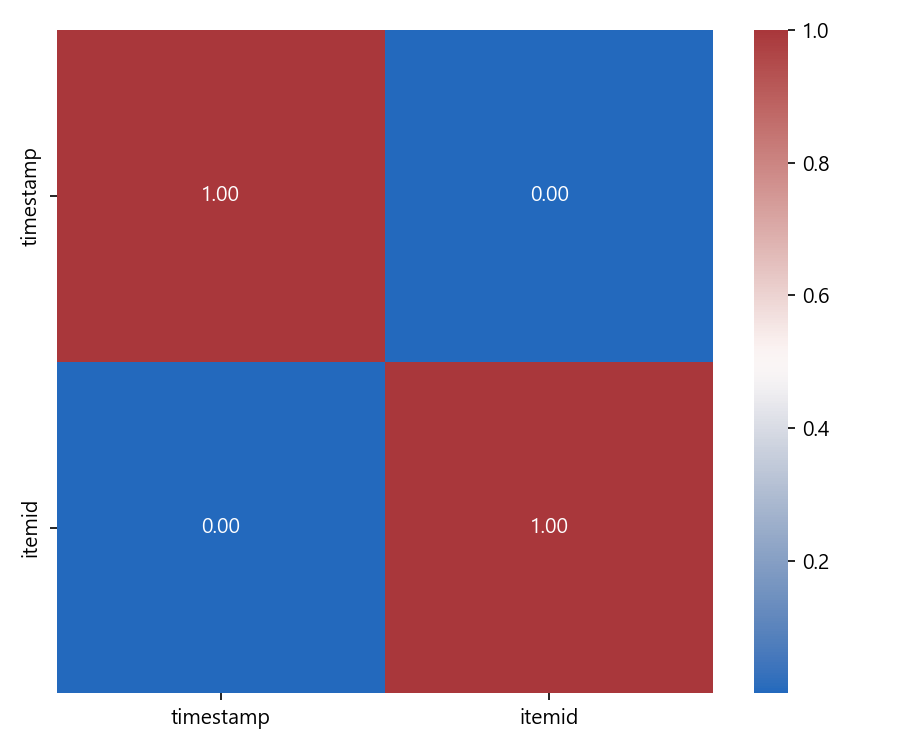

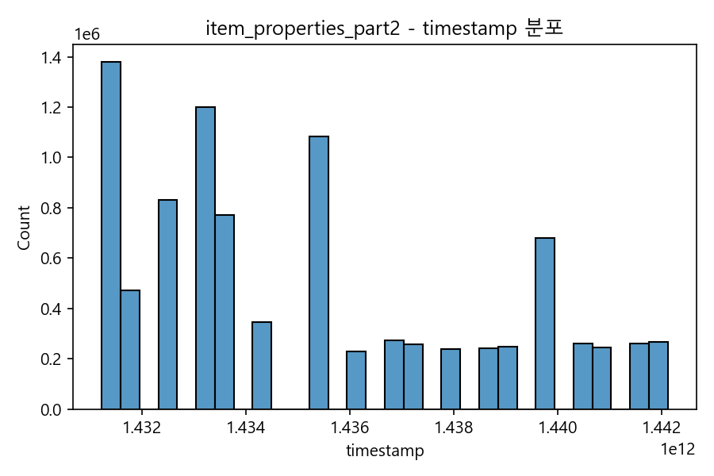

## timestamp 기초통계

```
count    9.275903e+06
mean     1.435156e+12
std      3.327970e+09
min      1.431227e+12
25%      1.432436e+12
50%      1.433646e+12
75%      1.437880e+12
max      1.442113e+12
``

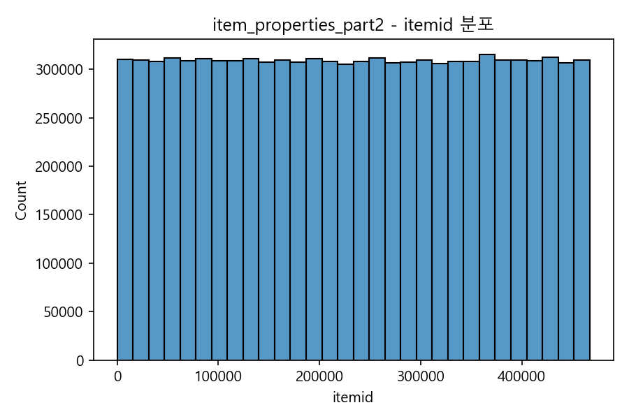

## itemid 기초통계

```
count    9.275903e+06
mean     2.333968e+05
std      1.348682e+05
min      0.000000e+00
25%      1.165175e+05
50%      2.334620e+05
75%      3.504470e+05
max      4.668660e+05
``

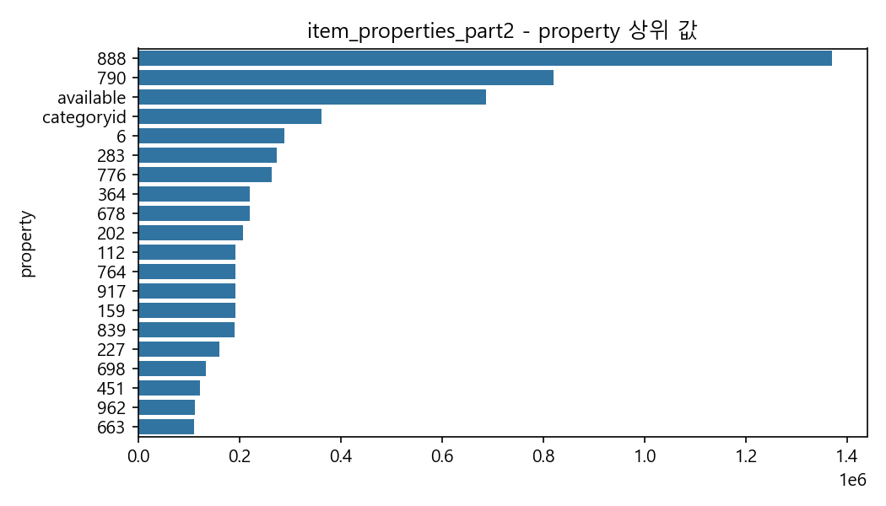

#### 해당 막대그래프에 대한 값표 (상위 20)

## property value_counts

```
property
888           1370581
790            819716
available      686252
categoryid     361909
6              288264
283            273738
776            262566
364            220146
678            220137
202            205954
112            190951
764            190811
917            190790
159            190551
839            190318
227            159283
698            132568
451            122028
962            110396
663            109482
``

## property vs timestamp (count/mean)

```
              count          mean
property                         
888         1370581  1.436450e+12
790          819716  1.436104e+12
available    686252  1.435907e+12
categoryid   361909  1.434706e+12
6            288264  1.434272e+12
283          273738  1.434012e+12
776          262566  1.433996e+12
364          220146  1.433260e+12
678          220137  1.433277e+12
202          205954  1.434862e+12
112          190951  1.432690e+12
764          190811  1.432687e+12
917          190790  1.432697e+12
159          190551  1.432681e+12
839          190318  1.434773e+12
227          159283  1.434634e+12
698          132568  1.434808e+12
451          122028  1.437178e+12
962          110396  1.437232e+12
663          109482  1.437177e+12
``

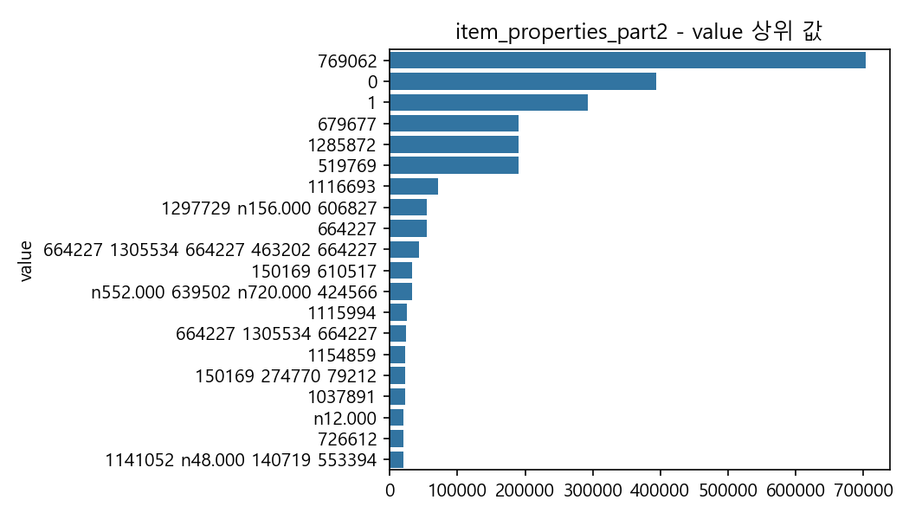

#### 해당 막대그래프에 대한 값표 (상위 20)

## value value_counts

```
value
769062                                 703537
0                                      393542
1                                      293204
679677                                 190952
1285872                                190811
519769                                 190551
1116693                                 71889
1297729 n156.000 606827                 54912
664227                                  54885
664227 1305534 664227 463202 664227     43841
150169 610517                           33558
n552.000 639502 n720.000 424566         33139
1115994                                 25158
664227 1305534 664227                   24132
1154859                                 22908
150169 274770 79212                     22413
1037891                                 22159
n12.000                                 20796
726612                                  20003
1141052 n48.000 140719 553394           19852
``

## value vs timestamp (count/mean)

```
                                      count          mean
value                                                    
769062                               703537  1.434739e+12
0                                    393542  1.435497e+12
1                                    293204  1.436452e+12
679677                               190952  1.432690e+12
1285872                              190811  1.432687e+12
519769                               190551  1.432681e+12
1116693                               71889  1.436316e+12
1297729 n156.000 606827               54912  1.439366e+12
664227                                54885  1.434563e+12
664227 1305534 664227 463202 664227   43841  1.439442e+12
150169 610517                         33558  1.434707e+12
n552.000 639502 n720.000 424566       33139  1.438471e+12
1115994                               25158  1.435895e+12
664227 1305534 664227                 24132  1.439454e+12
1154859                               22908  1.434971e+12
150169 274770 79212                   22413  1.434755e+12
1037891                               22159  1.434039e+12
n12.000                               20796  1.434375e+12
726612                                20003  1.434276e+12
1141052 n48.000 140719 553394         19852  1.439616e+12
``

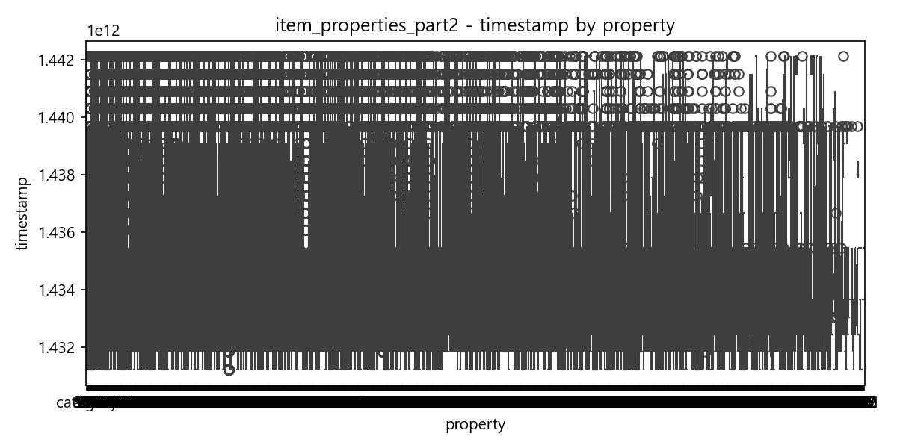

### 간단한 해석


- 데이터셋 `item_properties_part2` 은(는) 총 9275903개의 행과 4개의 열을 가집니다.
- 결측치가 많은 열이 있다면 전처리(삭제/대체)가 필요합니다.
- 상위 범주 및 수치 분포 이미지는 위에 포함되어 있습니다.
---

# 총평

자동 EDA가 완료되었습니다. 자세한 전처리 및 추가 분석은 본 리포트를 기반으로 진행하세요.
---

# 고객별 매출(거래수/구매수량) 기반 분석

## 고객별 요약 통계

## customers describe

```
       transactions  items_purchased
count  11719.000000     11719.000000
mean       1.507978         1.916290
std        7.344491         8.850529
min        1.000000         1.000000
25%        1.000000         1.000000
50%        1.000000         1.000000
75%        1.000000         1.000000
max      502.000000       559.000000
``

## 구매수량 상위 20 고객 (visitorid, transactions, items_purchased)

```
 visitorid  transactions  items_purchased
   1150086           502              559
    152963           278              349
    530559           221              286
    684514           162              189
    861299           148              188
     76757           155              185
    138131           137              173
    890980           104              145
   1297062           111              136
    247235           124              132
   1161163            93              115
    350566            92              112
    645525            85              107
    198270            88              104
    757355            82              101
    705542            79              100
    371606            79               94
    163561            81               92
    836635            79               90
   1385073            61               86
``

## 거래수 상위 20 고객 (visitorid, transactions, items_purchased)

```
 visitorid  transactions  items_purchased
   1150086           502              559
    152963           278              349
    530559           221              286
    684514           162              189
     76757           155              185
    861299           148              188
    138131           137              173
    247235           124              132
   1297062           111              136
    890980           104              145
   1161163            93              115
    350566            92              112
    198270            88              104
    645525            85              107
    757355            82              101
    163561            81               92
    371606            79               94
    836635            79               90
    705542            79              100
    994820            70               71
``

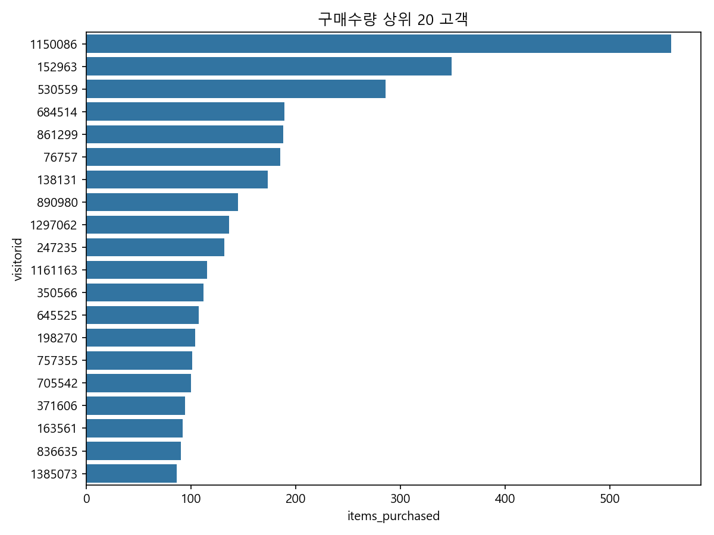

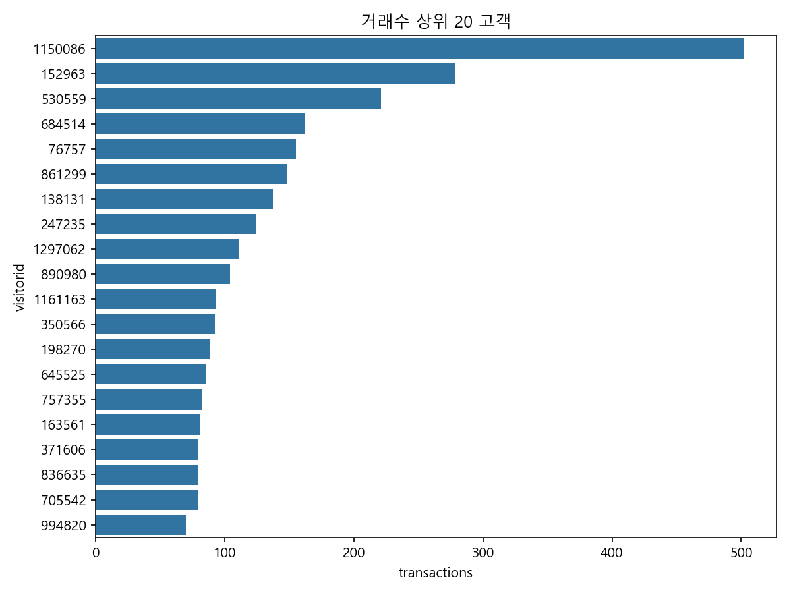

## 구매수량 기반 세그먼트 요약

```
                customers  total_items  avg_items
segment_items                                    
(0.999, 559.0]      11719        22457    1.91629
``

### 간단 해석


- 본 데이터셋에는 직접적인 결제 금액(amount) 컬럼이 존재하지 않습니다. 따라서 '구매수량(items_purchased)'과 '거래수(transactions)'를 매출의 대체 지표로 사용했습니다.
- 구매수량 상위 고객은 상위 20명에 대해 시각화되어 있으며, 실제 금액 기반 분석이 필요하면 주문-상품 가격 정보를 포함한 추가 데이터(예: order_items, payments)가 필요합니다.
- 세그먼트(사분위수 기준)는 고객군별 구매 집중도를 파악하는 데 유용합니다. 상위 세그먼트가 전체 구매량을 얼마만큼 차지하는지 추가 분석을 권장합니다.
